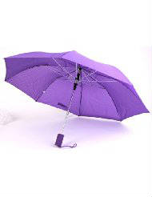
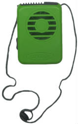
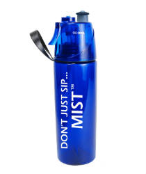
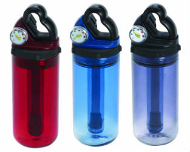
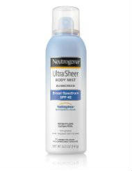

The best way to beat the Florida heat is to go to Disney World in February. But, let’s face it. Most of us want to take our kids with us, and we often have to do it in the summer. Here are a few tricks to help make the heat just a little more bearable.

A hat is obvious

[Soft ones that can take some folding are useful.](http://www.amazon.com/gp/product/B0058YU2DS/ref=as_li_qf_sp_asin_il_tl?ie=UTF8&camp=1789&creative=9325&creativeASIN=B0058YU2DS&linkCode=as2&tag=esiv-20&linkId=F6FHNY7XUQADZVVQ)

But there are some more items that can help you beat the eat that might not be obvious. Here are 5 ways to beat the heat at Disney Parks.

5 Ways to Beat the Heat at Disney Parks
=======================================

1\. [Umbrella ](http://www.amazon.com/gp/product/B000GCPZKW/ref=as_li_qf_sp_asin_il_tl?ie=UTF8&camp=1789&creative=9325&creativeASIN=B000GCPZKW&linkCode=as2&tag=esiv-20&linkId=LRUG24GJE7DHVCIU) – Your own portable shade! You want one that’s not too heavy, that collapses and folds easily. And it will also come in handy for those sudden Florida showers.

2\. [Fan, a personal fan](http://www.amazon.com/gp/product/B00DB4KELM/ref=as_li_qf_sp_asin_il_tl?ie=UTF8&camp=1789&creative=9325&creativeASIN=B00DB4KELM&linkCode=as2&tag=esiv-20&linkId=PVHEX7GC5I5JS4LD) – The open blade ones caught in my daughters’ hair, but these closed ones worked well.

3\. [Mist bottle ](http://www.amazon.com/gp/product/B002VEDG7M/ref=as_li_qf_sp_asin_il_tl?ie=UTF8&camp=1789&creative=9325&creativeASIN=B002VEDG7M&linkCode=as2&tag=esiv-20&linkId=WUWB4UBMRN7RMRZC)– The ones by [O2 Cool](http://www.amazon.com/gp/product/B002VEDG7M/ref=as_li_qf_sp_asin_il_tl?ie=UTF8&camp=1789&creative=9325&creativeASIN=B002VEDG7M&linkCode=as2&tag=esiv-20&linkId=WUWB4UBMRN7RMRZC) and [Orbit ](http://www.amazon.com/gp/product/B003QPJPYS/ref=as_li_qf_sp_asin_il_tl?ie=UTF8&camp=1789&creative=9325&creativeASIN=B003QPJPYS&linkCode=as2&tag=esiv-20&linkId=E4WDKTL2PSBYPJSE)were the best.4. [Cooling cloth ](http://www.amazon.com/gp/product/B003Y6DAY0/ref=as_li_tl?ie=UTF8&camp=1789&creative=9325&creativeASIN=B003Y6DAY0&linkCode=as2&tag=esiv-20&linkId=OQR2HDQUNDMAERAP)– We tried 3 types of cooling ties (including the gel type). This one [Grabber Magic Cool Bandana Cooling Cloth](http://www.amazon.com/gp/product/B003Y6DAY0/ref=as_li_tl?ie=UTF8&camp=1789&creative=9325&creativeASIN=B003Y6DAY0&linkCode=as2&tag=esiv-20&linkId=OQR2HDQUNDMAERAP) was easiest to refresh and carry.

5. [Spray Sunscreen](http://www.amazon.com/gp/product/B0018SC8VW/ref=as_li_qf_sp_asin_il_tl?ie=UTF8&camp=1789&creative=9325&creativeASIN=B0018SC8VW&linkCode=as2&tag=esiv-20&linkId=TS6Z4T72ZIU4SKCH) – Kids don’t mind putting this on as much as the messy creams. Instead of feeling hot and sticky, they’re a little cool going on.

