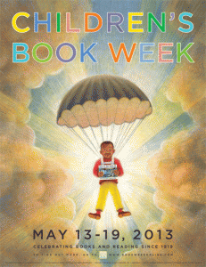

I’m so excited to be a part of my first give-away! To celebrate Children’s Book Week, May 13-19, I’m taking part in a blog hop through [Mother Daughter Book Reviews](http://motherdaughterbookreviews.com/). Renee linked me up with the lovely Tina at [Amanda’s Books and More](http://abooksandmore.blogspot.com/2013/05/5-mermaid-ebooks-giveaway.html).

This week, we’ll be giving away FIVE free ebooks of Miri Attwater and the Ocean’s Secret!

Here’s what Tina had to say about the book:  
“\[Miri Attwater and the Ocean’s Secret is\] a really neat mermaid story like no other for girls ages 6 – 12. I read the first book in the series and got really caught up in the story. I wanted to read more!”

So, don’t wait! Hop on over to [Amanda’s Books and More](http://abooksandmore.blogspot.com/2013/05/5-mermaid-ebooks-giveaway.html) and enter the Rafflecopter give-away now! (Contest closes 5/19/2013.)

Then go to the end of Tina’s post to look up the other blogs on the hop to enter for even more prizes!