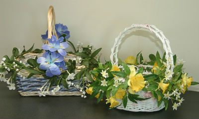

I adored my Easter basket growing up, which my grandmother had dressed up for me by attaching plastic flowers to it. Now, with all the gorgeous silk floral vines available in craft stores, it’s easier than ever! I made two baskets for my own little girls (now bigger), and they love them just as much.

Flower Covered Easter Baskets
=============================

Supplies

- woven Easter basket with loose weave along the top edge
- floral vine
- green floral wire or chenille stems
- wire cutters
- (optional – more silk accent flowers)

It helps to pick your flowers and your basket at the same time so you can coordinate colors. For the first basket I made, the best vine I could find only had tiny white flowers on it. Pretty and sophisticated, but little girls like color! So I added the accent blue iris at the handles. It was later that Sparkle developed her abiding love of all things pink and rejected all other colors for a while. But she never rejected her Easter basket!

For the second basket I found the perfect vine of daffodils. Yellow was Dizzy’s favorite color at the time. (And still is, although she likes lots of “happy” colors, which includes orange and fluorescent green.)

Does anyone beside me instead of saying “chenille stems” want to say “pipe cleaners”? 🙂 So, chenille stems or pipe cleaners will work. Moving on…

Directions
-------------------------------------------------------------------

1. Position the floral vine along the top edge of the basket. Trim length to size now or after you finish securing it – it depends on how difficult the entire length of vine is to manage. If you trim it before it is secured, leave a little extra length.
2. Secure the vine in place with green floral wire or green chenille stems by wrapping the wires around the stem and through the gaps in the basket. This is why you need the basket to have a loose weave at the top. Be sure you tuck in and crimp the edges of the wire so they won’t poke little fingers.
3. Add accent flowers if needed.

That’s it! If you already have a basket you love and it doesn’t have a loose weave that you can wrap the wire around, try decorating the handle. Or, there’s a good chance hot glue would work to secure the vine.

Happy Easter!