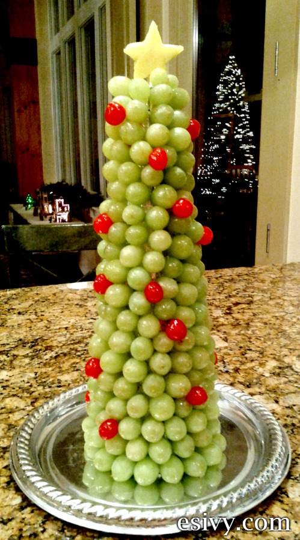
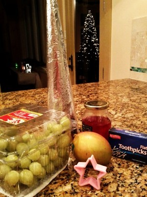
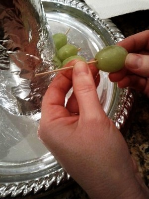
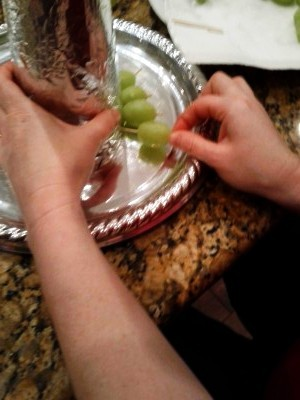
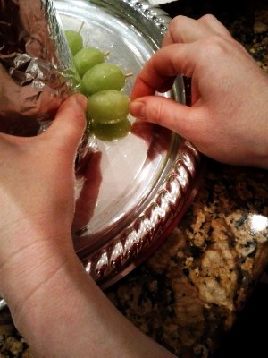
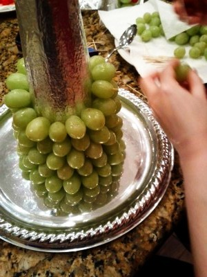
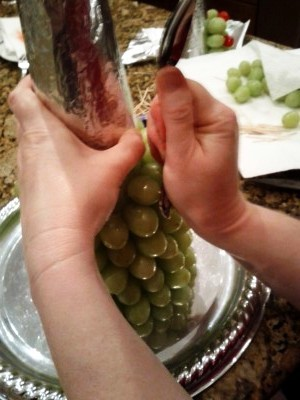
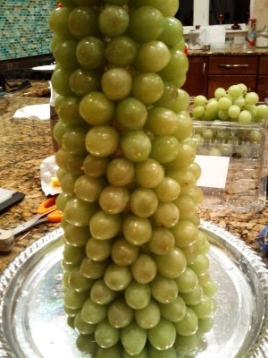
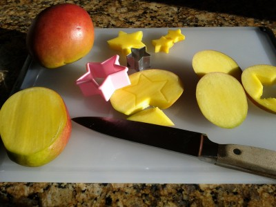
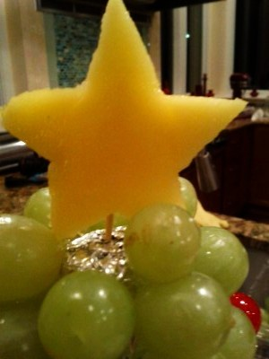

I made this for Dizzy’s 5th grade class party and it was a big hit! It’s impressive and not very hard, it just takes a while. Things are a bit busy here and I don’t have time to post full directions. But, I’ll upload the photos off all the steps. Full directions soon! If you need more help, contact me at esivy@phytapublishing.com and I’ll try to answer. Family party here tonight and my daughters are going to be busy making another one of these!

Supplies: foil wrapped 16 inch foam cone, 5 lbs large green grapes, mango, maraschino cherries, flat toothpicks

   

Press in the tips of the toothpicks with a spoon handle. If they won’t go in, clip them with kitchen scissors.

