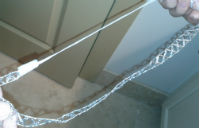
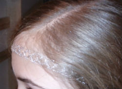
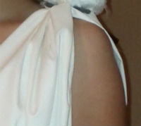
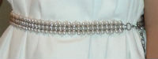

A no-sew Athena costume for girls

The books I write for kids are fantasy, so it’s probably no surprise that we’re big fantasy readers around this house. My middle grader, Sparkle, has just discovered the Percy Jackson series and is tearing through them. (Can you call it “discovered” when her brother has been begging her for years and she only read it because her English teacher put [The Lightning Thief](http://www.amazon.com/gp/product/0786838655/ref=as_li_tl?ie=UTF8&camp=1789&creative=9325&creativeASIN=0786838655&linkCode=as2&tag=esiv-20&linkId=BZRAZRGIJOU2BIUM "But it on Amazon!") on a reading list?)

Some parents would be appalled that English teachers are encouraging kids to read something as commercial as The Lightning Thief. I think it’s great! To me, the main reason for assigning books is to turn kids into readers. What better way to reach a kid who doesn’t think he likes to read than to assign him a book that thousands of kids love? For more on my thoughts on assigned reading, see my post [Why is required school reading so depressing?](http://192.168.1.34:4945/education/why-is-required-school-reading-so-depressing/ "Why is required school reading so depressing?")

Anyway, back to the costume! For Halloween, Sparkle wanted to be Athena, Goddess of War and Goddess of Wisdom. (Those two things don’t seem to go together! But the Greeks of myth aren’t around to argue with, so I guess it’s pointless to try.) Athena is Annabeth’s mom in the Percy Jackson series.

This isn’t the first time one of my kids has dressed up as a character from the Percy Jackson series. A couple of years ago, Techno boy dressed up as Percy Jackson. That was easy. We spray painted a pen silver, he wore an orange Camp Half-blood t-shirt (signed by Rick Riordan himself) and he was good to go!

Athena costume from Percy Jackson, The Mark of Athena

Athena took a little bit more preparation, but not much. With all the parts, we assembled the costume on Sparkle in about a half an hour. She wanted to wear it to her school costume dance, but she also had to help finish the entry for the robotics competition the next day. Thus, the lack of good pictures, some of which were hastily taken on my phone.

Athena Costume Instructions
===========================

Supplies
--------

- 4-6 yards white cloth, a cotton blend will work\*
- 18 inches thin ribbon: gold, silver, or brown – to tie the shoulders
- belt or a yard of wide ribbon
- 8 inches decorative gold or silver ribbon
- 10 inches elastic
- hot glue gun
- tape
- stuffed owl (optional) and magnets or clothes pins
- white clothing to wear under the costume
- sandals

\*The amount of cloth you need will depend on the length of the dress you and the height of the girl. We used 4 yards for a 5’3″ girl. To measure for fabric:

- Measure from middle of the shoulder to just above the knee for short dresses. For long Greek Goddess dresses, measure to 1-2 inches above the floor.
- For thin fabric (like inexpensive cotton or cotton-blends that you can see through) multiply this length by 4.
- For thicker fabrics multiply this length by 2.
- Buy a half yard more fabric than your finished calculation. This is something my mother always taught me to do when sewing. It is usually inexpensive and \*so\* much easier than having to run to the store for more fabric because you measured wrong or made a mistake.

Instructions
------------

### Headband

The only thing Sparkle had to make ahead of time was the headband. I can’t claim any credit for this. She did it all on her own. 🙂 She used a left-over piece of decorative package ribbon. (I have a hard time throwing out any package bow that is still usable. We have a drawer full. But see, it’s useful!)

1. Measure the amount of decorative ribbon you need to go across the forehead and tuck under the hair on either side.
2. Hot glue the piece of elastic to one end. Let it cool!
3. Use the half-assembled headband to measure the amount of elastic you need to run the ribbon across the front of the forehead and elastic under the hair around the back of the head. Pull it a little bit tight so that it will hold on with comfortable tension. Cut the elastic and hot glue it to the other end of the ribbon. Let it cool!
4. Wrap the hot glue joints with tape to avoid pulling the hair.

### Assembling the Athena costume

1. Since the costume is no-sew, it’ll be a bit breezy! So you want to wear some clothes under it to avoid any surprises. 🙂 Sparkle chose a white tank and white shorts, so she had a pocket for her cell phone and money.
2. Put the headband on before arranging the hair. Slip it all the way over the head to around the neck. Then pull the front of the headband up until it sits comfortably across the forehead.
3. Sparkle pulled her hair into a loose braid on the side. This also worked well with the owl perched on her other shoulder.
4. For thin fabric, keep the entire length of fabric folded in half length-wise, the way it came off the bolt. For thick fabric, that you can’t see through, cut it in half lengthwise.
5. Drape the fabric across one shoulder with the fold next to the neck. Adjust it so that the fabric is the length you want in the front, just above the knee for a short dress. For a Greek Goddess costume, adjust the fabric so that it is 1-2 inches off the floor.
6. Make a mark or a snip on the fabric hanging down the back so that the skirt will hang to the same length as in the front. Cut the fabric.
7. Using this first piece of fabric as a guide, cut the second piece to the same length.
8. Place the first piece of fabric over one shoulder again with the fold toward the neck. Gather up the fabric loosely and tie it with a small piece of gold, silver, or brown ribbon. We tied it around the strap of Sparkle’s tank-top for more stability. Repeat with the second piece of fabric on the other side.
9. Adjust the two piece of fabric so that they overlap in front and back. 
10. Using a belt or long piece of ribbon, gather the fabric around the waist and belt it. Adjust the pieces of fabric to overlap on the sides.

That’s it! Just cut, gather, and tie, tie, tie!

Sparkle wore this jaunty little fellow on her shoulder! If you’ve got a couple of days, you can order your own [Ty Beanie Boos Spells Owl 6″ Plush from Amazon.](http://www.amazon.com/gp/product/B008K7RM8I/ref=as_li_qf_sp_asin_il_tl?ie=UTF8&camp=1789&creative=9325&creativeASIN=B008K7RM8I&linkCode=as2&tag=esiv-20&linkId=T5LIMELCKLKN5EGO)

If you can’t find a small stuffed owl (for wisdom), you could make one out of pom-poms. She also thought about painting an owl on her cheek if we couldn’t find a stuffed animal.

We held the owl in place by wrapping a piece of fabric around an *incredibly* strong magnet and pinning it to the bottom of the owl with two safety pins. Then we wrapped another strong magnet in fabric and tucked it under the strap of Sparkle’s tank. The two magnets stuck together held them both in place.

Where did we get *really* strong magnets? From a broken hard drive! (Yes, we are an incredibly geeky family. It’s hard to hide when your craft instructions include: take a magnet from a broken hard drive… And your excuse for no time for photos is: my daughter had to finish things for the robotics competition…) You could affix the owl by sewing or hot-gluing clothes pins to the bottom of the owl and clipping it in place. Or, just carry the owl. Trick-or-treaters could let it peak out of their treat pumpkin.

*Please note that some of the links on this site are referral links which means I may get a small commission if you make a purchase after clicking on them. **You pay exactly the same price** as you would if you made the purchase directly. I only link to books and services I personally recommend and also it allows me to show you images relevant to posts. Thank you for your support in this way!*