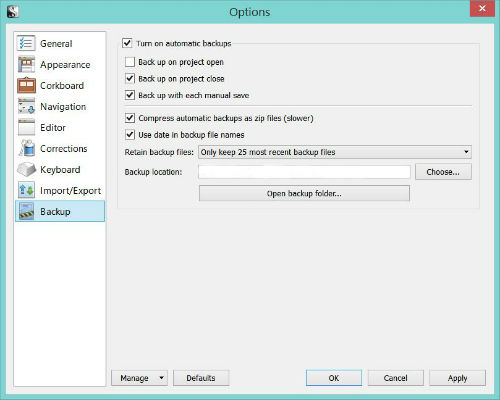

In this tutorial I’m going take you through the steps for backing up Scrivener files (or projects.) You’re going to save your [Scrivener](http://www.amazon.com/gp/product/B0079KJB54/ref=as_li_tl?ie=UTF8&camp=1789&creative=9325&creativeASIN=B0079KJB54&linkCode=as2&tag=esiv-20&linkId=ZMGLQ6NFASUCCEAW) files three places.

1\. Save your working copies to your computer hard drive.

2\. Save the 25 most recent automatic backups to a second location, such as in the cloud.

3\. Save an infinite number of manual backups to removable storage, like a memory card.

1. Save your working copies to a location you can find again.
=============================================================

When you start a project, be sure you pick a location to save it on your computer where you can find it again. (For more information, see my post [Where does Scrivener save files? Scrivener for Windows.](http://192.168.1.34:4945/?p=2480))

1. From the toolbar choose File &gt; New Project… &gt; Blank (or Fiction, etc.)
2. To the right of “Where:” choose “Browse” and find where you want to save your Scrivener projects.

(I save mine to a folder that’s also automatically backed up to the cloud, specifically DropBox. (For more information, see my posts [What does storage in the cloud mean?](http://192.168.1.34:4945/?p=2496) and [How to backup My Documents with Dropbox](http://192.168.1.34:4945/?p=2494).)

2. Set Scrivener’s auto-backup location
=======================================

1\. From the Menu choose Tools&gt;Options

2\. In the new window, from the menu on the left choose “Backup.”

3\. Make sure “Turn on automatic backups” is checked.

4\. Make sure “Back up on project close” is checked.

5\. Check “Back up with each manual save.”

6\. Next to “Retain backup files:” select “Only keep 25 most recent backup files” from the drop-down menu activated by clicking on the down arrow to the right. (For my reasoning on picking 25 copies, see my more in-depth tutorial, [Scrivener – Safely Saving Scrivener Files and Projects Tutorial](http://192.168.1.34:4945/?p=2432)).

7\. Make sure “compress automatic backups as zip files” is checked. (This will save you room on your backup disk.)

8\. Check “Use date in backup files names.” This will make it easier to make sense out of your backups files should you need to sort through them.

9\. What you have should now look like this:

10\. To the right of “Backup location” click the button that says “Choose…”.

11\. Browse to find where you want to back up your files, For me, it’s a folder I made specifically for Scrivener backups inside the folder that’s monitored by Dropbox. (For an explanation of Dropbox and storing “in the cloud” see my post [What does storage in the cloud mean?](http://192.168.1.34:4945/?p=2496)).

You could also choose a removable drive. (For more information, see my post [What is a flash drive? Tutorial on removable, external, computer file storage](http://192.168.1.34:4945/?p=2448).)

12\. Select the location you decided to save to.

13\. Click “Okay.”

3. Backup to a removable copy, done manually once a week.
=========================================================

This is the backup to a removable memory card, USB stick, or flash drive. (For more information see my post [What is a flash drive? Tutorial on removable, external, computer file storage.](http://192.168.1.34:4945/?p=2448)) This is the backup that I’m going to remember to make manually. And since I can just stick in a new memory card when the first one is full, I can keep an infinite number of copies. So if I discover I accidentally deleted the first half of my novel three months ago, I’ve still got a copy!

1\. Choose File &gt; Back up &gt; Backup to…

2\. On the right, click on the “Browse” button and find your removable storage device.

3\. I leave it with the default of putting the date in the name and I let it zip the files.

That’s it! I just have to remember to do it…

And now you know the steps for backing up Scrivener files and exactly where Scrivener saves the different types of files. If you need help figuring out how to open an existing Scrivener file now that you’ve saved it and know where to find it, see my post on [How to open an existing Scrivener for Windows project.](http://192.168.1.34:4945/?p=2416)

For instructions on how to open a project from a zip file, see [Gwen Hernandez’ post: Automatic Backups with Scrivener 2.X](http://gwenhernandez.com/2011/01/11/tech-tuesday-automatic-backups-with-scrivener-2-x/) and scroll down to “Restoring a Project from a Backup File”

Other Scrivener Resources:

If you’re new to Scrivener or find it faster to look things up in a book than to google every question, I’ve found [Scrivener for Dummies](http://www.amazon.com/gp/product/1118312473/ref=as_li_tl?ie=UTF8&camp=1789&creative=9325&creativeASIN=1118312473&linkCode=as2&tag=esiv-20&linkId=ALNU4OC3TVIW3DUO) to be excellent! It’s by [Gwen Herndandez.](http://gwenhernandez.com/)

If you need help recovering lost Scrivener files, try [Recovering Scrivener Files on Author’s Log ](http://www.davidearle.com/2013/01/triage-recovering-scrivener-files-from.html)and be sure to look at the comments.

For help with all things Scrivener, don’t forget to check out the [Literature and Latte Forums](http://www.literatureandlatte.com/forum/viewforum.php?f=29).

  
*Some of the Amazon links in this post are affiliate links, meaning I get a small commission – at not cost to you – if you make a purchase. Thanks for supporting my time writing these tutorials in this way.*