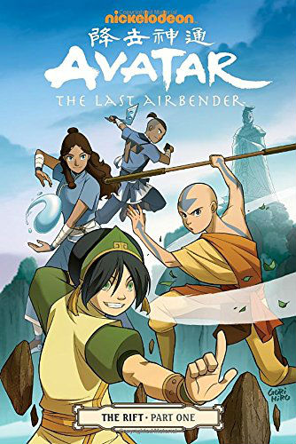
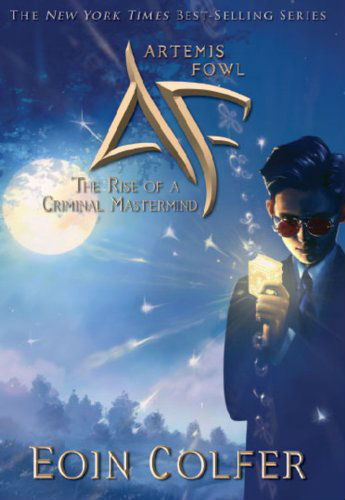
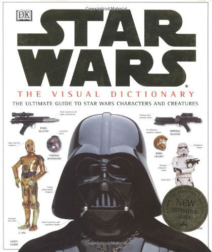
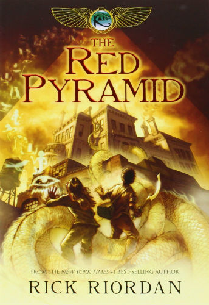
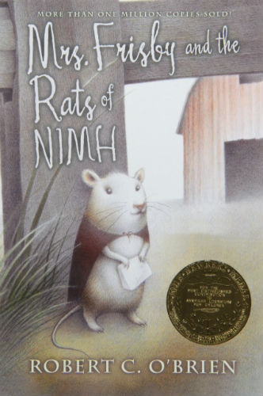
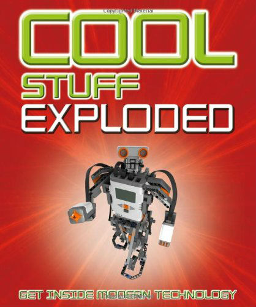

In fourth grade, my son continued to read many of [his favorite book series from the 3rd grade.](http://192.168.1.34:4945/?p=2865) But he added some new books as well. Here are 7 of the best books for boys, my son’s favorite books in fourth grade.

*This post contains affiliate links, at no cost to you. Thanks for supporting this blog in this way!*

Best Books For Boys in Fourth Grade – my son’s favorite books
=============================================================

[Avatar: The Last Airbender – The Rift Part 1 by Gene Luen Yangm](http://www.amazon.com/gp/product/1616552956/ref=as_li_qf_sp_asin_il_tl?ie=UTF8&camp=1789&creative=9325&creativeASIN=1616552956&linkCode=as2&tag=esiv-20&linkId=HOTNK6YTSFITZNDS) – A graphic novel based on the television cartoon series with the same name.

  
[Artemis Fowl by Eoin Colfer](http://www.amazon.com/gp/product/1423136810/ref=as_li_qf_sp_asin_il_tl?ie=UTF8&camp=1789&creative=9325&creativeASIN=1423136810&linkCode=as2&tag=esiv-20&linkId=JZJGBWJUFWC4ANSH) – Young millionaire genius Artemis Fowl doesn’t know what he’s taken on when he kidnaps a technologically advanced fairy.

[The Visual Dictionary of Star Wars, Episodes IV, V, &amp; VI: The Ultimate Guide to Star Wars Characters and Creatures](http://www.amazon.com/gp/product/0789434814/ref=as_li_qf_sp_asin_il_tl?ie=UTF8&camp=1789&creative=9325&creativeASIN=0789434814&linkCode=as2&tag=esiv-20&linkId=WXIPDPQJZ5HNUH5L) – Lots of photos and lots of information on Star Wars characters, creatures, and technology.

[The Kane Chronicles by Rick Riordan](http://www.amazon.com/gp/product/1423199626/ref=as_li_qf_sp_asin_il_tl?ie=UTF8&camp=1789&creative=9325&creativeASIN=1423199626&linkCode=as2&tag=esiv-20&linkId=CZXJIYSD3UN5IKH6) – Set in the same universe as Percy Jackson, this time it’s a brother and sister duo who find out that they’re descended from the Egyptian pharaohs. When their mom gets killed trying to keep an evil out of the world, they’re raised separately until their dad dies as well. They are then forced to continue their parent’s battle with the help of their sister’s special cat and their magician uncle.  
[Mrs. Frisby and the Rats of NIMH by Robert C. O’Brien](http://www.amazon.com/gp/product/0689710682/ref=as_li_qf_sp_asin_il_tl?ie=UTF8&camp=1789&creative=9325&creativeASIN=0689710682&linkCode=as2&tag=esiv-20&linkId=ZLQSXZJI5C52MUPR) – When the rat Mrs. Frisby’s son gets sick, she must overcome her fears to enlist the help of a highly advanced society of escaped lab rats. Kids who enjoy this will also enjoy Warriors, from the list of [My Son’s Favorite Books in 3rd Grade.](http://192.168.1.34:4945/?p=2865)  
[Cool Stuff Exploded by Chris Woodford](http://www.amazon.com/gp/product/0756640288/ref=as_li_qf_sp_asin_il_tl?ie=UTF8&camp=1789&creative=9325&creativeASIN=0756640288&linkCode=as2&tag=esiv-20&linkId=B4CBNHLUPPP3W3SF) – The third book in the Cool Stuff series, it has more technology with descriptions and photos of parts to spend hours pouring over.

Readers’ interests and ability are varied. Be sure to check out all [my other lists of my kids’ favorite books](http://192.168.1.34:4945/?p=2774), particularly my [Best Books for Girls in 4th Grade](http://192.168.1.34:4945/?p=2941) and Best Books for [Boys in 3rd Grade.](http://192.168.1.34:4945/?p=2865)