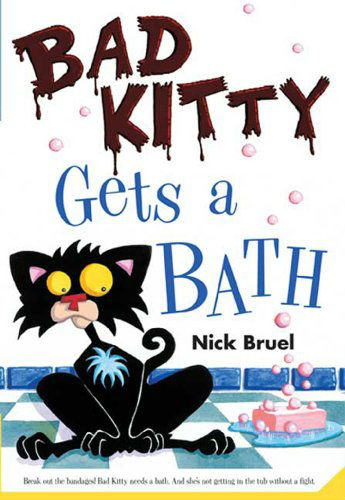
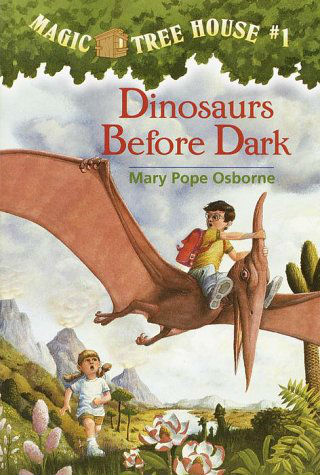
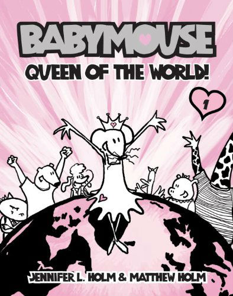
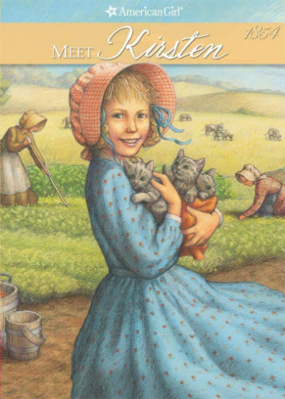
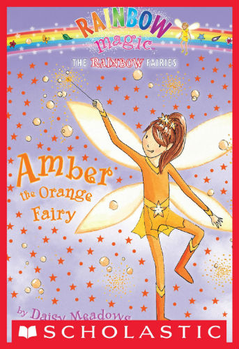
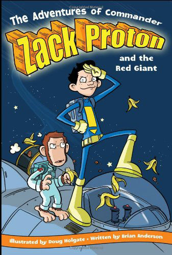
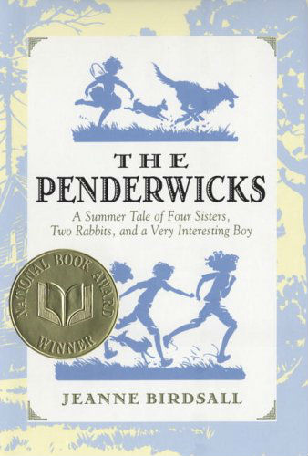
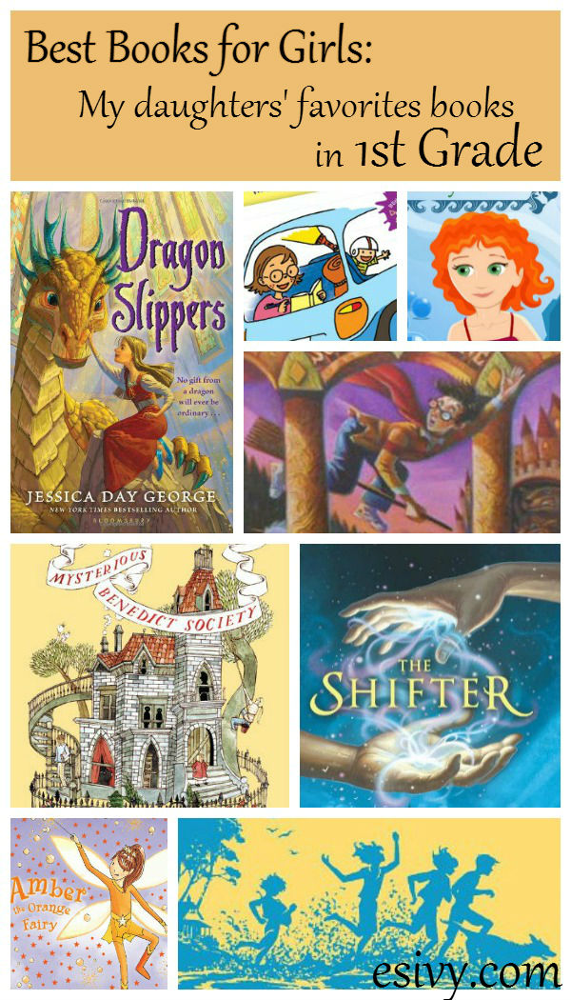

In first grade, kids are just getting started with independent reading. If you don’t read kids’ books for your own entertainment (I do!) you might have trouble coming up with some suggestions for your kids. But better than my suggestions, are the suggestions of other kids. Here are 7 of the best books for girls, my daughter’s favorite books in first grade.

*This post contains affiliate links, at no cost to you. Thanks for supporting this blog in this way!*

Best Books For Girls in First Grade – my daughters’ favorite books
==================================================================

[Bad Kitty by Nick Bruel](http://www.amazon.com/gp/product/1250010349/ref=as_li_qf_sp_asin_il_tl?ie=UTF8&camp=1789&creative=9325&creativeASIN=1250010349&linkCode=as2&tag=esiv-20&linkId=3RT53G2FQNDJDNLL) (series) – Bad Kitty does not want to take a bath or have a pet sitter. See what Bad Kitty thinks of a birthday party! Lots of antics illustrated with fun drawings in this beginning chapter book.

[Magic Treehouse, by Mary Pope Osborne](http://www.amazon.com/gp/product/0679824111/ref=as_li_qf_sp_asin_il_tl?ie=UTF8&camp=1789&creative=9325&creativeASIN=0679824111&linkCode=as2&tag=esiv-20&linkId=JAGHDHUPEEKR3MJO) (series) – An easy to read chapter book series about a boy, a girl, and the journeys they take in their magical treehouse.

[Babymouse by Matthew Holm](http://www.amazon.com/gp/product/0375832297/ref=as_li_qf_sp_asin_il_tl?ie=UTF8&camp=1789&creative=9325&creativeASIN=0375832297&linkCode=as2&tag=esiv-20&linkId=EM5QFRMBG4EE2RTQ) (series) – A graphic novel (lots of pictures) about a mouse with big dreams, like being Queen of the World!

[Meet Kirsten (The American Girls Collection) by Janet Beeler Shaw](http://www.amazon.com/gp/product/B00AKF7J8Q/ref=as_li_qf_sp_asin_il_tl?ie=UTF8&camp=1789&creative=9325&creativeASIN=B00AKF7J8Q&linkCode=as2&tag=esiv-20&linkId=NGLNFQKSZKKXJVZR) (series) – Kirsten arrives in America in 1854. Read about how strange it all seemed and how America became her home.

[Rainbow Magic #1: Ruby the Red Fairy by Daisy Meadows](http://www.amazon.com/gp/product/043973861X/ref=as_li_qf_sp_asin_il_tl?ie=UTF8&camp=1789&creative=9325&creativeASIN=043973861X&linkCode=as2&tag=esiv-20&linkId=OQ4BCXFTTPWHW3Y7) (series) – Easy, fun chapter books about the search for missing fairies.

[The Adventures of Commander Zack Proton and the Red Giant by Brian Anderson](http://www.amazon.com/gp/product/1416913645/ref=as_li_qf_sp_asin_il_tl?ie=UTF8&camp=1789&creative=9325&creativeASIN=1416913645&linkCode=as2&tag=esiv-20&linkId=4HSYGKOOYAUODFXQ) (trilogy) – The zany space adventures of a boy astronaut and the space chimp who rescues him after he opens the wrong door and tumbles out of his spaceship. Lots of funny illustrations in an early chapter book.

[The Penderwicks by Jeanne Birdsall](http://www.amazon.com/gp/product/0440420474/ref=as_li_qf_sp_asin_il_tl?ie=UTF8&camp=1789&creative=9325&creativeASIN=0440420474&linkCode=as2&tag=esiv-20&linkId=CR7MXJMK6K54RLWD) – The adventures of four sisters and a neighbor on their summer vacation. A modern kids book in the classic, old-fashioned style of kids literature. Listening to the audiobook is a great introduction to entice young readers into reading the book.

Readers’ interests and ability are varied. So be sure to check out all [my other lists of my kids’ favorite books](http://192.168.1.34:4945/?p=2774), particularly my [Best Books for Boys in 1st Grade](http://192.168.1.34:4945/?p=2791) and [Best Books for Girls in 2nd Grade.](http://192.168.1.34:4945/?p=2847)

