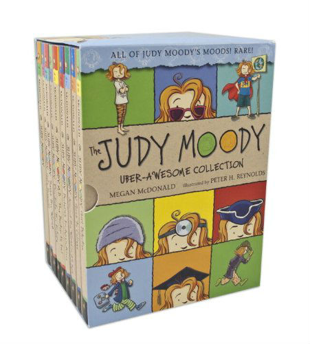
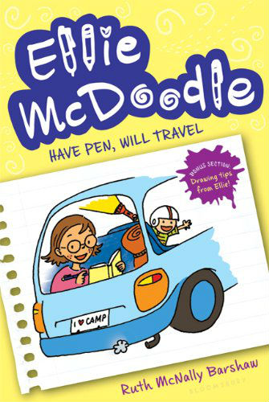
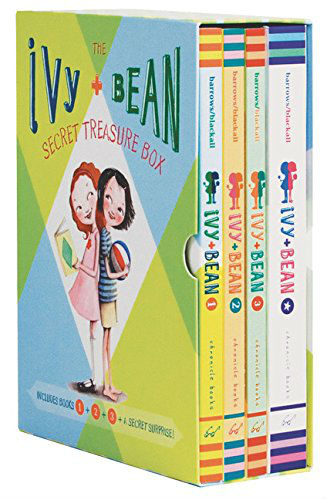
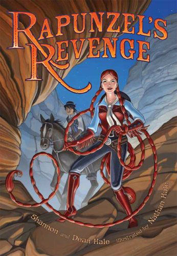
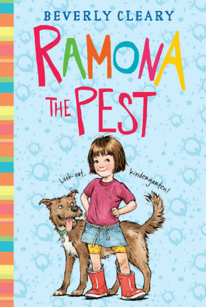
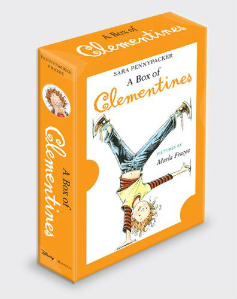
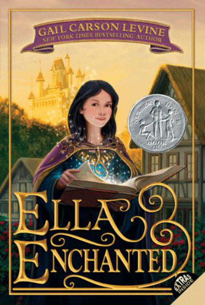
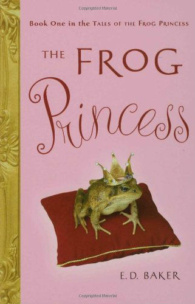

In second grade, readers can really take off. Or not. Don’t be worried if your child hasn’t turned into a reader yet. Just focus on making fun books available. If you don’t read kids’ books for your own entertainment (I do!) you might have trouble coming up with some suggestions for your daughter. But better than my suggestions, are the suggestions of another girl. Here are 9 of the best books for girls, my daughters’ favorite books in second grade, ordered roughly in order from the easiest to read to the more difficult.

*This post contains affiliate links, at no cost to you. Thanks for supporting this blog in this way!*

Best Books For Girls in Second Grade – my daughters’ favorite books
===================================================================

[Judy Moody, by Megan McDonald](http://www.amazon.com/gp/product/0763654116/ref=as_li_qf_sp_asin_il_tl?ie=UTF8&camp=1789&creative=9325&creativeASIN=0763654116&linkCode=as2&tag=esiv-20&linkId=5KYTYYSEVQ2EOTHP) (series) – Judy Moody has plans – big plans! They don’t always work out, but she always learns something along the way. Great early chapter book series.

[Ellie McDoodle, by Ruth McNally Barshaw](http://www.amazon.com/gp/product/1599907151/ref=as_li_qf_sp_asin_il_tl?ie=UTF8&camp=1789&creative=9325&creativeASIN=1599907151&linkCode=as2&tag=esiv-20&linkId=O4SH7LAX4COGRAY2), also called the Ellie McDoodle Diaries (series) – A series in graphic novel, diary format. Ellie uses her drawing journal to get through all sorts of situations, from her family trip to the travails of the school play. Great illustrations full of things worked into the plot like game instructions for group games.

[Ivy &amp; Bean, by Annie Barrows](http://www.amazon.com/gp/product/0811864952/ref=as_li_qf_sp_asin_il_tl?ie=UTF8&camp=1789&creative=9325&creativeASIN=0811864952&linkCode=as2&tag=esiv-20&linkId=CMUQIXCTAJYPRGCS) (series) – Ivy and Bean are best friends in spite of themselves. Bean is always getting into trouble and Ivy comes to her rescue, with more or less success.

[Rapunzel’s Revenge, by Shannon Hale, Dean Hale, and Nathan Hale](http://www.amazon.com/gp/product/1599902885/ref=as_li_qf_sp_asin_il_tl?ie=UTF8&camp=1789&creative=9325&creativeASIN=1599902885&linkCode=as2&tag=esiv-20&linkId=NU7FTYLRNHSMBE7G) – Rapunzel’s not a helpless maiden trapped in a tower, but instead a cowgirl with two braids and wicked lasso skills to use them.

[Ramona the Pest, by Beverly Cleary](http://www.amazon.com/gp/product/0380709546/ref=as_li_qf_sp_asin_il_tl?ie=UTF8&camp=1789&creative=9325&creativeASIN=0380709546&linkCode=as2&tag=esiv-20&linkId=Z4NMCZUB4OYK27JF) (series) – Technically book 2 in the Ramona books, this is a great place to start and understand things from Ramona’s eyes. Kids can relate to the difficulties of being seen as a pest when that’s not what you’re trying to do at all.

[Clementine, by Sara Pennypacker](http://www.amazon.com/gp/product/1423153731/ref=as_li_qf_sp_asin_il_tl?ie=UTF8&camp=1789&creative=9325&creativeASIN=1423153731&linkCode=as2&tag=esiv-20&linkId=F7QJR4BALSRA5MS2) (series) – Someone should tell you that you’re not supposed to answer the phone in the principal’s office. Clementine just thought she was being helpful. Clementine and Ramona would have been great friends, but would have perpetually been in trouble.

[Ella Enchanted, by Gail Carson Levine](http://www.amazon.com/gp/product/0064407055/ref=as_li_qf_sp_asin_il_tl?ie=UTF8&camp=1789&creative=9325&creativeASIN=0064407055&linkCode=as2&tag=esiv-20&linkId=73OWXBALAFMY5PLP) – In this fairy tale twist, Ella is enchanted by a fairy and has to find the key to breaking the curse herself, not just rely on her fairy godmother.

[Frog Princess, by E.D. Baker](http://www.amazon.com/gp/product/1582349231/ref=as_li_qf_sp_asin_il_tl?ie=UTF8&camp=1789&creative=9325&creativeASIN=1582349231&linkCode=as2&tag=esiv-20&linkId=475Q5HKSGSOGX657) – When the princess kisses the frog, it doesn’t turn into a prince. Instead, she turns into a frog too! Together they set off to find how to reverse the curse.

Readers’ interests and ability are varied. Be sure to check out all [my other lists of my kids’ favorite books](http://192.168.1.34:4945/?p=2774), particularly my [Best Books for Girls in 1st Grade](http://192.168.1.34:4945/?p=2806) and Best Books for [Boys in 2nd Grade.](http://192.168.1.34:4945/?p=2793)