In fourth grade, my daughters continued to add some series and authors to their reading list that they would enjoy for many years to come. Here are 11 of the best books for girls in fourth grade, my daughters’ favorites.

*This post contains affiliate links, at no cost to you. Thanks for supporting this blog in this way!*

Best Books For Girls in Fourth Grade – my daughters’ favorite books
===================================================================

[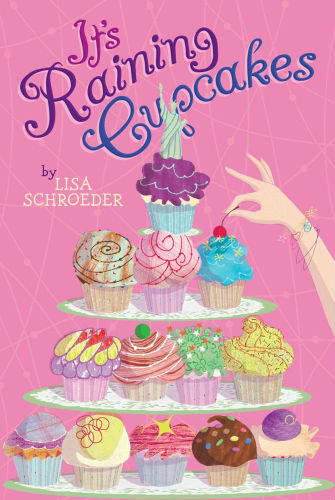It’s Raining Cupcakes by Lisa Schroeder](http://www.amazon.com/gp/product/1416990852/ref=as_li_qf_sp_asin_il_tl?ie=UTF8&camp=1789&creative=9325&creativeASIN=1416990852&linkCode=as2&tag=esiv-20&linkId=WEP6HKFSPLLJ5KRE) – Isabel wants to enter a baking contest and win a trip to New York City, but there’s one problem. Her best friend wants to enter it too.

[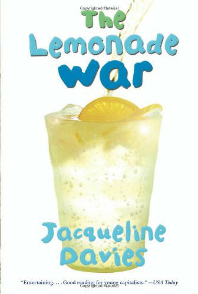The Lemonade War (The Lemonade War Series) by Jacqueline Davies](http://www.amazon.com/gp/product/0547237650/ref=as_li_qf_sp_asin_il_tl?ie=UTF8&camp=1789&creative=9325&creativeASIN=0547237650&linkCode=as2&tag=esiv-20&linkId=U7LWWHWFIVEKR26L) – Evan and his sister Jessie open rival lemonade stands and each think they know what it will take to beat out the competition. Who will win? Is there even a winner in an argument like this? (Shh… Don’t tell your kids but there’s some math and business tactics in this book.)

[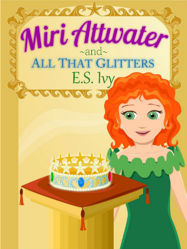Miri Attwater and All That Glitters (Miri Attwater, Mermaid Princess Adventures Book 2) by E.S. Ivy](http://www.amazon.com/gp/product/B00HKK1GYC/ref=as_li_qf_sp_asin_il_tl?ie=UTF8&camp=1789&creative=9325&creativeASIN=B00HKK1GYC&linkCode=as2&tag=esiv-20&linkId=WNRAP4ELSCQ6W47Q) – Miri isn’t too thrilled about the fish part of being a mermaid, living at the bottom of the ocean and slimy things, but it’s only for the summer. Then the Queen’s crown is stolen and no one can leave the mermaid colony until it’s recovered. Can she help solve the mystery and the theft? (Shhh.. Don’t tell your kids, but there’s some science in this story.)

[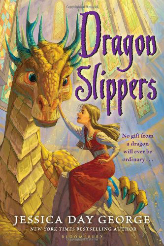Dragon Slippers by Jessica Day George](http://www.amazon.com/gp/product/1599902753/ref=as_li_qf_sp_asin_il_tl?ie=UTF8&camp=1789&creative=9325&creativeASIN=1599902753&linkCode=as2&tag=esiv-20&linkId=QEQ2ISQEOAUIDJLU) – To keep a dragon from eating her, Creel ends up befriending it and ends up with a pair of pretty slippers in the process. If only those slippers couldn’t be used to destroy the kingdom!

[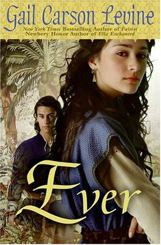Ever by Gail Carson Levine](http://www.amazon.com/gp/product/0061229644/ref=as_li_qf_sp_asin_il_tl?ie=UTF8&camp=1789&creative=9325&creativeASIN=0061229644&linkCode=as2&tag=esiv-20&linkId=ETT6SQ73P6U4GOYX) – When Kezi’s father bargains with a god to save her mother’s life, Kezi turns out to be the sacrifice. Can the young god Olus, god of the winds, help prevent her sacrifice as they both confront their fears?

[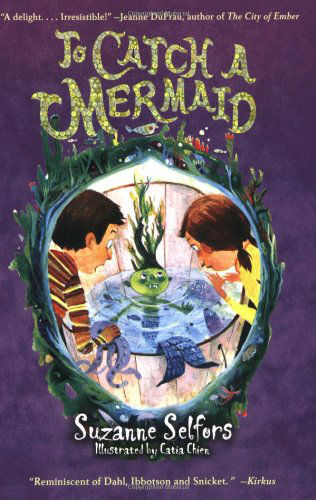To Catch a Mermaid by Suzanne Selfors](http://www.amazon.com/gp/product/0316018171/ref=as_li_qf_sp_asin_il_tl?ie=UTF8&camp=1789&creative=9325&creativeASIN=0316018171&linkCode=as2&tag=esiv-20&linkId=AS6YPGSS453ONAH3) – When Boom finds a baby mermaid that grants wishes, he thinks he has it made. Until his sister starts to turn green!

[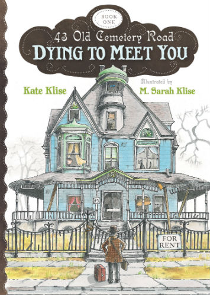Dying to Meet You (43 Old Cemetery Road) by Kate Klise](http://www.amazon.com/gp/product/0547398484/ref=as_li_qf_sp_asin_il_tl?ie=UTF8&camp=1789&creative=9325&creativeASIN=0547398484&linkCode=as2&tag=esiv-20&linkId=YZSWJQ6JGYQ7USCV) – A story told in a lively format that includes letters, drawings, and newspaper articles, about a grumpy old man — I. B. Grumply, and abandoned boy — Seymour Hope, his cat, and a ghost named Olive C. Spence.

[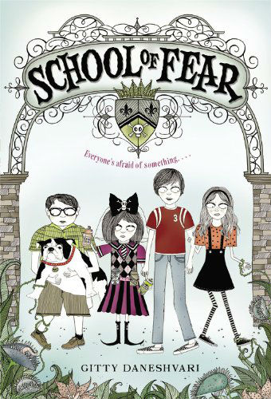School of Fear by Gitty Daneshvari ](http://www.amazon.com/gp/product/0316033278/ref=as_li_qf_sp_asin_il_tl?ie=UTF8&camp=1789&creative=9325&creativeASIN=0316033278&linkCode=as2&tag=esiv-20&linkId=KC4JTSCLFBW3Y6UN)– Four kids are sent to summer school to help get them over their fears – bugs, confined spaces, water, and death – at a school run by a seemingly crazy ex-beauty queen. To escape, they’ll literally have to face their fears. (And I mean “literally” as in the literal definition of the word, not the slang meaning! As someone recently said, we literally need another word that means “literally.”)

[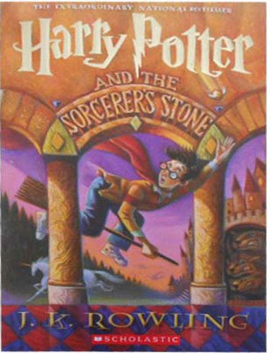Harry Potter and the Sorcerer’s Stone by J. K. Rowling](http://www.amazon.com/gp/product/059035342X/ref=as_li_qf_sp_asin_il_tl?ie=UTF8&camp=1789&creative=9325&creativeASIN=059035342X&linkCode=as2&tag=esiv-20&linkId=XR6LZUDJN7H6L2GO) – Raised by an unloving Aunt and Uncle, Harry Potter has no idea he’s a wizard and famous in the wizarding world, until he gets a magical letter of admittance to the Hogwarts. At a crazy school where the paintings on the wall talk and ghosts roam the halls, he’ll have the make friends and gain skills to face the evil wizard who killed his parents.

[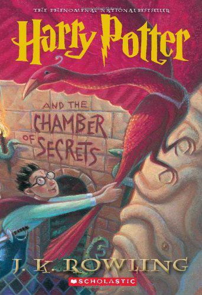Harry Potter And The Chamber Of Secrets by J. K. Rowling](http://www.amazon.com/gp/product/0439064872/ref=as_li_qf_sp_asin_il_tl?ie=UTF8&camp=1789&creative=9325&creativeASIN=0439064872&linkCode=as2&tag=esiv-20&linkId=UFIVYURHOKURVT4S) – In Harry’s second year at Hogwarts, something starts turning students to stone. It’s up to Harry and his friends to solve the puzzle before all the students are turned to stone – permanently.

[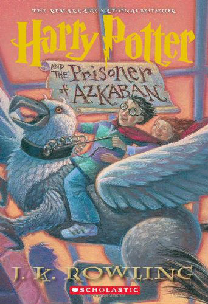Harry Potter and the Prisoner of Azkaban by J. K. Rowling](http://www.amazon.com/gp/product/0439136369/ref=as_li_qf_sp_asin_il_tl?ie=UTF8&camp=1789&creative=9325&creativeASIN=0439136369&linkCode=as2&tag=esiv-20&linkId=K26FRVVFKJCTRSIC) – The notorious convict Sirius Black, who betrayed Harry’s parents, has escaped from the prison of Azkaban. Now he’s after Harry!

Readers’ interests and ability are varied. Be sure to check out all [my other lists of my kids’ favorite books](http://192.168.1.34:4945/?p=2774), particularly my [Best Books for Girls in 3rd Grade](http://192.168.1.34:4945/?p=2866) and Best Books for [Boys in 4th Grade.](http://192.168.1.34:4945/?p=2924)

Happy Reading!