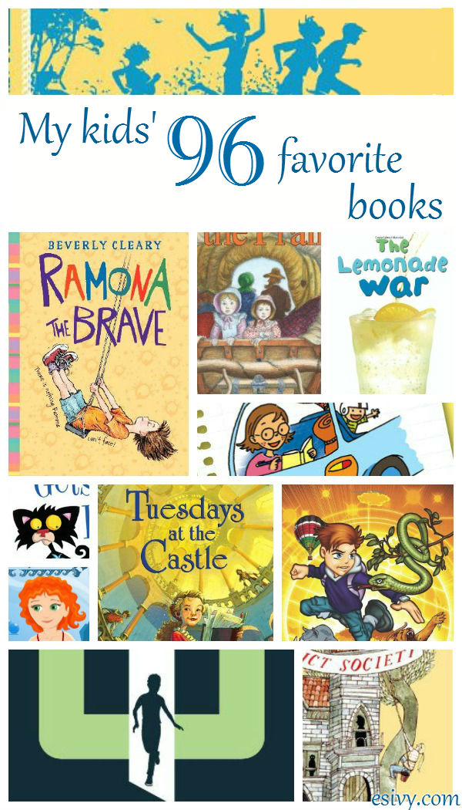

There many lists claiming to be lists of the best kids books. Lists of hundreds — if not thousands— of kids’ books that are carefully curated for their “literary merit.” I’m not a literature expert, just a children’s book author – but most of all a mom – who loves reading, with a house full of readers.

I don’t know about you, but when I read those long lists I find myself asking, “Yeah, but are the books really any fun to read?” Because when it comes to reading for kids, that’s what I’m most concerned about, fun. [When a kid likes to read — *loves* to read — because it’s fun, the rest will follow.](http://192.168.1.34:4945/?p=2766)

And that’s why the books on these best kids book lists are what *my kids* consider the best books. The ones they’ve read over and over, remember fondly, and the ones who were a great distraction — a friend — in times of need. And that’s why there aren’t “neat numbers.” I didn’t add books just to get to 10 or 20 in a list.

Below are the lists I’ll be covering in this post series. Links will go live after the posts go live, and you’ll be able to use this as a reference list to navigate your way around.

- [My Son’s 4 Favorite Books in 1st Grade](http://192.168.1.34:4945/?p=2791)
- [My Girls’ 7 Favorite Books in 1st Grade](http://192.168.1.34:4945/?p=2806)
- [My Son’s 9 Favorite Books in 2nd Grade](http://192.168.1.34:4945/?p=2793)
- [My Girls’ 9 Favorite Books in 2nd Grade](http://192.168.1.34:4945/?p=2847)
- [My Son’s 8 Favorite Books in 3rd Grade](http://192.168.1.34:4945/?p=2865)
- [My Girls’ 9 Favorite Books in 3rd Grade](http://192.168.1.34:4945/?p=2866)
- [My Son’s 7 Favorite Books in 4th Grade](http://192.168.1.34:4945/?p=2924)
- [My Girls’ 11 Favorite Books in 4th Grade](http://192.168.1.34:4945/?p=2941)
- My Son’s 6 Favorite Books in 5th Grade
- My Girls’ 11 Favorite Books in 5th Grade
- My Son’s 9 Favorite Books in Middle School
- My Girls’ 11 Favorite Books in Middle School
- My Son’s 4 Favorite Books in High School