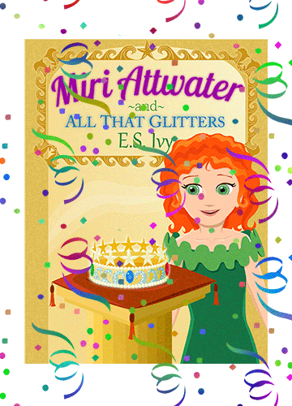

Book 2 in the Miri Attwater series, Miri Attwater and All That Glitters is now out! [Buy it on Amazon!](http://www.amazon.com/gp/product/B00HKK1GYC/ref=as_li_qf_sp_asin_il_tl?ie=UTF8&camp=1789&creative=9325&creativeASIN=B00HKK1GYC&linkCode=as2&tag=esiv-20 "Buy it on Amazon!")

(Confetti and streamers compliments of my TechBoy! Aren’t they great? I would have added some cheering and clapping but it’s just annoying when you click on a website and your speakers start blaring. So, you’re welcome.)

*As if finding out she’s a mermaid isn’t shocking enough, now Miri has to spend her summer at the bottom of the ocean!* 

*Slimy pets, weird and salty food,…* 

*Miri doesn’t think she’ll ever get used to any of it.* 

*But the mermaid city of Kai Kaona is so beautiful, she’s made some special friends, and she’s surprisingly good at hulikela, a type of underwater dancing. Then, just as she decides things aren’t too bad after all, the coronation crown is stolen. Is she going to be stuck at the bottom of the ocean forever?*

Find out how Miri copes with living at the bottom of the ocean and see what adventures she gets into. Check it out on [Amazon.](http://www.amazon.com/gp/product/B00HKK1GYC/ref=as_li_qf_sp_asin_il_tl?ie=UTF8&camp=1789&creative=9325&creativeASIN=B00HKK1GYC&linkCode=as2&tag=esiv-20 "Buy it on Amazon!")

And I’ve got lots in store for this blog the rest of the week, so stop back by!

UPDATE: The first [review of Miri Attwater and All That Glitters is out at Books, Babies and Bows!](http://booksbabiesandbows.blogspot.com/2014/01/miri-attwater-and-all-that-glitters-by.html "book review") I’ll do a dedicated post later, but go ahead and [check it out](http://booksbabiesandbows.blogspot.com/2014/01/miri-attwater-and-all-that-glitters-by.html "book review"). 🙂