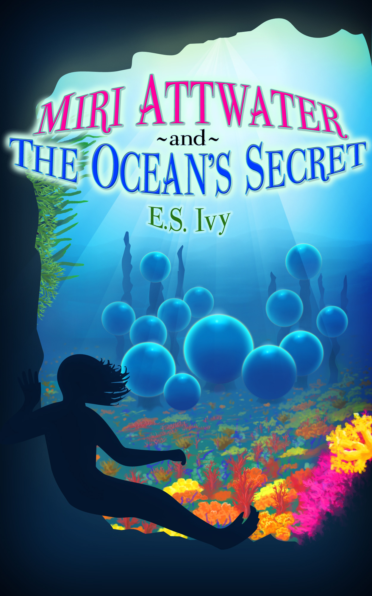
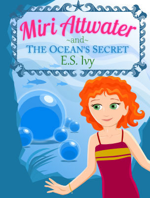

Now it’s time to put it all together! I think you’re going to like the new book cover design. The aim was to make the new cover friendlier for younger readers. I must say, TechnoTim does amaze me with his learning of new programs for this project.

Just to remind you, the original cover is this:

(Hehe. I bet you’re thinking that’s *all* over this page, so why am I reposting it? Well, as you can imagine, there are plans for the webpage design to change. One thing at a time!)

So, we took [Miri in full color](http://192.168.1.34:4945/behind-the-books/book-cover-design-miri-attwater-oceans-secret-cover-redesign-part-4/)[,](http://www.miriattwater.com/2013/11/miri-attwater-and-oceans-secret-cover.html) the [background…](http://192.168.1.34:4945/behind-the-books/book-cover-design-miri-attwater-oceans-secret-cover-redesign-part-5/ "Book Cover Design: Miri Attwater and the Ocean’s Secret Cover Redesign, part 5, background")

Oh! And we added a title, of course.

And the author name. That’s *really* important.

So here it is – the brand new cover for Miri Attwater and the Ocean’s Secret!

What do you think?