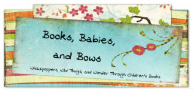

I know that book reviews for parents can be really useful when a parent is trying to pick out a good books for their kid to read. So I’m thrilled that [Books, Babies, and Bows has reviewed Miri Attwater and All that Glitters](http://booksbabiesandbows.blogspot.com/2014/01/miri-attwater-and-all-that-glitters-by.html "read Books Babies and Bows book review for parents of All That Glitters").

Books, Babies, and Bows said that in All That Glitters *“…the masterfully laid out mystery in the book had us quickly turning pages…”*

And that *“…E. S. Ivy uses her scientific background to weave real science seamlessly into the storyline.”*

A dragon wrasse being cleaned by Rainbow cleaner wrasses on a reef in Hawaii. By Brocken Inaglory (Own work) via Wikimedia Commons

On of the favorite parts for Jenny and her two daughters was the scene where Miri visits a fish cleaning station to remove the algae growing on her skin. They wondered if there really are fish cleaning stations on the ocean. There are! When I first learned about them I was fascinated too. Next week, I’ll start a series of posts about fish cleaning stations.

[Books, Babies, and Bows](http://booksbabiesandbows.blogspot.com/ "book reviews for parents site") is a wonderful review site where Jenny reviews kids’ books with her two young daughters in mind. Hop on over and read the full [review of Miri Attwater and All That Glitters over at Books, Babies, and Bows](http://booksbabiesandbows.blogspot.com/2014/01/miri-attwater-and-all-that-glitters-by.html "kids book review for parents, Miri Attwater and All That Glitters") and find other great kids’ books while you’re there.