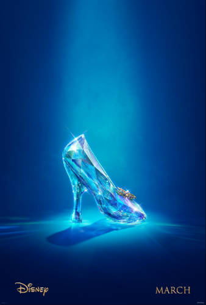

Are you like me and you haven’t seen the new Disney [Cinderella](http://movies.disney.com/cinderella/) movie yet?

Maybe you’re worried about showing your young daughter an out-dated fairy tale where a young maiden is distress is saved by a charming prince who swoops in and saves the day? Well the press information that Disney has released suggests that they really tried to do otherwise. Instead, they tried to produce a film that shows that “kindness can be a type of super power.”

According to Disney, this is shown in the film when “…despite the cruelty inflicted upon her, Ella will not give into despair nor despise those how mistreat her, and she continues to remain positive…” This struck me as interesting because I remember hearing in a recent news story that, during the holocaust, it was often those who managed to remain hopeful that survived the horrors of the concentration camps.

It’s funny how when you start studying something the subject starts popping up all sorts of places. Because I couldn’t help but have this bring to mind my recent readings about success. From my recent reading on [Mindset](http://mindsetonline.com/), by Carol Dwek, the ability to remain optimistic is important to develop if we don’t possess it naturally.

Maybe I should confess here that I think I remember as a child being in awe of how Cinderella could stay so nice and happy with all those terrible things happening to her. So if it doesn’t come naturally to you or your kids, you might be wondering how you can cultivate this. I’m intrigued that Disney/Pixar is coming out with a movie this summer that looks like it might actually provide a little insight into this, [Inside Out](http://movies.disney.com/inside-out), which is about, well… It’s best explained by watching a trailer.

<iframe allowfullscreen="allowfullscreen" frameborder="0" height="315" src="https://www.youtube.com/embed/1HFv47QHWJU?rel=0" width="560"></iframe>

Analyzing both of these movies could lead to some interesting discussions with your kids! Maybe you’d really like to just watch all your movies for fun, and that’s okay too. But I know that even my high school son would be glad to watch a Cinderella movie and analyze it if it meant he didn’t have to read and analyze another short story where “someone always dies in EVERY SINGLE ONE OF THE STORIES.” &lt;Sigh&gt; I really hate [the strangle-hold that depressing-drama-literature-lovers seem to have on literature education in this country.](http://192.168.1.34:4945/?p=749)

But back to the more fun subject of the Cinderella movie!

On the question of romance, the directors made a special effort to “address the notion of choosing who we spend the rest of our lives with” in a more thoughtful way. Chris Weitz, who wrote the screenplay, had the idea of Cinderalla and the Prince meeting earlier in the story and showing how they influence each other’s ideas, as well as form a connection of sharing similar views on life.

We’ve got older kids, but there’s an activity from the Disney Cinderella press kit on clock reading if you have younger ones (pdf below). We’ve found that our teens can’t instantly read analog clocks so we’ve recently filled our house with them. The Cinderella movie could be great motivation for practicing clock reading!

However, I can’t help wishing that they hadn’t put a corset on the lovely Lily James to make her already small waist look even more Barbie proportions tinier. I know they were trying to give the movie a 19th century feel, but as it wasn’t a true period piece I don’t think it was necessary. I’ll refrain from mentioning that I also don’t think the amount of cleavage they revealed in the official movie poster was necessary. Oops! I just did.

In spite of that, I’m looking forward to seeing it. One of my daughters has been lucky enough to see it, and she says it’s fantastic!

UPDATE: I noticed that someone came to my post after having searched “is the new Cinderella movie good for kids.” I have now seen the movie and it really was beautiful! If I watch a movie with a specific age group in mind, I notice things I wouldn’t otherwise. Since I had my teens with me, I didn’t really have little kids in mind. However, there was a tiny little girl, 6 or 8, sitting next to me and at no point did I worry about her. (Yes, seeing little kids in a movie that I find scary does bother me!) The movie is sad when the parents die, but it’s not over-done, and you see Cinderella coping and the ways in which your loved ones always stay with you. (My girls were sensitive to parents dying in books and movies when they were younger.) You can see a more in-depth description of the off-camera deaths in the movie over at [My Crazy Good Life, Cinderella Parent Review.](http://mycrazygoodlife.com/cinderella-parent-review/)

There is a bit of tension, but it’s comical, with exploding pumpkins one way or another. Animals do change into humans or other animals (this is another thing that scared my kids in the Shaggy D.A. ) but they change back without too much angst. Cinderella gets chased as she leaves the castle, but there’s a lot of comical relief as she does. A cat chases mice that are friends, but never catches them. I would hazard to say that it’s less scary than the animated version. For example, the scene where the Step-mother locks Cinderella in the attic is less traumatic. It’s definitely less scary than the animated Snow White (which is the first scary movie I remember seeing.) That’s all that comes to mind right now. But at the end of the movie the little girl next to me did a fist pump and said “Yes!” when they kissed at the end. 🙂 That’s quite an endorsement!

*Media from Walt Disney Studios* *and Youtube. I was not compensated for these movie reviews. All thoughts and comments are my own.*

[Click here to view the pdf for the Disney Cinderella clock craft](http://192.168.1.34:4945/wp-content/uploads/2015/03/Cinderella-clock-craft.pdf "download the pdf")