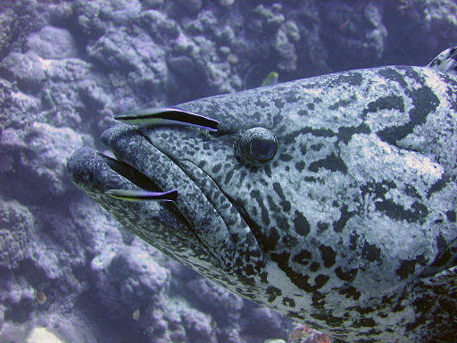

As I mention in[ last weeks post about fish cleaning stations,](http://192.168.1.34:4945/?p=1825) I didn’t intend to do any research for the Miri Attwater series. So when I did start doing some research, I wasn’t doing it like I would if I had been writing a non-fiction book about marine biology. I wasn’t taking a lot of detailed notes with page numbers and cross-referencing. I wasn’t double checking to see if information I got in one source could be confirmed by other sources. I wasn’t looking at a lot of original sources – meaning I wasn’t reading scientific research articles in marine biology journals. Because I know from my text book writing and editing work that there is lots of misinformation in science books and text books, and it gets copied when writers don’t go back to original sources. Writing a really well researched science book takes time – a lot of it. And it helps if you’re an expert in the field.

Really, my first goal for my research was to look at pretty pictures so I could make the underwater scenes in the book more real to the reader.

I probably shouldn’t have been surprised that the more I saw, the more amazed I became by the diversity of marine life. But I still wanted to write a fantasy, not a nonfiction informational book. So I didn’t keep detailed lists and notes of all the information I came across. I felt like if I did that kind of in-depth research and note taking, then I would start to develop a list of things that I wanted to include in the book. Then all the information would be in danger of taking over from the story. I wanted the story to be most important.

A potato cod is cleaned by two striped cleaner wrasse, By Richard Ling, via Wikimedia Commons

There were some subjects that I ended up reading in depth on both in books and on the web. Others things I thought were interesting, but I didn’t know immediately when I saw them that I would use them in the story. They just became some of my general background knowledge that I had about life in the ocean. The fish cleaning stations in the scene in [Miri Attwater and all That Glitters](http://www.amazon.com/gp/product/B00HKK1GYC/ref=as_li_qf_sp_asin_il_tl?ie=UTF8&camp=1789&creative=9325&creativeASIN=B00HKK1GYC&linkCode=as2&tag=esiv-20 "Buy it on Amazon") were one of those. I don’t know quite when it occurred to me that it would make a fun scene.

It wasn’t until I was reviewing videos for this series of posts that I realized something. In all the videos I was viewing, yellow tangs and other cleaner fish were eating algae off the backs of turtles. Wrasse were the cleaner fish cleaning sharks and rays, and lots of other fish – including yellow tangs. And when I viewed videos with commentary, they mentioned that wrasse were eating dead skin and parasites. They didn’t say anything about wrasse eating algae.

While I have both tangs and wrasse in the cleaning station scene, I have Miri and Fisk having the algae cleaned off them by wrasse. Oops! Did I make a mistake? Information about fish cleaning stations isn’t easy to find. I think perhaps it’s one of those areas of science that’s an emerging area of research. Maybe because as [Howard Hall, and IMAX photographer, mentions in his notes while filming his latest movie, cleaner fish and cleaning can be disturbed by divers.](http://www.oneworldoneocean.com/blog/howard_hall_west_papua#.Uu7nJ_mwLwl) I did find a bunch of mentions on aquarium boards that people talked about their wrasse eating algae, but I still wasn’t sure.

I got really excited when I finally found this website: [Cleaner Fish do Clean by Coral Reef Ecology Laboratory.](http://www.lexagrutter.com/cleaner%20fish%20do%20clean/cleaner%20fish%20do%20clean.htm) Now I could satisfy the only definitive way to be sure of an answer in science – ask an expert! I contacted Dr. Lex Grutter, and she was kind enough to answer me back. Sure enough, biologists consider wrasse carnivores, which means for a wrasse to clean Miri she would probably have to have a cut or be infected by parasites. Ooh, yuck!

It’s a pretty minor detail. Most readers are likely to only remember that Miri was cleaned by fish at a cleaning station and learn a little tiny bit more about the wondrous life under the ocean. And since some people have reported their aquarium wrasse eating algae, I could have satisfied the question by saying that the wrasse in Kai Kaona might act a little bit different. I do describe all the marine life in Kai Kaona as being transplanted from all over the world, like in our gardens and zoos.

But, I like to be as accurate as possible. So I tweaked the scene by having the cleaner fish that tickle Miri while they’re eating algae be yellow tangs instead. I’ll post the corrected excerpt on next week’s posts. I’ll also ask Amazon to make corrected versions available to readers who have already purchased, [Miri Attwater and All That Glitters](http://www.amazon.com/gp/product/B00HKK1GYC/ref=as_li_qf_sp_asin_il_tl?ie=UTF8&camp=1789&creative=9325&creativeASIN=B00HKK1GYC&linkCode=as2&tag=esiv-20 "Buy it on Amazon") as soon as I can get the new copy uploaded.

If you want to learn more about fish cleaning stations, here’s a great video to get a good overview of lots of different cleaner fish and their behaviors.  
<iframe allowfullscreen="allowfullscreen" frameborder="0" height="480" src="//www.youtube.com/embed/gQ0ueM1si8A?rel=0" width="853"></iframe>

And if you need to write a report or you’d like to learn even more about cleaner fish and fish cleaning stations, check out the following websites.

[Cleaner Fish do Clean by Coral Reef Ecology Laboratory](http://www.lexagrutter.com/cleaner%20fish%20do%20clean/cleaner%20fish%20do%20clean.htm)

[Turtle Cleaning Stations on SailHawaii.com.](http://sailhawaii.com/turtle_cleaning_station.html)

[Symbiosis of Sea Turtles and Yellow Tang on Demand Media.](http://animals.pawnation.com/symbiosis-sea-turtles-yellow-tang-4583.html) (This site has a lot of ads, but good concise information.)