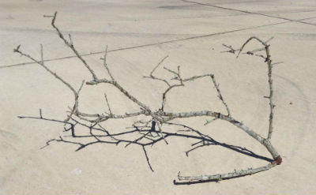
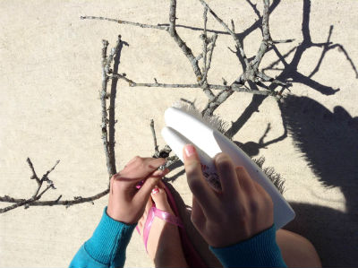
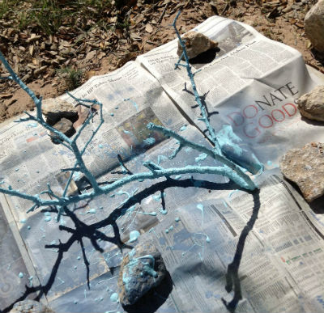
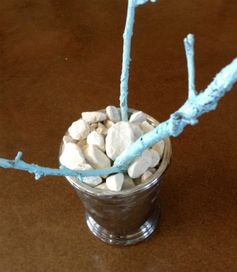
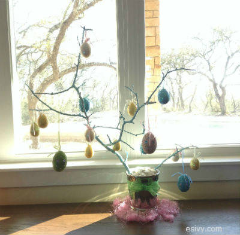

Can’t stand to look at Pinterest because you feel like such a failure as Super Mom? You are not alone! I am constantly plagued by the fear that I am not doing enough with my kids. And that’s coming from someone who for a while sold craft ideas to Family Fun Magazine. Later, when I hit a slump I couldn’t even stand to look at the magazine because it reminded me of all the great activities I *should* be doing with my kids.

I have been chatting with some other super moms recently and have found that I’m not the only one who feels this way.

We talk about and publicly post our successes.

We only see our own failures!

Is that mixed up or what? But this weekend I got a hint that, yes, maybe I am not such a failure after all! 🙂 How do you know when you have done enough crafting with your kids? When they do it on their own.

Not that this is the first time my kids have done their own crafts, but just a recent reminder. So take heart, if you do *any* activities with your kids, you’re doing enough. Kids also need to learn how to entertain themselves.

Both my daughters were devastated to re-learn that our ratty old, tiny, cheap Easter tree had not made the move with us. (They had blocked out the memory of learning this last year.) I mentioned they could make a new and better one out of a tree branch, and Sparkle did! Dizzy helped her, so they even took pictures so I could post directions for you.

Easter Egg Tree
===============

1\. Choose a branch with lots of twigs. Sparkle just picked one up out of our yard. She had to remove the bottom branch to anchor into into the pot.

2\. The branch had lots of lichen on it, so she brushed it with a stiff brush. (Did you know that a lot of lichen growing on trees and rocks is a sign of low air pollution?)

3\. Paint the branch. She started out with spray paint but ran out, so she finished with a sample wall paint we had – any paint will work! (Here is where I would have gotten totally derailed. I was thinking white paint, and when I could only find blue I would have put off the project until I could go to the store… in other words, until never! But the blue turned out great. Lesson learned from my child.)

4\. Anchor the branch in a pot with rocks. You’ll want to put the branch in the pot and then pile the rocks on top/around it. This is where saving everything becomes useful. I had this great pot from some plant at Christmas that I saved. And these rocks were from some project of my sister’s. If you don’t have rocks, try rice or dried white beans.

5\. Hang eggs and enjoy! I had these eggs from craft stores that I used to hang from my chandelier at my last house. But, if you don’t have those handy, you can just hang regular plastic eggs with curling ribbon and it will still look festive.

