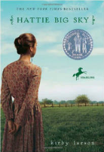

I was so honored to do my first ever guest post at the blog of Kirby Larson. Kirby is the author of the beautiful Newbery book, Hattie Big Sky, that won a well deserved Newbery Honor Award in 2007. It’s a story of a pioneer girl in the early 1900s in the style of my favorite Laura Ingalls Wilder book. I’ve given it many times as a gift and highly recommend it as a great read!

If you’re curious about a peek into some of how the Miri Attwater series came about, and how a fantasy book came to involve science, you can [read my guest blog post at Kirby’s Lane.](http://kirbyslane.blogspot.com/2014/01/friend-friday.html "E.S. Ivy at Kirby's Lane")