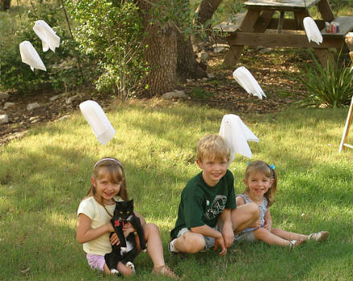
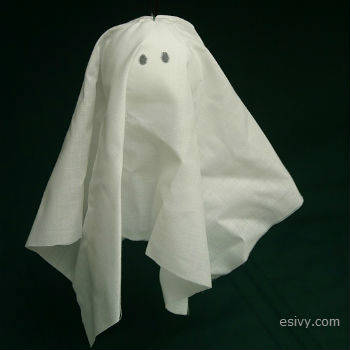

Hang these from your trees outside or chandeliers inside for super easy Halloween decorations.

Directions for Little Hanging Ghosts
===================================================================================================================

For each ghost you will need:  
3 inch Styrofoam ball  
16 inch square of white cloth  
1 ½ inch piece wire  
black permanent marker  
string for hanging

1\. Center the piece of cloth on top of the Styrofoam ball. Bend the piece of wire into a U-shape. Push the ends of the wire through the cloth  
and into the Styrofoam ball to hold the cloth in place and make a hook for hanging.  
2\. Draw on eyes with a black permanent marker.  
3\. Tie on string to hang.