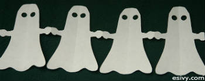

Try this variation on paper dolls to make some easy Halloween decorations.

================================================================================

Ghost Paper Doll Garland Directions
===================================

You will need:  
8 ½ x 11 inch white paper  
scissors  
hole punch

1\. Fold the short side of the paper up 1 ½ inches. Flip the paper over and turn the same edge, the same amount, to the opposite side. Continue  
flipping and folding the paper to fold the paper into an accordion, or fan, fold. Trim off the last ½ inch.  
2\. Trace half a ghost onto the folded paper, the arm and hand should reach the opposite side, just like you would for a paperdoll. Cut out the  
ghost shape.  
3\. Use the hole punch to make the eyes of each ghost while they are still folded in half.  
4\. Unfold and tape together strands made from different sheets of paper to make garlands.