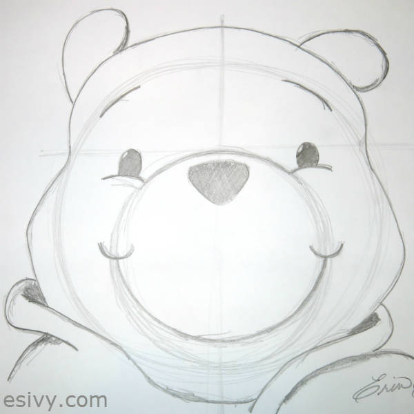
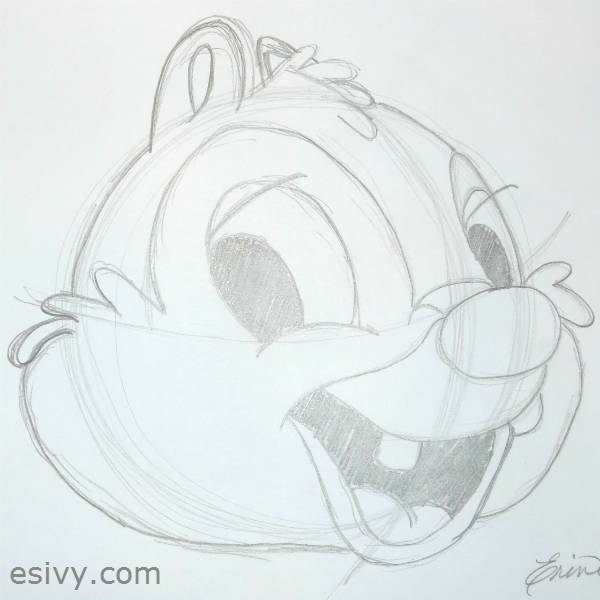
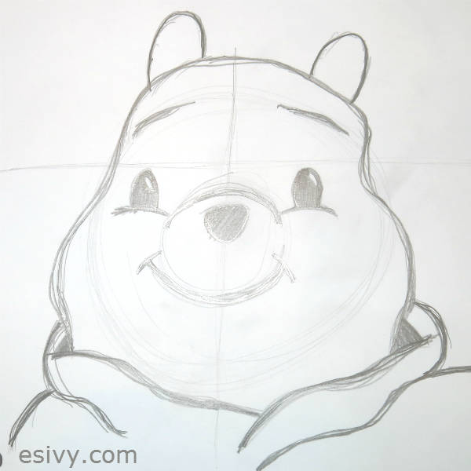

One of our favorite attractions at Disney Hollywood Studios was [The Magic of Animation: Animation Academy at the Animation Station](https://disneyworld.disney.go.com/attractions/hollywood-studios/magic-of-disney-animation/ "Hollywood Studios Magic of Animation"). My daughters are both artistic, so they were dying to go to a class, even though it meant devoting at least and hour out of a packed schedule. (Classes are generally every 30 minutes, but are often full, so be sure to check the schedule.) We sent the guys off to enjoy repeated rides on the [Star Wars ride Star Tours: The Adventures Continue,](https://disneyworld.disney.go.com/attractions/hollywood-studios/star-tours/ "Star Wars Star Tours") while the girls headed to the class. In second week of June, we arrived early for the second-to-last session of the day, and didn’t have any trouble getting in.

The class is arranged with long rows of tables with an instructor up at the front. The instructor draws on top of a light box that’s projected onto a screen. The lights are dim so you can see the drawing, nice change of pace after a hectic and exciting day in the park. Our instructor was Nanci and she had such a gentle nature with a nice soothing voice that it added to the almost zen-like experience.

The instructor picks a character face to draw, sometimes taking requests from the class, and everyone draws the same one. Here’s the drawing I did in our first class, a drawing of Dale’s face.

The girls had so much fun in the first class, that they were dying to take another. We talked the guys into joining us, and the last class was packed to capacity. We drew Pooh – much to my younger daughter’s delight, she *loved* Pooh as a toddler – and here’s the drawing my son made.

At this point, you might be thinking – “But all those Ivy’s are artists! I can’t draw!”

Not so. My son dreads drawing and doesn’t think he’s any good at it.

The instructors teach by the method of first lightly drawing underlying shapes. The step-by-step instructions (the instructor pauses frequently) keep you from getting overwhelmed by the details before you even start. The drawing usually starts with a big circle, and Nanci even gave us tips for drawing a good circle!

In my drawing below, you can see that to draw Pooh’s face, we drew a big circle for the overall size of the head, guide lines, and then a second smaller circle. After we drew the shapes, we added in the details one by one, and darkened the lines as we adjusted them to exactly the way we liked. You can see the faint guide lines in my drawing of Pooh below with the darker detail lines drawn on top. You might be able to see that the lines and the circles were used to guide the placement of the smile, nose, and other facial features. See how the top of the eye’s touch the horizontal cross line? And the eyebrows follow the curve of the bigger circle?

Notice how my son’s drawing and my drawing are different, but they’re both great drawings! I loved how Nanci pointed out that all drawings are different and that’s what makes them unique and special, not wrong. There were some little kids in our class, hugely proud to show everyone their drawings, and Nanci was happy to highlight each one and point out her favorite features. So no matter what your drawing ability, you’ll have fun and learn in this class!