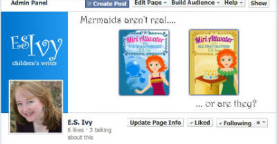
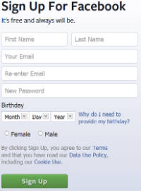

This is the first in a couple of posts that will show you how to create a Facebook author page for an author or book series.

I know that Facebook’s popularity has been waning. Apparently there have been some changes in their rules that meant that book sales driven by author’s Facebook presence dropped off a cliff. Younger people are said to be leaving Facebook in droves. The number of new users was flat for the first time last year. So why am I taking the time to create a Facebook page?

Reaching readers and buyers of middle grade novels is difficult, if not impossible on-line. An informal survey of moms has shown me that Facebook is just about the only place they go on-line besides their personal email. Other web users may be going elsewhere, but quite frankly moms don’t have the time to learn anything new until what they’re using is completely broken. So I’m hoping Facebook won’t completely break for a few more months, at least.

Before I set up my Facebook author page, the above was all I knew about Facebook. I’ve never had a personal Facebook profile, never wanted one, never needed one. So, once again I’m a complete newbie when everyone on the web just assumes you know how to do something. A lot of the information I did manage to find was out of date. So I’ve summarized what I’ve learned here.

Do you need a Facebook Profile or a Facebook Author Page?
=========================================================

From my research, if you want to do any type of promotion at all, you need to have a Facebook author page to not violate their terms of service. The downside is that – apparently – posts from Facebook pages don’t get shown as much in people’s timelines or what-ever-it is they see when they log onto Facebook. (Remember, I told you I’m a newbie. As of this writing, I’m just getting on myself.) The upside is that for a small fee ($5-$10) you can make sure certain posts are seen. Since I have a feeling it’s going to be hard for me to be a Facebook stalker, which I think is required to stay in people’s notice on Facebook anyway, this might be a plus. We’ll see.

If you want to know more, here’s a good article I found on profiles vs. pages on ustandout.com, [Should I Create a Facebook Page or Profile to Promote my Business?](http://ustandout.com/facebook/should-i-create-a-facebook-page-or-profile-to-promote-my-business "Should I create a Facebook page or profile?")

How to create a Facebook author page, step 1: sign up for a Facebook profile first
==================================================================================

Before we can get started with the instructions for how to create a Facebook author page, you’re going to need to sign up for a Facebook profile. If you’ve never been on Facebook, like me, then you don’t have a Facebook profile. From my research the easiest thing way to create a Facebook page is to first set up a personal profile. You can do this even if you have no intention of telling everyone that you’re at the movies or going out for dinner. I don’t plan to post anything on my profile, but it’s easiest to make a page if you have one first.

It’s pretty easy to make a Facebook profile. All you have to do is go to [Facebook](https://www.facebook.com/ "Facebook") and sign up. They make the sign up pretty obvious. Right now it’s the entire right half of the page.

Even if you aren’t going to post on your profile, you might want to go in and add your avatar. It’s really quite straight forward, but just in case you are even more of a web-newbie than me, try this article on Ustandout.com, [How to Size your Facebook Profile Picture &amp; Thumbnail](http://ustandout.com/facebook/size-facebook-profile-picture-thumbnail "facebook profile picture").

The one thing I would caution you on would be, be careful when it comes to choosing a name! Especially when they warn you that it will become your web address. DON’T pick the name that you want for your page.

Because pages and profiles HAVE THE SAME BEGINNING TO THEIR WEB ADDRESSES. And even if you go in and change the name on your profile, they won’t let you have the name for your page. Grrr…. Trust me, I found this out the hard way.

And Facebook technical support is NON-EXISTENT. It took me a few hours to find this out, but it’s true. I even got so far as to find somewhere at Facebook to email. Only to have them send me an email TELLING me that THEY HAVE NO TECHNICAL SUPPORT. (end of rant)

So, yeah, I agree with everyone that Facebook isn’t long for this web world. Because when you don’t have support, people get lost.

But, for now, I’m going to stumble my way on. If you’d like to follow along an learn from my mistakes, next post I’ll tell you how to create a Facebook author page. Then there will be a series of posts to tell you step-by-step how to make a cover photo to pretty up your page.

If you want to see what a Facebook author page is like, hop over and say hello on [my new Facebook page.](https://www.facebook.com/E.S.IvyAuthor "E.S. Ivy's Facebook page") Of if you know more about Facebook than I do, feel free to make suggestions! As you can tell, the page is set up but I haven’t really used it yet. If you’d like to keep up with my book news, “like” my page. (Just a little more information. Don’t feel like you have to “like” my page. Apparently, if a bunch of people “like” your page but don’t interact with you, it will hurt your Facebook visibility.)