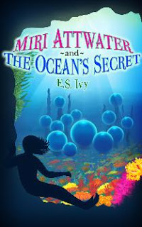

*Miri Attwater and the Ocean’s Secret* is now available [on Nook at Barnes &amp; Noble](http://www.barnesandnoble.com/w/miri-attwater-and-the-oceans-secret-es-ivy/1115162210?ean=2940016695419)!

*Miri always knew she was adopted, liked her food extra salty, and could hold her breath an unbelievably long time, but she never would have guessed that it meant she was a mermaid.*

*Mermaids aren’t real.*

*Or are they?*

It took some doing to get it up, but it’s finally there. Unfortunately, it’s not showing up under Nook Kids new releases. I would guess that’s because it shows a publication date of December 2012 – which is how long I have been trying to get it to show up in their store. Grrr!

I really want Barnes &amp; Noble to succeed. I love how they use the epub format, which is a universal book format, as opposed to the Kindle mobi format that can only be read on the Kindle and Kindle reading apps. But it’s hard to sell your book when it’s virtually invisible! New releases at least would put the book in front of a few readers.

But *you* can find it – either by typing the title in Barnes &amp; Noble’s search bar, or clicking on the handy dandy link I’m going to provide right here:

[Buy Miri Attwater and the Ocean’s Secret for Nook](http://www.barnesandnoble.com/w/miri-attwater-and-the-oceans-secret-es-ivy/1115162210?ean=2940016695419)

*Miri Attwater and the Ocean’s Secret* is still available, of course, at [Amazon](http://www.amazon.com/Miri-Attwater-Oceans-Secret-ebook/dp/B0087451I2/) and [Kobo](http://www.kobobooks.com/ebook/Miri-Attwater-and-Oceans-Secret/book-tCqvomeUIUy8rx2zhF5jWQ/page1.html?s=MlkL6AscbUK17DlCKFFIvQ&r=1). And through the magic of [Smashwords](http://www.smashwords.com/books/view/269749) it is also available on [ibooks](https://itunes.apple.com/us/book/miri-attwater-oceans-secret/id591635029?mt=11), [Sony](https://ebookstore.sony.com/ebook/e-s-ivy/miri-attwater-and-the-ocean-s-secret/_/R-400000000000001021215), and [diesel](http://www.diesel-ebooks.com/item/SW00000269749/Ivy-E.-S.-Miri-Attwater-and-the-Ocean-s-Secret/1.html).

So you can buy it anywhere, anytime!

If you’ve already bought a copy and feel inclined to hop over to any of the sites and leave a review, that would be a wonderful boost to the book’s visibility on the different sites!

