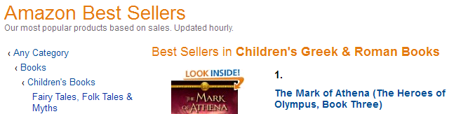
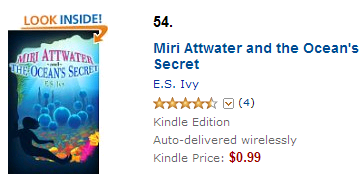

Miri Attwater and the Ocean’s Secret has moved up to #26 on the Top 100 Kindle Children’s Greek and Roman Myths List!

…

Not only that, it made it onto the Top 100 Best Seller’s in Children’s Greek and Roman *Books.* That’s all books, not just Kindle ebooks, debuting at #54!

And that’s not all! It debuted on that list *above* two Percy Jackson books.

Okay, okay, quit pointing out to me that both of those books are old releases. And in hardcover. And quit telling me to look at my sales numbers which are laughably small. In the spirit of Christmas, let me have my fun. 🙂

Besides, they’re big for me! And every sale represents a potential fan!

And now I think I will go eat some left over sweet potato pie. Or maybe some hot rolls. Decisions, decisions.