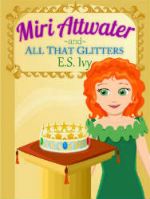

Chapter 1

Miri watched her skirt flare out as she twirled down the halls. Green ruffles foamed around her feet like froth churned up by ocean waves. Glimpses of doorways, fountains, and people flashed past as quickly as the fleeting thoughts in her mind. Her head was spinning in more ways than one.

She couldn’t believe she was a princess, living in a castle. Her new dress at least made her look like a princess, even if she still didn’t feel like one. She’d been more of a sequin and flip-flops kind of girl all her life. Now there would be diamonds and tiaras! Not that she’d gotten any real jewelry yet. Not unless you counted the dolphin charm on the bracelet —

A flash of someone crossed her vision a split second before they collided. She grabbed their arm to keep from falling.

“S-sorry,” said Miri as she reached with one hand to brush her tangled red curls out of her eyes.

She looked up into a lady’s spinning face. For a second, she mistook the lady for her mom. This lady did have almost the same red hair. She wore it pulled back from her face, only a few tendrils escaping and curling defiantly front of her ears. But Miri’s mom wore her long curls pulled back more loosely. And even though this lady wasn’t wearing a crown she was still, unmistakably, the Queen.

“Oh, pardon me, your Highness,” Miri added hastily. She dropped Queen Nerina’s arm and went into a deep curtsy. Somehow, her big feet ended up on top of each other.

This time she did fall over.

Queen Nerina looked down at her with the same look she gave her yesterday. The one Miri couldn’t tell if it was amused or annoyed. Why, or why, did she have to be so clumsy? It wasn’t very princessy.

She couldn’t help but wish it were her mom looking down on her instead, even if she would be laughing at her. It wouldn’t be in a mean way. It would be in more of a I-can’t-believe-you’re-so-silly way. Not in a what-am-I-going-to-do-with-this-child way like Queen Nerina was looking at her with now.

Queen Nerina raised one eyebrow. “Are we having fun?” she asked.

Miri struggled to get up. “Yes, Ma’am. I mean, no Ma’am. I mean, whatever you say, Ma’am.” Wow, that was a great recovery. As if tripping over her own feet wasn’t enough, now she was tripping all over her own words.

“Can I help you?” Queen Nerina asked.

“Ummm…”

What was she doing here? Oh yeah, she’d gotten lost looking for Tante Kala. She’d been having so much fun twirling down the halls that she’d almost forgotten. “Do you know where Tante Kala is?”

“In her office,” Queen Nerina answered as she gracefully gestured two doors down.

Miri opened her mouth to say something, anything, to keep the conversation going. But the man from yesterday, the Queen’s cousin Rafe, appeared at her side carrying a stack of red boxes.

“I have this morning’s documents. Would you like for me to go through them for you?”

“That won’t be necessary,” said the Queen as she took the boxes firmly from him.

Miri probably imagined he was reluctant to let them go. Because he quickly smoothed the black curls from his forehead and changed the subject as he followed the Queen down the hall. “Now, about the menu we were discussing yesterday —”

The Queen cut in. “That reminds me, I’ve decided to have a state banquet in honor of the LP as soon as he arrives.” Her voice trailed off as the continued down the hall.

Miri was apparently dismissed.

She stood there a minute looking after the Queen, feeling slightly abandoned somehow.

That lady, the Queen, was supposed to be her mother. Not her real mom, of course. To Miri, her real mom was her adoptive mom, Stella, the one who’d raised her. The Queen was only her birth mother.

That would have been confusing enough, but her adoptive mom and her birth mother were sisters. That meant both her mothers were also her aunts. But even though Stella and Nerina were sisters and looked a lot alike, Miri thought they were completely different. Her real mom was nice, for one thing.

Miri twisted the aquamarine ring on her finger. Her real mom had worn it ever since she could remember. She’d given it to Miri on her eleventh birthday, just before she’d sent her off with Tante Kala, here to Kai Kaona to meet the Queen. Miri’d always thought it was the most beautiful ring. She’d never seen another one like it.

At first glance, it looked rather plain and simple, just a small aquamarine in a gold band. But the stone had a tiny dolphin carved in the back of it. Peering at the dolphin through the depths of the aquamarine, the color of ocean water, she felt connected to her mom. Her real mom. She didn’t need this other mother. Peepers! But she was glad she was only here in Kai Kaona for the summer.

And with that, Miri shrugged it off and skipped down to Tante Kala’s office.

Chapter 2

As Miri entered the office, Tante Kala gave her a cursory look up and down. “At least you dressed appropriately this morning.” She turned quickly back to her desk submerged in papers. “Have a seat and I’ll be with you in a swish.”

Miri perched on the edge of her chair, her knees bouncing impatiently. Tante Kala’s tight gray bun nodded as she tended to different stacks, pausing every now and again to write something. But watching Tante Kala shift papers around wasn’t terribly interesting.

Miri wondered how high she could bounce her knees, pushing only with her toes. Bounce, bounce, bounce…

Oh, pretty high!

Each time her feet left the ground, she concentrated on pointing her toes, just like her ballet teacher was always reminding her.

As her knees went even higher, Tante Kala glanced up sternly.

Reluctantly Miri made her knees stay still. She forced herself to pay attention to what Tante Kala was doing again and wait patiently. But even though she didn’t want it to, her gaze drifted to the window that took up the entire wall behind Tante Kala. A school of bright yellow tangs, surgeonfish with pointy noses, meandered past.

Miri tried to pretend that she was just looking into a giant aquarium. But it was no use. No matter how hard she tried, she couldn’t forget she was at the bottom of the ocean!

And that, in fact, was her biggest problem.

Her biggest problem wasn’t finding out that she was a princess. It wasn’t finding out that her birth mother, the Queen, didn’t even take an interest in her.

It was finding out she was a mermaid princess.

Which wouldn’t have been so bad, if mermaids didn’t live at the bottom of the ocean and have slimy fish tails.

Okay, so it turns out that when her legs turned into tails, the tails weren’t slimy. They were smooth and supple and even a bit pretty, in their own green and rainbow-y sort of way. And she didn’t have to sit around all day combing her hair and singing. And thank-the-lucky-starfish mermaids did wear clothes. Her adoptive mom had laughed when Miri thought she’d have to go around naked. Which Miri didn’t think was the least bit funny. But there you go. Her mom found lots of things funny that Miri didn’t find at all amusing. But that was still way better than her birth mother who acted like she didn’t even know who Miri was.

“I don’t think the Queen likes me very much,” she said out loud.

Tante Kala leapt out of her chair. “Fins and flippers!”

She bustled around her desk to close the door, her long gray dress swishing softly as she did so. She peered out at the receptionist to see if she had heard, then pushed the door closed behind her, leaning against it as if to block the sound further with her bulk. The latch clicked softly into place.

“Whatever put that idea in your head?” Tante Kala asked in a quiet voice.

“She hardly talks to me.”

“She just doesn’t want to call attention to you, that’s all.”

“How long do I have to keep this princess thing a secret, anyway?” Maybe if everyone knew she was a princess she’d at least get to wear a crown. That might make all this worth it.

“Until Nerina decides the timing is right,” said Tante Kala. Hardly anyone else referred to the Queen by her name, but she had been the nanny to the Queen and her sister. “It’s a bit tricky, what with no one knowing you were even born,” she said as she moved away from the door. “And your legger upbringing and all,” she added under her breath.

“But humans —”

Tante Kala started and looked toward the door again.

“I mean —” Miri talked more quietly and struggled to use the right word, “— leggers. Leggers are nice.”

Well, maybe not all of them, she admitted to herself. Some of the kids in her class, like Wendy, could be pretty snotty. But it’s not like they were dangerous. Not unless you counted them trying to steal away your best friend while they were at summer camp and you were stuck at the bottom of the ocean. She missed Catherine.

She couldn’t help it. Her eyes misted a bit and her gaze drifted back to the window and the ocean surrounding her.

A huge brown fish, a grouper, was looking in. It’s tiny pectoral fins fluttered on either side, making it look like a giant flying potato. Somehow this grouper followed her everywhere she went, even while she was in the castle.

“Maybe the leggers you know are nice,” sniffed Tante Kala, “but when you’ve lived a whale’s life like I have, you’ll learn they can’t be trusted. That’s why Nerina sent you to live with Stella, hidden among the leggers as one of them. They were sculling around all the time back then. No one knew what they were up to, what might happen to our colonies if they discovered us. Things have settled down a bit now —”

“Because my mom and dad set up the ocean reserve!” Miri cut in proudly.

Her dad was a marine biologist. She knew about the years it had taken her parents to establish the reserve to protect the reefs on the northern end of the Hawaiian Islands. Because of that, hardly anyone was allowed in this part of the ocean. No fishing was allowed and access was limited to only a few researchers. But she never would have guessed that they were really protecting the ocean’s biggest secret. Mermaids.

“Besides, my dad did all that and he’s a legger,” she added.

“That may be true, but you can still can’t trust them.”

Changing the subject, Tante Kala squeezed herself back behind the desk and asked, “Now, what was it you needed?”

“Oh,” said Miri, remembering. “What am I supposed to do all day?”

“Do?” Tante Kala’s eyes widened. “Why, whatever you want.”

The merboy Miri had met yesterday, Fisk, swam past the window behind Tante Kala. Catching sight of Miri, he puffed out his cheeks. With his short blond hair sticking straight out from his head he looked like a puffer fish. Miri burst out laughing.

Tante Kala turned to look.

Fisk flipped his brown tails and shot out of sight.

“Stella and Nerina never had any trouble finding things to do,” continued Tante Kala turning back. She tapped her lips thoughtfully. “Sometimes the things they did got them into trouble.”

“Like the time they opened all of the cook’s scallops looking for pearls?” asked Miri.

“Yes, like then,” Tante Kala smiled fondly. She quit tapping. “Maybe it would be good if you did have something to keep you busy. The princesses always had their lessons…”

While she thought, two colorful butterflyfish chased each other’s tails up the window in a tight spiral. Then a bigger angelfish fluttered across in bright flashes of color. A parrotfish, with rainbow scales and buck-like teeth, meandered along. It paused every now and then to take a bite of coral, making clouds of dusty sand that floated away. After it passed, a school of flat-sided lookdown fish, like a flock of flying silver skillets, swam the entire length of the window. And that grouper was still down at the bottom edge of the window, looking in.

There was a knock at the door.

“A boy named Fisk Gillespie is asking if Miri’s busy,” called out the receptionist.

“Oh, Gillespie. Good,” said Tante Kala. “I thought I recognized him,” she said to Miri. “I’ve got a shoal of things to do,” she added, shooing her away. “Swim along.”

*I hope you enjoyed reading this excerpt of Miri Attwater and All the Glitters! You can [buy it on Amazon.](http://www.amazon.com/gp/product/B00HKK1GYC/ref=as_li_qf_sp_asin_il_tl?ie=UTF8&camp=1789&creative=9325&creativeASIN=B00HKK1GYC&linkCode=as2&tag=esiv-20)*