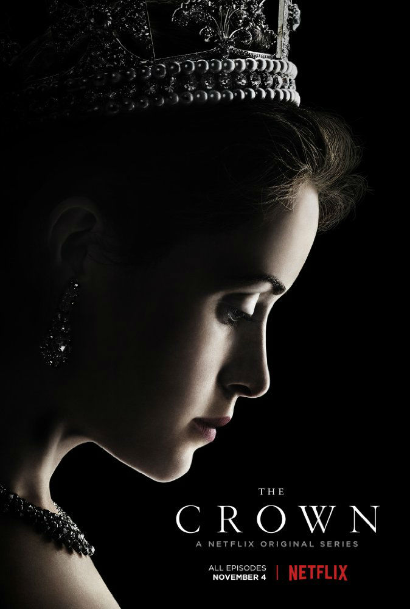
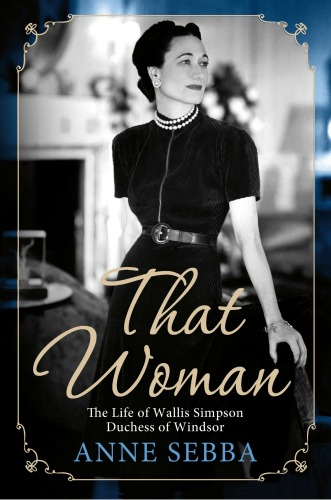
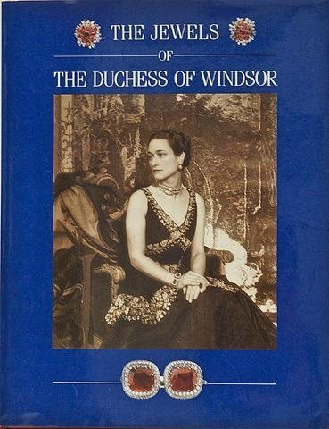
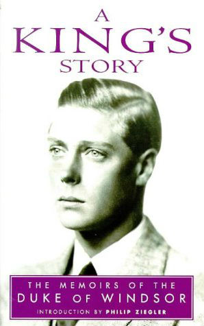
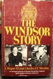
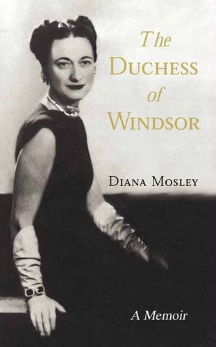

I was surprised at first that there was so much about the Duke of Windsor in the Netflix series’ The Crown, since the crown is mainly about the reign of Queen Elizabeth II. The abdication of King Edward VIII happened long before Queen Elizabeth II came to the throne. However, a lot of things that happened early in the reign of Queen Elizabeth II were caused by the crisis when her uncle abdicated. Knowing a bit more about the history of how a former king became the Duke of Windsor might give you a new understanding of the treatment of his story in Netflix The Crown.

<iframe allowfullscreen="true" class="youtube-player" height="360" src="https://www.youtube.com/embed/JWtnJjn6ng0?version=3&rel=1&fs=1&autohide=2&showsearch=0&showinfo=1&iv_load_policy=1&wmode=transparent" style="border:0;" width="640"></iframe>

The Duke of Windsor and Wallis Simpson
======================================

My mother had a fascination with the British monarchy that started in her childhood. She also likes to read (and understatement) and would entertain us with stories from history she had read. So I knew from her that Queen Elizabeth II was only Queen because her uncle gave up the throne to marry an American divorcee.

The way I understood it, when King George V died, the Duke of Windsor was supposed to inherit the throne, but he decided he wanted to marry an American woman who had been divorced. The laws said he couldn’t marry her and be king. So he said, “Okay, I won’t be King then.” He gave up the throne and that was that. 

He never looked back and never regretted it. He moved off the pages of history and his brother and niece, Queen Elizabeth II, moved on.

The full story is way more complicated!

As I read about the evolution of the British Monarchy, I discovered that he hadn’t disappeared after all. In fact, during WWII there were rumors about the Duke of Windsor plotting with Hitler to put the Duke back on the throne. I began to think that studying his biography might provide some interesting motivation and actions for some characters in my children’s fantasy series that included royalty. ([Miri Attwater Mermaid Princess series.](http://amzn.to/2kBpjqI)) In any case, it was a convenient excuse to read some interesting history!

Different books give different views of the Duke of Windsor and Wallis Simpson
------------------------------------------------------------------------------

 I started with *King Edward VIII: A Biography* by Philip Ziegler. Then I decided to read a second, because it bothers me that an author is *always* biased. Sometimes intentionally, sometimes not. And how can I come to an honest conclusion for myself if I don’t consider different sides? So I decided to read another book just to get another point of view. And oh, while I’m at it, I’m not sure which book will be the best, so I’ll just check out everything the library has and read what I want. And before I knew it I had read not one book on the Duke of Windsor, but six. (For a full list and links, see below.)

Ridiculous, I know. What need do I have to be an authority on the Duke of Windsor? But along the way I also gained interesting insights into how World War II came about the maneuvering of royalty and government. I was impressed by how personal lives can affect the direction of almost the entire world. Following is a summary of what seemed to me to be the interesting points about the Duke of Windsor’s life.

How to follow British Royal Titles when reading about the Duke of Windsor and Wallis Simpson
--------------------------------------------------------------------------------------------

Technically, when you write about royalty, your are supposed to use the correct title for people for the period of time you are covering. This means that the same person can be referred to with multiple different names in the same book, even the same paragraph! 

### The full names and titles for the Duke of Windsor

If you were to read an official biography about Edward Albert Christian George Andrew Patrick David, he would be referred to as “David” by his family and in the book during his childhood. As he got older he would also temporarily be called the Prince of Wales, while his father George V is on the throne. Then he is temporarily King Edward the VIII. And finally he’s the Duke of Windsor after his abdication. Just to confuse you more, early in the book his father and grandfather would also be called the Prince of Wales at different times. So, to keep things simple, I will continually refer to him as the Duke of Windsor. That’s the title he held at his death.

A short history of the Duke of Windsor and Wallis Simpson
---------------------------------------------------------

### The Abdication of the Duke of Windsor

To begin with, the Duke of Windsor didn’t give up the throne *before* he became King. He already *was* King and had been King for several months. But he did give up the throne before he was *crowned *king. The Duke of Windsor automatically became King on the death of his father, King George V. Modern coronations being what they are, you can’t organize one in a week. It takes a little more than a year. So he was King Edward VIII, for a little less than a year before he abdicated and give up the throne.

### Wallis Simpson, a married woman

The Duke of Windsor also didn’t abdicate to marry a divorced American woman. He gave up his crown to marry a *married* woman, Wallis Simpson. Her divorce was in process when he abdicated, but Mrs. Simpson (as she came to be known) was still married. Okay, technically I guess she was already “a divorced woman” because this was her second marriage. She’d already been divorced once. But the point is that the whole time they were dating, or courting, or whatever you want to call it, Wallis Simpson was married. In fact, the Duke of Windsor had a history of dating married women.

### The Duke of Windsor and his birthright

Let me back up and try to explain briefly how the Duke of Windsor got into that situation. The Duke of Windsor grew up knowing he was destined to be King, but wondering if that’s what he wanted, or even if he was qualified.

His letters and diaries show that he questioned his right to rule just because of his birth. Being brought up separate from others, with a difficult father who was King, wasn’t easy. When he served in World War II, he didn’t think it was fair that his fellow soldiers had to endure the trenches and other horrors of war when he wasn’t allowed to put himself in any danger. At the same time, he couldn’t fathom how French soldiers could follow an officer who was of lower birth rank than they were. He wrestled with a conscious that was developing differently from the way he was raised. After the war, the poor and destitute who couldn’t find work in Britain troubled him, but he had few ideas (and in fact, probably little power) to do anything about it.

### The many married women of the Duke of Windsor

Meanwhile, both of the Duke of Windsor’s serious relationships were with married women. This wasn’t uncommon among the nobles he was surrounded by. At a time when it was difficult for women to hold jobs and make money of their own, marriages were often their “careers.” They were the means to consolidate or preserve wealth. When the nobles in Britain started running out of money, newly wealthy American girls crossed the Atlantic and married for a tiara in exchange for a fortune that helped their husbands hold onto the family estate. Everyone thus having done their duty, no one saw any reason why they shouldn’t have a little fun afterward. Courting before the marriage was a business negotiation. Dating after marriage was the romance.

The difference was that the Duke always wanted to *marry* the married woman he was “dating.” He thought it was dishonorable not to. Until Wallis Simpson, neither of the British married women he dated let him get very far with that thought. They understood too well that it would not only jeopardize his position, but threaten the stability of the country. They probably also didn’t want to spoil the fun.

### The history of Wallis Simpson

Mrs. Simpson grew up dependent on an uncle to support her and her widowed mother. While no one, including herself, ever called Mrs. Simpson beautiful, she was elegant, intelligent, and had a talent for showing true interest in men. She never lacked for suitors. Sadly, her first husband turned out to be to an abusive alcoholic. She finally got her marriage dissolved on grounds of abandonment. Not long after her first divorce, she married her second husband, Ernest Simpson. He wasn’t rich, but he was well off and steady in temperament.

### The Duke of Windsor meets Wallis Simpson

When the Duke was introduced to the Simpsons by friends, the Simpsons were happily married. As a British subject with an American background, Ernest Simpson was thrilled to be in the circle of royalty. It didn’t hurt that it helped his business connections. Wallis Simpson thoroughly enjoyed entertaining as part of high society, and the Duke admired a woman who didn’t just bow and cater to his every need. He considered that kind of adoration false, and I would guess may be one of the reasons married women were more appealing. They probably weren’t as eager to please him as a girl who was trying to catch and marry him.

The Duke became devoted to Mrs. Simpson and her lack of fear to give him guidance. Mrs. Simpson became enamored with the lifestyle of luxury and gifts of jewels. She seems to have thought that the Duke’s infatuation would run it’s course, just like it had with other married women. If she played her cards right she’d have acquired enough gifts for a little security when he moved on, and she and Mr. Simpson would go back to their married life a little more financially secure.

Only the Duke was more devoted than usual. He abruptly cut off all ties to his former mistresses, who had been close to him for years, and became fairly isolated. There were some interesting dynamics between the the Duke and Wallis, reported differently depending on who’s doing the observing. But by several accounts, and for the rest of his life, the Duke would light up and become more sure of himself whenever Wallis was near. When she was gone, he was dejected and depressed.

### The Duke of Windsor becomes King

But maybe more importantly, the turning point in their relationship may have come when his father died. The Duke of Windsor (as he would come to be known later) was now King Edward VIII of Great Britain.

But unlike the summary suggests, he didn’t just say, “Oh, oops, well I want to marry an already married woman so I’ll just step aside and you can put my brother on the throne.” 

It was to prove to be a long year for both the British Royalty and Parliament.

At first, the Duke seemed to honestly believe that it wouldn’t matter to the people whether or not Mrs. Simpson was a divorcee. As the Prince of Wales, he was extremely popular with the public and didn’t think anything he did would change their love of him. After all, all of the nobles he was surrounded with fooled around. They even divorced and remarried pretty frequently.

### The Problem with Wallis Simpson

But as Anne Sheba perhaps explained the best in her book, *That Woman, *that blase view didn’t apply to most of the population. One of the reasons that divorces were still difficult to obtain in Britain was that with no careers, women usually had no means of support other than a husband. So it was the women who were against Wallis Simpson divorcing even more than the men. The way they saw it, was if the King married a divorced woman, divorce would become more acceptable, and women would be the ones left destitute.

### The negotiations to marry Wallis Simpson

The Duke argued and negotiated with men in government, and men not in government but still in power (such as Winston Churchill), for months. His brother, the future King George V (father of Elizabeth II) didn’t want to be King. The possibility of the Duke marrying Mrs. Simpson, but her not getting a title and their children not becoming heirs, was considered and discarded.

You have to remember that all this was going on as Hitler was flaunting the power of Nazi Germany. So in addition to dealing with that, the British government was distracted by their King’s romance.

It appears that for her part, Mrs. Simpson wanted things to just go on as they were and eventually things would move on one way or the other. She had no real desire to be Queen per say, but she found it impossible to give up the luxury and jewels that her relationship with the Duke gave her.

The longer they argued, the more extreme the Duke became. In the end he refused to be crowned unless he could marry Mrs. Simpson before the coronation and have her crowned Queen with him. The longer the argument drug on, the uncertainty started to be a drain on the economy.

On top of that, it truly was a constitutional crisis. From this vantage point, with the British monarchy not having any real power, this seems hard to believe. There wren’t many kings and queens left after World War I; the British monarchy was a survivor, and barely hanging on.

### The fall of European Monarchies

At the beginning of the 1900’s there were monarchies all over Europe. Now, after World War I – still being called the Great War – the global map looked very different. At the time the Duke of Windsor was arguing to marry Wallis Simpson, it was just a few years after most of the royalty of Europe had toppled. 

Many of them were assassinated. And through Queen Victoria’s huge family, many – if not most – of them were related to the British Royal family, such as the last German Kaiser, Wilhelm II. The Duke himself had personally met a number of his European royal relatives who’d met their fate. This included the Russian Tsar, whose entire family was brutally murdered. This happened after the Tsar’s cousin – the Duke’s father, King George V – refused him asylum in Britain. 

The toppling of monarchies all over Europe had proven that popular opinion could threaten stability, dissolve a monarchy, and worse. And both the royal family and the government of Britain knew it.

### The Duke of Windsor Abdicates

The argument grew so public that there were threats on Mrs. Simpson’s life. She fled to France to stay with friends. In the Duke’s defense, part of his decision to not back down was because he believed the woman he was in love with would be ruined, personally and socially, if he deserted her at this point. But he also was personally miserable without her near. He made up his mind abdicate.

Still, there were lots of details to be ironed out. What would the Duke now be called? 

His brother created the new title of Duke of Windsor for him. 

How would he be paid? 

Where would he live? 

A lot of things were discussed, but in the rising panic of the moment, not everything was decided for certain before he left Britain.

### The Duke and Duchess of Windsor give up the throne to live in “poverty”

In due course Mrs. Simpson’s divorce became final, the Duke’s brother was crowned King, and the Duke and Duchess were married. But a lot of bad feelings remained. 

The Duke’s family was upset that he gave up his responsibilities. 

King George VI was upset that during his negotiations for his allowance, the Duke had misled him about how much money he had. (“A lot” in most people’s terms. “Not enough” in his way of thinking. There is also evidence that he had already transferred most of his cash into Mrs. Simpson’s name.) 

It was decided (by someone, it’s not clear who) that even though the Duke would still be known as His Royal Highness the Duke of Windsor, his wife would simply be the Duchess of Windsor.

Being offended by the refusal of allowing the Duchess to be called officially “Her Royal Highness” is probably only completely understood by royalty, and perhaps by nobles. But to the Duke, who ironically on one hand didn’t think rank by birth was fair, but was raised in the tradition, it was the ultimate insult. 

So there was tension between the Duke, his family, and the British government.

### The Duke of Windsor and Hitler

Based on his experience in WWI, the Duke thought that getting into any war was the greatest folly. He wasn’t alone in thinking that Hitler and Germany should be negotiated with. He thought that Hitler was the only thing standing against the Russian communists and the rest of Europe, and that going against the Fascists would doom the rest of the world to communism. As it turns out, that opinion was right in a lot of ways.

When a friend arranged for the Duke to visit Germany and observe what Hitler had done for the poor, working conditions, and housing, he jumped at the chance. If the Duchess couldn’t be a Royal Highness, it gave him an opportunity to take her on what amounted to a royal tour, and also to study ways in which the poor could be helped. He naively didn’t think it endorsed the atrocities of the Nazis.

### The Duke and Duchess of Windsor and World War II

When war did break out, he was disappointed when Britain joined in, but wanted to serve. A place was finally found for him in France, but there was a lot of confusion when France was invaded. The Duke and Duchess fled but couldn’t immediately get off the continent. This is where contradictions and entanglement with Germans really start to complicate things.

The Duke and Duchess worried about what would become of their possessions in France. Through German friends, they possibly arranged to make sure their possessions stayed safe. (The Duke had a lot of relatives among the Germans. Queen Victoria’s husband, Prince Albert, was German.)

### The plot by the Nazis to crown the Duke of Windsor King of Great Britain

The Germans plotted to kidnap the Duke. They thought that when they invaded England, if they put him on the throne his past popularity would help them. There are a lot of documents to support this.

The Duke and Duchess seemed to not know anything about the plot. But they balked at a “suitable position” not being found for the Duke. Then when he was offered the office of Governor of the Bahamas, not only was it still not good enough, but they balked over rumors started by the Germans that the British government itself was out to kill them during or before the trip.

### The Duke and Duchess of Windsor and the rest of World War II

Eventually a friend and adviser convinced them to sail. During the course of the war they continued to harass Winston Churchill and the King about the Duchess’ title, their allowance, and money for other matters, which seemed rather selfish given the current world crisis. They took frequent and sometimes overly long trips to the United States and embarrassed the British government by some of their opinions on the war. 

But maybe it was was a diversion (if not a nice one) for King George VI and Churchill from the even more depressing war. And other than that, the Duke and Duchess worked hard at their new positions. He made some progress with equalizing pay and government reform. She worked for the Red Cross and other relief efforts for the war and the poor.

### The Duke and Duchess of Windsor after World War II

After the war, the Duke still wanted a position. The Royal family and the government still didn’t want to raise the rank of the Duchess to Her Royal Highness. The Queen (then Queen Elizabeth, later known as the Queen Mother) feared that the Duke’s old popularity would overshadow King George VI, and all their family’s sacrifice for him to be King during the war would be discarded.

The Duke refused to return to live in Britain if his wife wasn’t raised to the same rank as him. On top of that, he still considered himself destitute (even he was a multi-millionaire, by any standard) and if he returned to Britain he would have to pay taxes, the ultimate insult.

The Duke and Duchess settled in France, but they spent almost half of every year in the United States. Having discarded their own royalty centuries before (starting with Marie Antoinette’s husband), France was now a haven for discarded royalty of other countries. France didn’t require the Duke and Duchess to pay taxes, provided personal security, and eventually gave them a mansion in Paris almost rent free.

In the minds of the Duke and Duchess, the Duke – as a former King and still royalty – had to live at a certain standard to which he had become accustomed. He didn’t even know how to pack his own suitcase, after all. They considered themselves poor and were always afraid of running out of money, but bought luxury items and kept a staff that seemed to be at odds with that. (See *The Jewels of the Duchess of Windsor,* by John Culme and Nicholas Rayner, to get an idea of what I mean. That really makes their wealth concrete.)

### The Duke and Duchess of Windsor, a great love story?

Some accounts have them as miserable with their lack of royal position, citing letters. Other accounts, some by friends, say they were happy with their life of luxury, travel, entertaining, golf, and gardening. The truth probably lies somewhere in the middle. 

Their letters were probably mostly written when they were trying to negotiate. Often people complain about things they don’t like, but don’t take the time to write about things that are going well. If you only read the letters, you might get a skewed perspective. On the other hand, there are friends who you wouldn’t tell your complaints to. By all accounts the Duke remained devoted to the Duchess and she, if not devoted, remained loyal to him. 

Letters to her second husband, though, suggests she never wanted the divorce, she just wanted to have some “fun” for awhile. Perhaps she would have been happiest as mistress of a king. Some stories seemed to indicate that while the Duke always worshiped her, there were times she just barely tolerated him. But she either had the decency, or fear of social downfall, to stick by him once he gave up everything for her. That in itself is admirable. 

Commitment is what keeps marriages going for the long haul, after all. Maybe the definition of a great romance isn’t happily ever after, but the length of the ever after. By that definition, the Duke of Windsor and Wallis Simpson did have a great romance. 

Who’s to blame for the abdication?
----------------------------------

As I read about the quibbles after the abdication, one of the things that bothered me was the constant refrain of the Duke and Duchess that they hadn’t done anything wrong. I won’t even go into the list of possibilities and argue the points. But in the last book I read, something struck me that none of the authors pointed out.

After his abdication, the Duke gave a speech on the radio. It’s famous for the line “… I have found it impossible to carry the heavy burden of responsibility and to discharge my duties as King … without the support of the woman I love…” But it also contains these lines.

*“There has never been any constitutional difference between me and \[the Ministers of the Crown\] and between me and Parliament. Bred in the constitutional tradition by my Father, **I should never have allowed any such issue to arise.”** *(emphasis mine)

In the end, the Duke of Windsor abdicated when it became clear that his personal decision was leading to the instability of the government. But unlike his brother, King George VI, he wasn’t willing to give up personal happiness for his country. And maybe he couldn’t. But at least once, and publicly, he was willing to acknowledge his mistake.

UPDATE: Newly unclassified documents show that the government of Great Britain was sorried enough that Wallis Simpson might be a spy and the fascist leaning of the then King Edward VIII that they wire-tapped the King’s phone. You can read more about it in the article [British Spies Tapped King Edward’s Phone to Eavesdrop on Wallis Simpson Calls. ](http://www.nbcnews.com/news/world/british-spies-tapped-king-edward-s-phone-eavesdrop-wallis-simpson-n741906)

The best books about the Duke of Windsor and Wallis Simpson
-----------------------------------------------------------

You may have noticed that this isn’t a scholarly research paper. I haven’t cited any sources, and the professional writer in me feels a little bit guilty about that. Without any footnotes or any authoritative sources (primary sources, meaning I haven’t researched original documents myself), you probably shouldn’t believe a word you’ve read here. But here’s a list of the books I’ve read:

If you just want to read one book relatively short book, I suggest:

*[That Woman](http://amzn.to/2eZ0o0s),* by Anne Sebba.

If you want to bring some of the setting and jewelry vividly to life, to get a sense of the riches of the “impoverished” Duke and Duchess of Windsor add:

[The Jewels of the Duchess of Windsor](http://amzn.to/2fOZBOA) By John Clume and Nicholas Rayner. 

If you want to read a more scholarly work, move on to:

[*King Edward VIII: A Biography*](http://amzn.to/2eZ4K7L) by Philip Ziegler

For a naturally biased view, and the most difficult read, dig into:

[A King’s Story: The Memoirs of H.R.H. the Duke of Windsor K.G.](http://amzn.to/2fP37Zb), by the Duke of Windsor

(Interesting how he titled his book not “A Duke’s Story,” but “A *King’s* Story.” It gives you some insight into how he thought of himself and wanted to be seen.)

Also scholarly, and easier to read but an older book, is:

[The Windsor Story](http://amzn.to/2fRfcMh)[,](http://amzn.to/2fRfcMh) by J. Bryan III and Charles J.V. Murphy. 

Finally, for a different point of view read:

[*The Duchess of Windsor,*](http://amzn.to/2fP44AM) by her friend, Diana Mosley

More About Netflix series – The Crown
-------------------------------------

[The Crown – Neflix](https://www.netflix.com/title/80025678)

[The Crown – Imdb](http://www.imdb.com/title/tt4786824/)

[Watching The Crown with Lady Pamela Hicks, Queen Elizabeth’s Lady-in-Waiting – India Hicks shares her mother’s memories of the true story behind the Netflix series.](http://www.townandcountrymag.com/society/tradition/news/a8741/the-crown-india-hicks/)

[How Real Is the Crown? Fact-Checking the Series About Queen Elizabeth](http://people.com/royals/the-crown-historically-accurate-netflix/)

[The Cast of The Crown vs. the Real-Life Royals](http://www.vogue.com/article/the-crown-vs-real-life-royals)