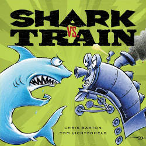

A young reader got to wondering about who would win in a fight, a shark or a puma? I did tons of research on sharks for the Miri Attwater series, but I don’t remember coming across that particular information. But I can’t resist a good research topic.

Update: A quick update before we get into the rest of the post: [reads4tweens.com](http://reads4tweens.com/ "book reviews for parents") just published a review of [Miri Attwater and All that Glitters.](http://reads4tweens.com/miri-attwater-and-all-that-glitters/ "Miri Attwater and All That Glitters Review") So if you’ve been wondering what your child would encounter if they read the book, hop over and check it out!

Now, back to the research on shark vs. puma.

I couldn’t find anything specifically about shark vs. puma or even shark vs. lion. But I did find that a lion lost to a crocodile. And one unfortunate bull shark found that he shouldn’t have tried to take on a hippo. Given that the encounter would have to happen at the edge of water or in water, I think the outcome would likely be similar to crocodile vs. lion. My money would be on the shark.

The most impressive to me, though, was something I remembered from my original research. Given our last topic was octopus it seems appropriate.

Who would win in shark vs. octopus? Check out the video below, Shark vs. Octopus below. The winner might surprise you.

<iframe allowfullscreen="" frameborder="0" height="480" src="//www.youtube.com/embed/p9A-oxUMAy8?rel=0" width="640"></iframe>  
To check out that amazing octopus camouflage they mentioned, see my post: [Octopus camouflage, science behind the magical mermaids of Miri Attwater.](http://192.168.1.34:4945/behind-the-books/octopus-camouflage/ "Octopus camouflage, science behind the magical mermaids of Miri Attwater")

If you find yourself contemplating this question at length, you’d enjoy the great picture book, [Shark vs. Train,](http://www.amazon.com/gp/product/0316007625/ref=as_li_qf_sp_asin_il_tl?ie=UTF8&camp=1789&creative=9325&creativeASIN=0316007625&linkCode=as2&tag=esiv-20 "Buy it on Amazon") by Chris Barton. I gave this as a gift to one of my nephews and he thinks it’s hilarious. From the description on Amazon: *Shark VS. Train! WHO WILL WIN?! If you think Superman vs. Batman would be an exciting matchup, wait until you see Shark vs. Train. In this hilarious and wacky picture book, Shark and Train egg each other on for one competition after another, including burping, bowling, Ping Pong, piano playing, pie eating, and many more! Who do YOU think will win, Shark or Train?* 

 If you’d like to know how the mermaid Miri Attwater deals with sharks and slimy octopus pets, check out my fantasy books for kids, [Miri Attwater and the Ocean’s Secret](http://www.amazon.com/gp/product/B0087451I2/ref=as_li_qf_sp_asin_il_tl?ie=UTF8&camp=1789&creative=9325&creativeASIN=B0087451I2&linkCode=as2&tag=esiv-20 "Buy it on Amazon") and [Miri Attwater and All That Glitters.](http://www.amazon.com/gp/product/B00HKK1GYC/ref=as_li_qf_sp_asin_il_tl?ie=UTF8&camp=1789&creative=9325&creativeASIN=B00HKK1GYC&linkCode=as2&tag=esiv-20 "Buy it on Amazon")

To learn more about real spiny dogfish sharks and the Giant Pacific octopus, try the following sites:

[Giant Pacific Octopus on NationalGeographic.com](http://animals.nationalgeographic.com/animals/invertebrates/giant-pacific-octopus/?source=A-to-Z "Octopus National Geographic")

[Spiny dogfish shark on Discovery.com](http://dsc.discovery.com/tv-shows/shark-week/types-of-shark/spiny-dogfish-shark.htm "Spiny dogfish shark on Discovery")