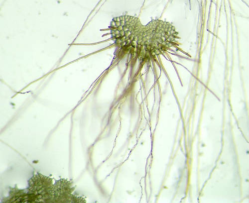

In last weeks post about [the paperback cover for Miri Attwater and the Ocean’s Secret,](http://192.168.1.34:4945/?p=2637) I mentioned that there was a little something that I’m especially proud of. Well, here it is, but bigger.

It’s the new logo for Phyta Publishing, Phyta Books for Young readers! And I’m especially proud of it because I not only designed it, but I drew it myself using Inkscape. ([Inkscape](http://en.wikipedia.org/wiki/Inkscape) is open source free software.) It was my first experience drawing something in vector graphics.

“Phyta” means plants and makes me think about green plants and growth. Phyta Publishing is all about growing readers!

For the longest time I couldn’t figure out why “phyta” was so much more familiar to me than most people. Turns out that “-phyta” is the ending of all the plant division names in biology classification.

Photo of a fern gametophyte under a microscope. You can see the individual cells. Photo by By Curtis Clark, Wikimedia Commons

It’s also often found in other names relating to plants, such as “gametophyte.” A “fern gametophyte” is a tiny fern plant that’s part of the fern’s reproductive cycle. And that just happens to be what I studied, experimented on, and looked at under a microscope by the thousands to earn my PhD in plant biology. It appears that from the “magic” in Miri Attwater that is explained imaginatively by science, to the naming of the publishing company, I just can’t get away from my science background!