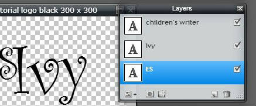
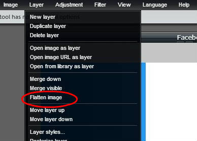
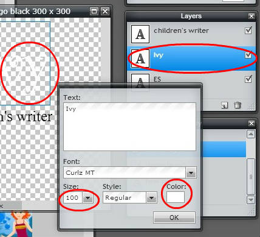
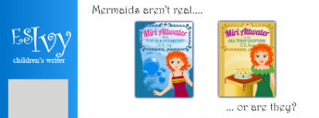
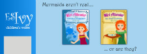
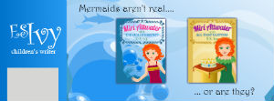
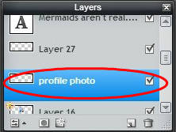
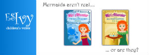
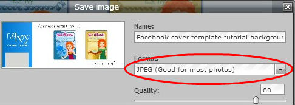
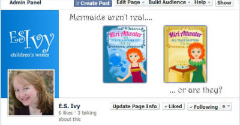

This is a continuation of the [Pixlr tutorial: how to make a Facebook page cover photo for your author page in Pixlr with a Pixlr template.](http://192.168.1.34:4945/?p=1314 "pixlr tutorial")

If you’re using this as a Pixlr tutorial to learn how to edit photos for free, in this tutorial I’ll cover how to unlock layers in Pixlr, how to delete layers in Pixlr, transparent layers in Pixlr, how to flatten an image in Pixlr, the difference between a .pxd and a .jpg file, how to change the font size and font color in Pixlr.

In this tutorial, we’re going to put your author logo on a Facebook page cover photo. You should have your facebook cover photo Pixlr template open in [Pixlrcom.](http://pixlr.com "pixlr") If you don’t, go to [Pixlr tutorial: how to make a Facebook page cover photo for your author page in Pixlr with a Pixlr template](http://192.168.1.34:4945/?p=1314 "pixlr tutorial") and then [Pixlr tutorial: How to make an author Facebook page cover photo: background.](http://192.168.1.34:4945/?p=1426 "pixlr tutorial")

You will also need your author logo open in your Pixlr browser window. The directions for that are in the post [Pixlr tutorial: add text to image: How to make an author logo for an author Facebook page cover photo.](http://192.168.1.34:4945/?p=1335 "pixlr tutorial")

Pixlr tutorial: How to add a logo to your cover photo for your author Facebook Page
===================================================================================

1\. When we paste the image into our facebook cover photo, we’re going to want to only paste the letters, not a white background. So we need to remove the background layer. To remove the background layer, we need to unlock it first. Go over to Layers on the right, find the background layer and double click on the little lock to unlock it.

2\. A box with a check mark will now appear. Right click on selected Layer 0 and choose “Delete Layer.”

The background of your logo will now change to a checkerboard pattern, which means you have a transparent background. Layer 0 will also disappear from your layers box.

3\. Your author logo is saved as a Pixlr image with the file extensions .pxd. This keeps all the layers separate. But, when we paste the logo onto our facebook cover photo, we’re going to want to be able to move it around as a unit. So we need to flatten the image, which means that we’re going to merge all the layers into one layer. Think of it as gluing all the layers together.

Make sure you’re working on your logo (over on the right it should show up in your Navigator. If not, click in your logo window to select it.)

Go up to Layers &gt; Flatten Image.

You’ll notice that now in the Layers box you only have one layer.

4\. Select all, copy, and paste it onto your facebook page cover photo. If you’ve forgotten how to do this, refer back to [Pixlr Tutorial: add photo to image: add book covers to your author Facebook page cover photo.](http://192.168.1.34:4945/?p=1466 "pixlr tutorial")

5\. Now you’re in your logo layer, you can select it and move it around in your Facebook page cover photo until you get it to where you want it. Mine now looks like this!

Pretty good. But now that I see it, I think it would look better if the logo was a little smaller. You can shrink just this one layer, but the problem is, since we flattened the image, the type isn’t *text* anymore, it’s an *image* of text. So if I shrink or enlarge it I’m going to lose some quality. I also think I’d like to make it white.

6\. So, while I’m in the Facebook page cover photo, I’m going to use Ctrl + Z to undo placing the image of the logo.

7\. Now I select the logo image box, and I’m going to undo all the way back, (just keep hitting Ctrl + Z) until I undo the merge layers and get my three layers back.

8\. To work on each bit of text, I’m going to have to work in each individual layer. I’ll start with the Ivy first, since it’s the biggest part. I select that layer over in the layers box. Then I select the text tool. I place it on top of the Ivy text and click so that I get my text editing box. Now I change my font size 100 and change my color to white. Click okay.

Oh, great. Now I can’t see the text. So what I’m going to do is position and size everything in black. Then I’ll go back and change the color to white. (You could also add a background layer, color it, and then delete it before flattening the image again.) 

9\. Change the font size and color for each of your text layers. I changed my font sizes to 60 and 25, respectively. (Before you flatten the image, you might want to save the logo you end up using as a .pxd file so you can modify it later if you want to.)

10\. Repeat steps 3-5. Remember that to move the logo around on the Facebook cover photo you’ll have to have the Move tool selected. (Your cursor will be an arrow.)

From the example of [Lindsay Buroker’s facebook page,](https://www.facebook.com/LindsayBuroker "Lindsay Buroker Facebook") I decided to add some tempting text to describe the series.

My Facebook page cover photo now looks like this!

11. This would be a good time to save your Facebook page cover photo as a .pxd file in case you ever want to come back and modify it.

12. This cover photo has a nice clean look that’s currently popular on web pages. But, if you want to add more color, you could change the white. Remember to select the background layer. Then use the paint bucket tool to fill the color of the background. You could make it light blue. Like this:

12\. Or maybe you have a background image from your cover artist. Select the background layer and paste your cover background image into it. You could make something like this:

13\. Before we save the image to use on our Facebook page, we need to get rid of the gray placeholder box for the profile photo. In the Layers box, find the layer called Profile photo. (I know it’s called that because that’s what I named it in my Facebook page cover photo template.) You can tell you’ve got the right layer, because when you click on the check mark to turn it off, the gray box will disappear.

14\. We want to completely get rid of that layer. So right click on the layer in the Layers box and choose Delete Layer. The gray box will disappear. My Facebook page cover photo now looks like this:

15\. To use your Facebook page cover photo on your Facebook page, you’ll need to save it as a jpeg. Go up to File&gt;save. And when the save box comes up, under format choose JPEG. (I left the quality at 80 as it decreases file size and seems fine for most web work. For my blog images, I choose quality 70.)

16\. Now all we have to do is upload it to our Facebook page. Here’s what it will look like on the Facebook page with the profile photo in place.

And that’s it! You now have a cover photo for your author Facebook page. I hope you found this tutorial useful. Remember, I’m an author too. If you’re enjoying these tutorials, don’t forget to check out my books, [Miri Attwater and the Ocean’s Secret](http://192.168.1.34:4945/miri-attwater-and-the-oceans-secret/ "Miri Attwater and the Ocean’s Secret") and [Miri Attwater and All That Glitters](http://192.168.1.34:4945/books/ "Books") and pick one up for the child in your life or the child inside you! 🙂