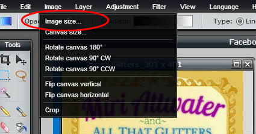
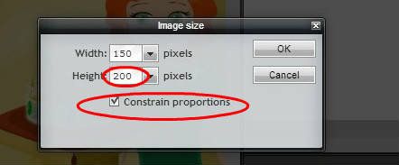
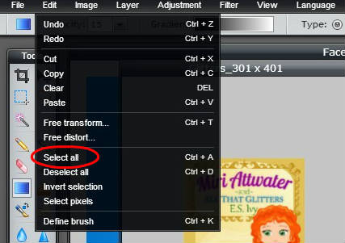
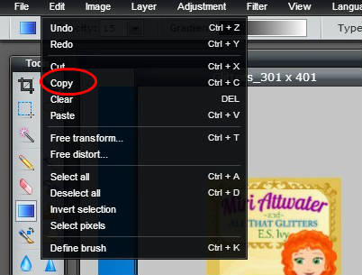
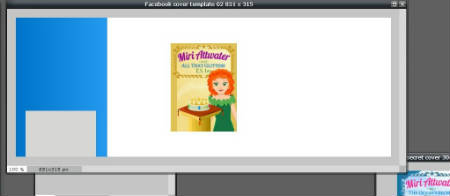
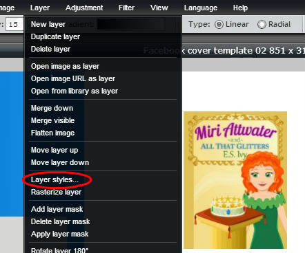
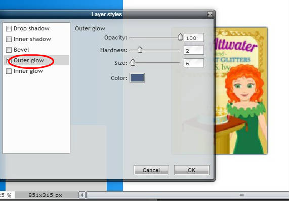

This is a continuation of the [Pixlr tutorial: how to make a Facebook page cover photo for your author page in Pixlr with a Pixlr template. ](http://192.168.1.34:4945/?p=1314 "pixlr tutorial")

If you’re using this as a Pixlor tutorial to learn how to edit photos for free, in this tutorial I’ll cover how to resize an image in Pixlr and keep the proportions the same, how to copy an image into another image in Pixlr, working with layers in Pixlr, and adding a shadow around the image in an layer in Pixlr (Layer style outer glow).

In this tutorial, we’re going to put your book cover images on a Facebook page cover photo. You should have your facebook cover photo Pixlr template open in [Pixlrcom.](http://pixlr.com "pixlr") If you don’t, see the previous posts starting with [Pixlr tutorial: how to make a Facebook page cover photo for your author page in Pixlr with a Pixlr template.](http://192.168.1.34:4945/?p=1314 "pixlr tutorial")

Your book covers also need to be open in your Pixlr browser. If don’t know how to do that, look back at [Pixlr tutorial: How to make an author Facebook page cover photo: backgroun.](http://192.168.1.34:4945/?p=1426 "pixlr tutorial") JPEG format will work; 300 x 400 will be more than big enough.

Here we go!

Pixlr tutorial: How to put your book cover images in your author Facebook page cover photo
==========================================================================================

1\. If your covers are 300 x 400 they’re bigger than you need them. So the first thing we’re going to do is resize the images. Make sure your working on one of your book cover images. Check over on the right at your Navigator box. (f you don’t remember where that is, look back at [Pixlr tutorial: How to make an author Facebook page cover photo: background.](http://192.168.1.34:4945/?p=1426 "pixlr tutorial")) You should see an image of the book cover you want to work on. If not, go over to the left, in tools, and select the move or crop tool. Go to the cover you want to work on and click once to select it for Pixlr.

Now, go to Image &gt; image size.

2. An image box pops up. Make sure Constrain Proportions is checked. Now when you change the height to 200 pixels the width will automatically change to the correct value.

Click Okay.

3\. Now we’re going to copy it onto our Pixlr Template for Facebook Cover Photo. Go to Edit &gt; Select all.

A moving dashed line will appear around your book cover.

4\. Now go to Edit &gt; Copy.

5. Now click inside the image box of your Pixlr Facebook cover photo template to tell Pixlr that’s where you’re going to work now.

Go to Edit &gt; paste.

Your book cover will now appear on your Pixlr facebook cover photo template!

6\. Now we’re going to add some dimension around the cover. Go to Layer &gt; Layer styles.

7\. This part is a little tricky. We’re going to select Outer glow. If you only click on the box, only a check mark will appear, along with a shadow around your cover. But if you click on the words, the box will get checked AND controls will appear. So click on the words.

8\. Now you can play around with the controls until the shadow looks the way you want. I changed the size to 10 and left everything else the same. You can also change the color.

9\. While this layer is selected, you can click on your book cover and move it around on the Facebook cover photo until it’s where you want it.

9\. Repeat with all your covers. Remember, if you want to move a cover, you have to make sure the layer it’s on is selected over in the Layers box on the right.

I only have two covers. Which reminds me, I should probably get back to writing…

Don’t worry! I’m going to finish this tutorial first. In spite of how much time these are taking, it takes less time than writing a book. 🙂 If you’re enjoying these tutorials, please leave a comment and let me know. Or check out my children’s books in the right side bar!