This is a continuation of the [Pixlr tutorial: how to make a Facebook page cover photo for your author page in Pixlr with a Pixlr template.](http://192.168.1.34:4945/?p=1314 "Pixlr Tutorial") The last previous post in this tutorial was the [Pixlr tutorial: how to make an author logo.](http://192.168.1.34:4945/?p=1335 "Pixlr tutorial: author logo")

If you’re using this as a pixlor tutorial to learn how to edit photos, in this tutorial I’ll cover opening images from your computer to edit them in Pixlr, how to zoom in and out on an image in Pixlr, using the drawing tool in Pixlr to draw a square and filling it with color, adding a gradient in Pixlr, and moving layers in Pixlr. In this tutorial, I’m going to show you how to add some color to your Facebook page cover photo background.

You’ll want your book covers for color inspiration, so first thing we’re going to do is open up your cover images from your computer. JPEG format will work; 300 x 400 will be more than big enough.

If you’r not there already, go to [Pixlr.com.](pixlr.com "Pixlr") If you need a reminder of how, go back to the first [Pixlr tutorial](http://192.168.1.34:4945/?p=1314 "pixlr tutorial") in this series. As a reference for this tutorial, here are the numbered basic areas on Pixlr in your browser. [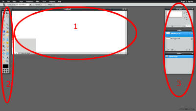](http://192.168.1.34:4945/wp-content/uploads/2014/01/pixlr-areas.jpg)

Pixlr tutorial: How to make your background for your author Facebook page
=========================================================================

1\. In the upper left hand corner, go to File, then choose Open Image. [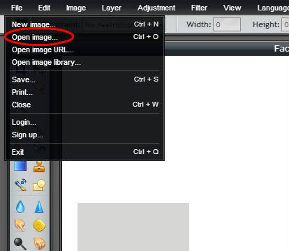](http://192.168.1.34:4945/wp-content/uploads/2014/01/open-image.jpg)2. Navigate your computer’s file browser that comes up and find your book cover images on your computer. Click open. You’ll be using these for color reference for your facebook cover photo background.

If your window is getting crowded, you can shrink the covers. To shrink an image in Pixlr without changing the image size, (also called zooming in and out.): Select (click) on the image area (book cover) that you want to shrink. Then go over to the right (area 3) to the Navigator box. Move the slider or type the percent you want into the text box. Your image window will reduce in size. [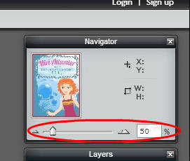](http://192.168.1.34:4945/wp-content/uploads/2014/01/shrink.jpg) Now you can drag the corners of your image box to decrease the size of the image frame box around your image.

3\. Now we’re going to make the color box as a background for your author logo. Pick a color from one of your book covers that will coordinate with all of them. You might want to have this cover’s image pretty big. I’m gong to pick a blue color from the Ocean’s Secret cover. Go over to your tools box in area 2 and choose the color picker tool – it looks like a medicine dropper. [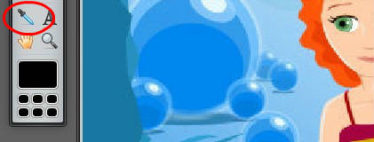](http://192.168.1.34:4945/wp-content/uploads/2014/01/color-picker.jpg) 4. Move over to your book cover image and, using the dropper as your cursor, click on the area that’s the color you want. The color in the black box on the tool bar will change. [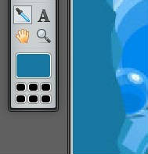](http://192.168.1.34:4945/wp-content/uploads/2014/01/color-change.jpg) 5. Shrink the cover (using the Navigator on the right) so we have more room to work on our cover template. Now click in the image area for the cover template so that we can work on that. (area 1)

6\. Go over to the Layers box. (in area 3) Click on New Layer. [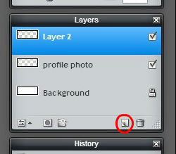](http://192.168.1.34:4945/wp-content/uploads/2014/01/new-layer.jpg) A new layer, here called Layer 2, will appear. (Don’t worry if you have another number. You were probably clicking around and learning all about Pixlr. The number won’t matter.) [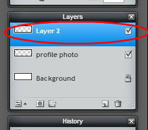](http://192.168.1.34:4945/wp-content/uploads/2014/01/layer-2.jpg) 7. Go back to the tools bar and select the drawing tool. [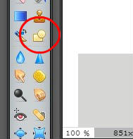](http://192.168.1.34:4945/wp-content/uploads/2014/01/drawing-tool.jpg)8. A new tool bar will appear at the top of the page, just under the file tool bar. Change the border size to zero. (You can click on the image below to see it larger.) [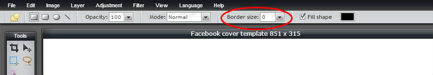](http://192.168.1.34:4945/wp-content/uploads/2014/01/border-size.jpg)9. Click on the Fill Shape color, which is currently black. [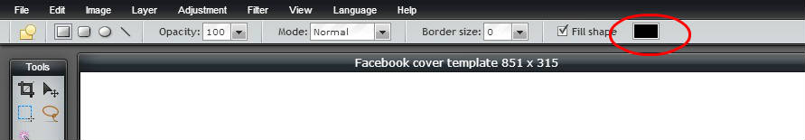](http://192.168.1.34:4945/wp-content/uploads/2014/01/fill-color.jpg)10. A color selector window will appear. Notice that if you move your cursor off of the color selector window, it will change from an arrow into the color picker tool (the eye dropper thingy.) Move over and select the color from the big box of color that you chose from your book cover in the tool box. The colors in your color selector window will change. [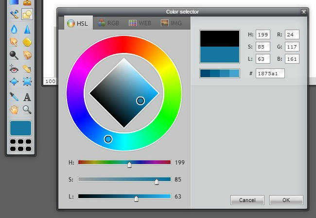](http://192.168.1.34:4945/wp-content/uploads/2014/01/color-selector.jpg)Click okay.

11\. Put your cursor in the upper left hand corner of the cover template until it turns into a cross. Click and drag down and across, then let go to make a box the size below. You might have to increase your magnification in the navigator, and then increase the size of your image frame by dragging, to get all the way into the corner. [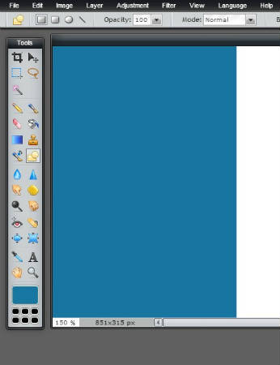](http://192.168.1.34:4945/wp-content/uploads/2014/01/draw-box.jpg) Oops! The gray box placeholder for your profile photo overlap disappeared. Don’t worry. We’re going to fix that.

12\. Move over to your Layers box. It currently looks like this: [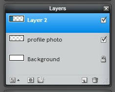](http://192.168.1.34:4945/wp-content/uploads/2014/01/layer-2-on-top.jpg) You want to move Layer 2 below the profile photo layer. You click and hold to drag it down. You want your layers box to look like this: [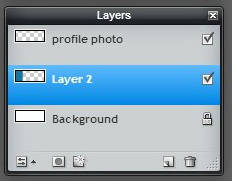](http://192.168.1.34:4945/wp-content/uploads/2014/01/layer-2-below.jpg)Wala! The gray box will reappear. You’ve made that layer visible again by changing the stacking order of the image layers.

13\. At this point it’s a good idea to save the work you’ve done so far. Move to the upper left, to file, and choose save. [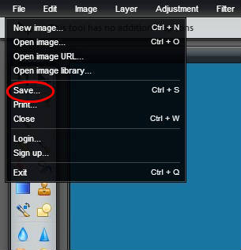](http://192.168.1.34:4945/wp-content/uploads/2014/01/save.jpg)14. Name your file. I’ve found it useful to always include the image size in the file name. I like names that are very descriptive! I also like to keep more than one version along the way, so I added a number. Choose the format pxd (layered pixlr image.) This is a special file type for Pixlr, and it will let you open the file back up and work on it if you ever want to change it. Click okay. [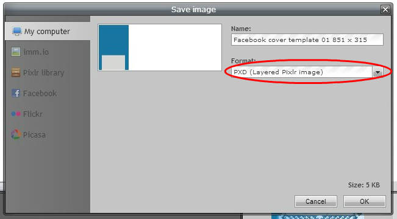](http://192.168.1.34:4945/wp-content/uploads/2014/01/save-pxd.jpg)15. The file browser for your computer will come up so you can choose where to save it. Click save.

16\. Now we’re going to add a little bit of a gradient, some shading, to the color so it won’t be so flat. Move over to your tools box and click on the gradient tool. [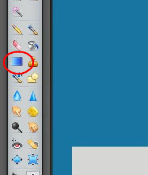](http://192.168.1.34:4945/wp-content/uploads/2014/01/gradient-tool.jpg) 17. Make sure that, in your Layers box, Layer 2 with your colored box image is highlighted. This means you are working on layer 2. You will also notice that a new tool bar has appeared at the top of the window. Yippee!

(I’m getting a little tired at this point of drawing red circles. How are you doing? Let’s press on.)

Set your Opacity to 15. [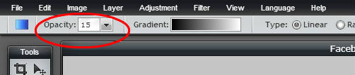](http://192.168.1.34:4945/wp-content/uploads/2014/01/gradient-opacity.jpg)18. Now, put your cursor cross on the left edge of your colored box on your Facebook page cover photo background. Click and hold as you drag across to the right side of your colored box (it will drag a line out behind it.) Let go. Your color will now be shaded. (You’ll notice that I decided my blue was too dark and I changed to a brighter color blue.) So before the gradient tool I had this: [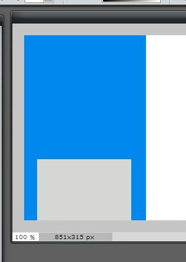](http://192.168.1.34:4945/wp-content/uploads/2014/01/before-gradient.jpg) And after the gradient I now have this: [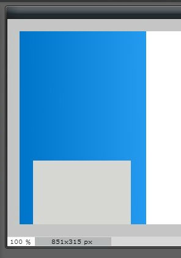](http://192.168.1.34:4945/wp-content/uploads/2014/01/after-gradient.jpg)I hope you can see the difference in both mine and yours. I posted these last two images at a little higher quality than I usually use for blog posts. I like a subtle gradient, so that most people won’t even notice it. It will just make your image look more professional, and most people won’t know why. 🙂 You are now a computer image expert with tricks!

If you can’t see the gradient on yours, just use Ctrl + Z to undo what you did, increase the opacity number, and try again. You might want to save again now. Don’t forget to save! If you forgot how, go back to step 13.

Wow! Are you still with me? These tutorials are taking way longer than I thought I would. And when I’m trying to make images for the tutorial I keep forgetting if I’m in my cover creating Pixlr or my tutorials image pixlr and “am I saving or am I drawing a red box around save?” 🙂 So if you’re finding this tutorial helpful, please leave a comment or shoot me an email and let me know! Or, better yet, check out my books for kids, [The Miri Attwater series](http://192.168.1.34:4945/books/ "E.S. Ivy books"), for the kid in your life or the kid inside you. Next post we’ll put our [book cover images on our facebook cover photo. ](http://192.168.1.34:4945/?p=1466 "pixlr tutorial")(link won’t work until post is published)