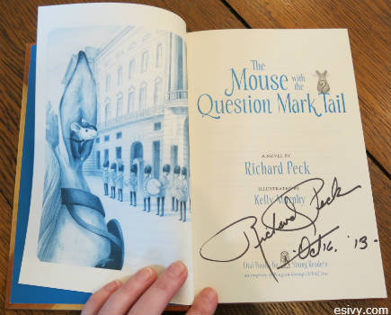
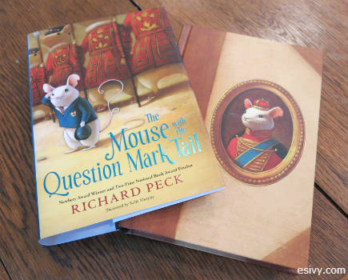
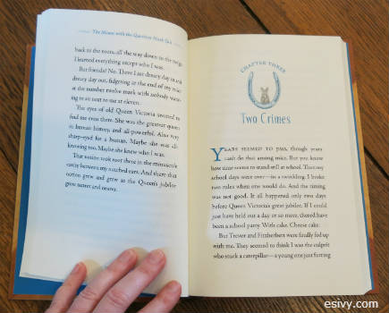
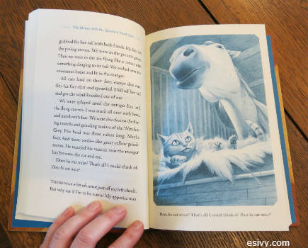
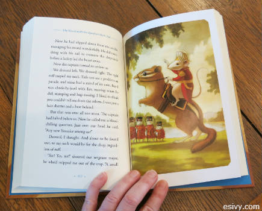

I’ve seen print publishing’s answer to ebooks.

Many have predicted the end of paper books, that they’ll go the way of the stone tablet. Others have suggested they’ll persist only as expensive collector’s editions – elaborate coffee table books with burnished gold edges.

I was lucky enough to attend a book signing at [Book People in Austin](http://bookpeople.com/) for Richard Peck’s new book, *The Mouse with the Question Mark Tail.* The future is already here. Richard Peck himself was quite pleased with the design of the book. I think he’s got ebooks to thank for it. For their Newbery Award winner, Penguin has turned out a stunning book.

The design starts with foil embossing on the front of the dust jacket and two-tone glossy printing on the back, but even the hard cover itself has a full color illustration.

The color continues to the inside, where every page has a touch of blue ink in the page folios and headers. First chapter pages have a two-color illustrations in blue and gray.

Every chapter has one or two full page illustrations – and not just in black and white, they’re done in blue. Some of Kelly Murphy’s lively illustrations have interesting perspective.

The real surprise, though, is the full color illustrations on glossy paper. The book has 3 of these vibrant pages. It’s not many, but I’ve never seen glossy color pages in a middle grade book before. Richard Peck pointed out that it’s his first book with full page color illustrations. (And he’s written a lot of books!)

It really is a beautiful book. And they’ve done it all at a price in line with other hardcover children’s books, $16.99. Even though I got to Book People early before the talk so that I could connect my laptop to the WiFi for [Stacy Abrams’](http://www.entangledpublishing.com/the-team/) SCBWI webinar on Best Practices in Digital Publishing, it was enough to make me want to buy a print book.

So it’s time for me to quit writing this post and get back to trying to figure out how to format Miri Attwater and the Ocean’s Secret for CreateSpace. It won’t be the same as Richard Peck’s book, but it’s a start. And then I’d better do some real writing.

Because beautiful printing and illustrations aren’t all *The Mouse with the Question Mark Tail* has going for it. Richard Peck is a master of storytelling. Even his author presentation was a masterful weaving of his inspiration, his life, his writing career, and humor.

Readers might pick up the book because of it’s beauty, but they’ll treasure it for the story.