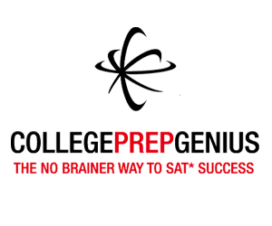

If you’re like a lot of high school students (or their parents), around this time of year you’re probably worrying about how you can improve your SAT score. If you’ve been following my blog, you know I’ve been questioning the worth of a lot of the standard advice you’re given for improving your chances of getting into college and being successful, but one thing I’ve found is that good SAT or ACT scores are still definitely important for college admission. This is one place that it’s still definitely worth your time to put in some effort. (For a information on schools that will even give you a full ride scholarship based on your SAT score, see the post [What ACT or SAT Score Can Get You a Full-Ride Scholarship? by My Kid’s College Choice.)](http://www.mykidscollegechoice.com/2013/11/09/what-act-or-sat-score-can-get-you-a-full-ride-scholarship/)

I’m still working on setting up my blog specific to high school, college, and success, but my son just finished studying for the PSAT, which he took yesterday. (For the difference between the SAT and the PSAT, see [What is the PSAT on DIY College Rankings.](http://diycollegerankings.com/faqs/what-is-the-psat/)) His scores were already high, but even with private tutoring he’d reached a limit in his improvement. He was frustrated, so I did a lot of research into how to improve your SAT scores. And he did improve. To the point that he was capable of even perfect scores on practice sections. (In case you’re wondering, I was a National Merit Scholar, back in the day. 🙂 But we didn’t even consider him prepping for National Merit Scholar level until his practice test his sophomore year showed him to be within reach of the qualifying score.)

However, the more I dug into it, I realized that [the quest for National Merit recognition now is like trying to get Olympic Gold](http://192.168.1.34:4945/?p=2756). In the Olympics, all of the athletes have the skills, and top competitors are separated by fractions of a second. Different athletes will win on different days and some will crumble under the pressure. Same goes for the PSAT. It will be interesting to see if the new format of the PSAT has any effect.

But, if your quest is for high SAT scores or to raise your SAT score, it’s at least not a one day shot. And all your efforts studying for the PSAT will pay off when you take the SAT later.You can take the test more than once. But if you need some help raising your SAT score, following are the best resources I found to improve your SAT scores without a private tutor. Unless you’re graduating in 2017 or later\*, you’ve got to know a bunch of “SAT words.” So some resources for improving your vocabulary, learning more SAT words, are included.

6 Best Tools to Improve your SAT Scores without a Private Tutor
===============================================================

This is not just a list of SAT prep tools that I just found in a web search. These are all tools that my son personally tried and found useful.

  
1\. [The Official SAT Study Guide Second Edition by The College Board. ](http://www.amazon.com/gp/product/0874478529/ref=as_li_tl?ie=UTF8&camp=1789&creative=9325&creativeASIN=0874478529&linkCode=as2&tag=esiv-20&linkId=7XXUH53GVBGZJPDZ)No matter where you go after this, you’ve got to start here. This will give you official practice tests to help you track your progress. Be sure you get the most up to date edition.\* For the form of the test being given right now, that’s [The Official SAT Study Guide Second Edition](http://www.amazon.com/gp/product/0874478529/ref=as_li_tl?ie=UTF8&camp=1789&creative=9325&creativeASIN=0874478529&linkCode=as2&tag=esiv-20&linkId=7XXUH53GVBGZJPDZ) or [The Official SAT Study Guide with DVD Jan 3, 2012.](http://www.amazon.com/gp/product/0874479797/ref=as_li_qf_sp_asin_il_tl?ie=UTF8&camp=1789&creative=9325&creativeASIN=0874479797&linkCode=as2&tag=esiv-20&linkId=VF7HUZDXDTSF3F7A)

2. [College Prep Genius.](https://store.collegeprepgenius.com?affiliates=68 "College Prep Genius Affiliate Link") This was recommended to us by my niece, who’s a National Merit Commended Scholar. She attended a workshop, after she took the PSAT, and says she definitely would have done better on the PSAT with this information. We ordered their [set of SAT prep videos,](https://store.collegeprepgenius.com/shop/sat-prep-course-dvd-set?affiliates=68) and this is the information that helped my son’s speed. (For example, in a reading section you have 25 minutes to complete 24 questions. So speed is an issue.)

These videos are not exciting. 🙂 But after watching these videos, my son could finish each section with time to spare. And, when he strictly followed the step-by-step methods for critical reading and writing, he improved his accuracy for correct answers. Before watching these videos, there were always 2-4 questions on the PSAT Reading and Writing sections that he would narrow down to two best answers and then pick the wrong one. These videos showed him how to “crack the code” and decide between the two to find the one best answer!

3\. [Reasonprep.com ](http://reasonprep.com/ "SAT study")– My son seems to learn better from videos than from reading. This is the best resource if found for studying on-line. There are a lot of free videos and resources before you get to the paid version. (He also has [ACT study resources.](http://reasonprep.com/act-english-bootcamp/))

We found it late, so my son only used some of the critical reading videos, but the explanations were excellent and easy to listen to. After listening to some of the videos accessed through the paid version, my son felt more confident applying the methods he learned in the CollegePrep Genius videos below.

At the point we started using these videos, my son was already capable of perfect scores on the PSAT math sections (the PSAT and SAT math sections, and all the test sections, are slightly different between the two), but I would expect the math videos to be good as well. In addition, check out the breakdowns on what kind of [preparation you need to do to achieve different SAT score ranges,](http://reasonprep.com/how-to-achieve-from-1500-to-2400/) and [how to cram for the SAT](http://reasonprep.com/sat-crash-course/) if you’re running out of time. He goes over two cram plans in his free video that I’ve linked to below.

<iframe allowfullscreen="allowfullscreen" frameborder="0" height="315" src="//www.youtube.com/embed/fYVvSHM9KFA" width="560"></iframe>

  
4\. [Vocabulary Cartoons, SAT Word Power, by Sam Burchers. ](http://www.amazon.com/gp/product/0965242234/ref=as_li_tl?ie=UTF8&camp=1789&creative=9325&creativeASIN=0965242234&linkCode=as2&tag=esiv-20&linkId=HWT64ROM4T25K7KC)Drilling vocabulary words is a drag. To add insult to injury, vocabulary words learned by drill and kill aren’t likely to stick with you. My son already knew quite a bit of vocabulary, but we started trying to expand it pretty early so this and the other vocabulary tools below were some of the first resources he used.

They say a picture’s worth a thousand words, and the cartoons in the book are clever and memorable. Keep it some place you can browse it in a spare moment.

5\. [The Kindle Paperwhite.](http://www.amazon.com/gp/product/B00JG8GOWU/ref=as_li_tl?ie=UTF8&camp=1789&creative=9325&creativeASIN=B00JG8GOWU&linkCode=as2&tag=esiv-20&linkId=OD3YUYFC4HATG6FA) Like I said, my kids are all big readers, so their vocabularies are already pretty extensive. Reading is one of the best ways to permanently expand your vocabulary. But everyone has words they even read regularly without really knowing their exact meaning. The Kindle Paperwhite has [Vocabulary Builder.](http://www.amazon.com/gp/help/customer/display.html?nodeId=201306850#GUID-BF735541-6435-4FA8-9963-D368AED50062) If you look up a word in their dictionary, you can put it in a vocabulary list that has flashcards and will show it in the context of the book in which you read it. You can see [a good description of of the Vocabulary](http://www.dummies.com/how-to/content/how-to-use-vocabulary-builder-on-your-kindle-paper.html) from the [Kindle Paperwhite for Dummies 2nd edition. ](http://www.amazon.com/gp/product/1118855329/ref=as_li_qf_sp_asin_il_tl?ie=UTF8&camp=1789&creative=9325&creativeASIN=1118855329&linkCode=as2&tag=esiv-20&linkId=ESF5SMPTD7TLTNWX)The downside – the words from library books will disappear when you return the ebooks to the library.

I got the “special offers” discounted version for myself. But if you don’t want to look at (or you don’t want your kid to look at) ads with horror, thriller, and romance covers, I suggest you pay for the version without the ads.

6. [Direct Hits Core Vocabulary of the SAT 5th Edition (2013). ](http://www.amazon.com/gp/product/1936551136/ref=as_li_tl?ie=UTF8&camp=1789&creative=9325&creativeASIN=1936551136&linkCode=as2&tag=esiv-20&linkId=WBQ4QLWSXWC7CDSF)This was one of the best resources I found for drilling vocabulary words and giving them a chance of sticking. In addition to the definition, words are also given in context from places like pieces of literature.

As a bonus, get the Kindle version of this book and put all the words that are new to you on the list in your vocabulary builder of your Kindle Paperwhite.

Remember, studying for the SAT should be a balance between achieving perfection and a reasonable level of effort. More on that when I get my new site up and running!

UPDATE: To see how these tools worked for my son, see my post, [What PSAT score is good enough to qualify for a National Merit Scholarship?](http://192.168.1.34:4945/?p=2970)

For more ideas, see [Studying for the SAT for Free on the College Solution website.](http://www.thecollegesolution.com/studying-for-the-sat-for-free/)

Good luck!

\*If you’re graduating from high school in 2015 or 2016, then you’ll be taking the current form of the SAT for college admission. If you’re graduating in 2017 and think you’ll do well on the current SAT, then you might hedge your bets by taking at least one SAT before the form changes. For students graduating in 2017 or later, the new version of the SAT can be used for college admission. Many of the resources above will adapt to the new test and I would expect them to be excellent. They’re where I’ll go first for our younger kids’ SAT prep.

*The SAT and PSAT/NMSQT are registered trademarks of The College Board and National Merit Corporation and do not endorse this website. Some of the links on this post are affiliate links, meaning that if you navigate to the sites and make a purchase, AT NO COST TO YOU, I will receive a small commission. Remember, all of the products in this post, both with and without affiliate links, are products that we have personally used.*