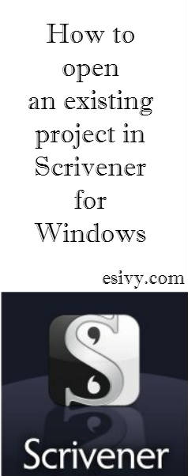

Are you not sure what to click on in [Scrivener](http://www.amazon.com/gp/product/B0079KJB54/ref=as_li_qf_sp_asin_il_tl?ie=UTF8&camp=1789&creative=9325&creativeASIN=B0079KJB54&linkCode=as2&tag=esiv-20&linkId=C5TX4ZEFK5RLOVJO) for Windows to open an existing project? Are you depending on “Recent Projects” in Scrivener to find your files? Then this Scrivener for Windows tutorial is for you! (If you’re really in a panicked rush and just want to know the steps, check out my post [How to open a File or Project in Scrivener for Windows, A Quick Guide](http://192.168.1.34:4945/?p=2425). To understand fully why it works this way, read on.)

Maybe it’s just me.

But I couldn’t find a good explanation of how to open an existing project in Scrivener anywhere. Instead of risking messing something up in the all important project folder, I resorted to depending on Recent Projects. For obvious reasons, this method eventually broke down.

It’s just opening a file! How hard could that be? You’d think this would be fairly obvious from reading the [Scrivener 1.7 for Microsoft Windows Users Manual ](http://www.literatureandlatte.com/documentation/scrivener-manual-win-a4.pdf "Scrivener for Microsoft Windows Users Manual"). But this is one of those cases where the “experts” have no idea how clueless some of us non-techies can be.

In 7.4 of the manual, Opening Existing Projects, it tells you that: *“You can open older projects using File &gt; Open… (Ctrl-O), or click the Open an Existing Project… button in the Project Templates window.”*

But what they don’t tell you is that when you try File&gt;Open and browse around to your Scrivener files, what you’re going to see is your project “folders” named according to what you selected when you created your projects. If you’re like me, you’re going to click on one of them and expect them to launch your Scrivener project.

Only that isn’t going to happen.

When you click on a folder — that has the familiar name from when you made the project — Scrivener won’t “open” it. Instead, you’ll be shown inside that “folder.” There you’ll see a list of 4 more items:

- Files
- Settings
- Snapshots
- project.scrivx

If your view is like mine, all those tiny icons are the same yellow color, and they look a lot alike. So it looks like all the items inside that folder are all the same, and none of them have the name you created on it. Well, given all the warnings not to mess with anything inside the Scrivener project folder, I was scared to click on anything!

According to my tech expert, this file structure is likely a hold-over from originally creating Scrivener for the Mac. They needed to connect several different files and they had to figure out a way to use the Windows files and folders structure. The tip off is that one of those items inside the “folder” that has your project name, has an an extension like you’re used to seeing on the ends of documents or photos. That extension is “.scrivx.” This is your clue that this item is different from the other folders inside there. And if you go back to the original “folder” that had your Scrivener project name on it (the name you chose when you created the project) THAT folder has the extension “.scriv.”

Unfortunately, when you name your project in Scrivener, it doesn’t actually put your name on what you’re going to click on to launch the project. That’s because they don’t want someone to go around cleaning up files on their computer and move it away from all the other files it needs, like Settings and Files. If you keep reading in the Scrivener Manual, you’ll find this clue as to what you need to open to launch your project:  
*“Projects can also be opened directly using the Explorer, or any shortcuts to the .scrivx file.”*

Aha! That .scrivx file is what you want! Even though this doesn’t have the specific project name on it, after you go inside your project folder, this is what you’re going to click on to launch your Scrivener project!

That .scrivx file not being named is also what will make it hard to search for your projects and launch them directly – if multiple come up how do you know what you’re opening? For more help on searching for your existing Scrivener projects, see [How to Find Your Saved Scrivener files or projects. ](http://192.168.1.34:4945/?p=2507)(Link will work when post goes live.)

So here you have it –

How to open an existing Scrivener for Microsoft Windows file (or project)
-------------------------------------------------------------------------

1. Inside Scrivener, go to File &gt; Open, or use the shortcut (Ctrl +O).
2. Browse to find your Scrivener project folders that you named when you created the project. Click on the folder with the correct name of the project you want to open.
3. Scrivener will now open that folder and you’ll see 4 files inside it:  
  – Files  
  – Settings  
  – Snapshots  
  – project.scrivx
4. Click on the project.scrivx file. Scrivener will open your project.

That should have you on your way to using Scrivener for Windows files more correctly. While we’re on the subject – Are you saving your Scrivener projects correctly? Are you sure? 🙂 Check out my post [Safely Saving Scrivener Files and Projects.](http://192.168.1.34:4945/?p=2432) (Link will work after post goes live.)

For quick reference, bookmark my post, [How to open an existing Scrivener Project in Windows, A Quick Guide. ](http://192.168.1.34:4945/?p=2425)(Link will work after post goes live.)

  
Read more about the great novel writing software, [Scrivener, ](http://www.amazon.com/gp/product/B0079KJB54/ref=as_li_qf_sp_asin_il_tl?ie=UTF8&camp=1789&creative=9325&creativeASIN=B0079KJB54&linkCode=as2&tag=esiv-20&linkId=C5TX4ZEFK5RLOVJO)at their website, [Literature and Latte.](http://www.literatureandlatte.com/scrivener.php "Scrivener")

~ Happy Writing!

*Note: Some of the links in this post are affiliate links at absolutely no cost to you. Thanks for supporting the hours I spend writing tutorials in this way!*