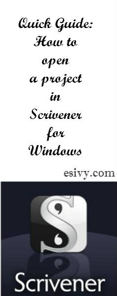

If you’re baffled by what file, exactly, you need to click on to open an existing project in [Scrivener for Microsoft Windows,](http://www.amazon.com/gp/product/B0079KJB54/ref=as_li_qf_sp_asin_il_tl?ie=UTF8&camp=1789&creative=9325&creativeASIN=B0079KJB54&linkCode=as2&tag=esiv-20&linkId=C5TX4ZEFK5RLOVJO) this guide will help you!

(You might also be thinking of this as needing to know how to open a Scrivener file. Folders, files, documents, and projects in Scrivener; they all get a bit confusing!)

How to open an existing Scrivener for Microsoft Windows project, a Quick Guide
------------------------------------------------------------------------------

1. Inside Scrivener, go to File &gt; Open, or use the shortcut (Ctrl +O).
2. Browse to find your Scrivener project folders that you named when you created the project. Click on the folder with the correct name of the project you want to open.
3. Scrivener will now open that folder and you’ll see 4 items inside it:  
  – Files  
  – Settings  
  – Snapshots  
  – project.scrivx
4. Click on the project.scrivx item. Irregardless of the fact that the project.scrivx item doesn’t have the name of the project you’re trying to open, that’s the one you want! (If you hover over the icon, it will tell you it’s a Scrivener project.) When you click on the project.scrivx item, Scrivener will now launch your project!

If you still have questions about what you’re doing, see my post [How to open an existing Scrivener Project in Windows, fully explained.](http://192.168.1.34:4945/?p=2416)

That should have you on your way to using Scrivener for Windows files more correctly. While we’re on the subject – Are you *saving* your Scrivener projects in the right place? Are you sure? Are you backing them up? 🙂 Check out my guide, [Safely Saving Scrivener Files and Projects. ](http://192.168.1.34:4945/?p=2432)(Link will work when post goes live.)

  
Read more about the great novel writing software, [Scrivener, ](http://www.amazon.com/gp/product/B0079KJB54/ref=as_li_qf_sp_asin_il_tl?ie=UTF8&camp=1789&creative=9325&creativeASIN=B0079KJB54&linkCode=as2&tag=esiv-20&linkId=C5TX4ZEFK5RLOVJO)at their website, [Literature and Latte.](http://www.literatureandlatte.com/scrivener.php "Scrivener")

~ Happy Writing!

*Note: Some of the links in this post are affiliate links at absolutely no cost to you. Thanks for supporting the hours I spend writing tutorials in this way!*