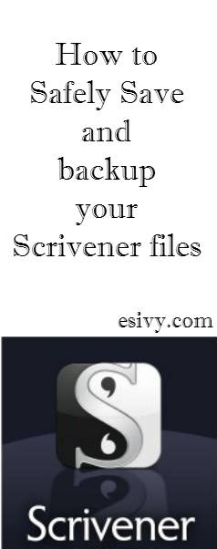
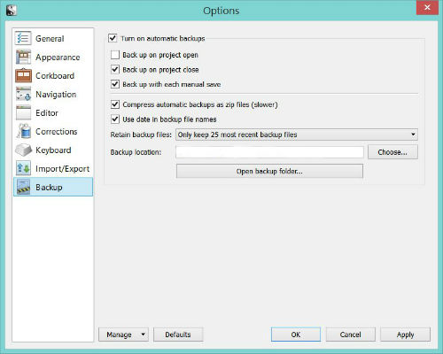

[Scrivener ](http://www.amazon.com/gp/product/B0079KJB54/ref=as_li_tl?ie=UTF8&camp=1789&creative=9325&creativeASIN=B0079KJB54&linkCode=as2&tag=esiv-20&linkId=ZMGLQ6NFASUCCEAW) is an amazing piece of writing software! It’s great for constructing a novel or even keeping track of all your blog posts. But it has a few moving parts.

At some point in learning how to use it you probably have the urge to GET BACK TO WRITING ALREADY. If you’re at that point, but are smart enough to not start off without being absolutely sure you’re backing up to the right places, I’m going to fully explain how to do that. Or if you’re like me, and hobbled together a backup “somewhere” and mailed yourself backup files “just in case” and were relying on “Recent documents” to find what you’ve been working on – you might have quite a mess. Here’s how to figure out a place to put things.

There seems to be a lot of confusion about how, when, and where Scrivener saves your files. I found a few blog posts that hinted at the right information about where you should be saving your files, but they didn’t tell me how to do it. I think part of the confusion comes from the complicated way that Scrivener for Windows saves projects, inside folders that aren’t really folders. (That results in the “What is it I’m supposed to click on to be able to open my project?!” confusion.) It makes it hard to recognize the Scrivener files on your computer, and it’s one reason why I resorted to depending on Recent Projects to find my files.

Yeah, that was a mistake. Pretty soon I didn’t have any idea where my files actually were on my computer, which were backups, and which were my working copies. Sound familiar? Gee, I hope I’m not the only one!

(For more information on how Scrivener saves your working projects, see my post [How to open an existing Scrivener Windows project](http://192.168.1.34:4945/?p=2416).)

I’ve also been doing a lot of tech learning on the web lately, and in addition to my dogged persistence and a need to understand everything down to the finest detail, I have the advantage of a in-house tech expert to explain all the things that software engineers just assume “everybody knows.” Those are the parts that they leave out and I keep hunting for. So there’s quite a bit of explanation in this guide. (If you want just a quick and dirty guide, I’ll post that later as [Safely Saving files and Backing up your work in Scrivener, a quick guide](http://192.168.1.34:4945/?p=2481). \[Link will work after post goes live.\]) I work on a Windows PC, but from what I’ve read you should be able to follow this flow with the Mac as well.

(When I refer to “saving projects,” I might also use the term “saving files,” because if you aren’t really familiar with Scrivener that’s probably what you’re calling Scrivener projects – files or documents.)

First the basics.

Where do you want to save your Scrivener files, or Scrivener projects?
======================================================================

I wanted to save my Scrivener files 3 places to have working copies and backups:

- my laptop hard drive
- a removable copy on a flashdrive, USB stick, or memory card (For more information, see my post: [Types of removable storage media](http://192.168.1.34:4945/?p=2448) )
- in the cloud

#### What does storing “in the cloud” mean?

Storing “in the cloud” just means that you’re going to store your files somewhere remotely on someone else’s computer, usually a computer owned by some big company. For example, Amazon has cloud storage.\[link\] You can pay for this, but there are a lot of places that will give you some space for free. Right now, [Dropbox ](https://db.tt/NTJdiGou) offers 2 GB for free, and that’s what I use to backup my work.

There’s one thing that’s kind of confusing about cloud storage. The way cloud storage works is that you put things you want saved in the cloud into a folder on your computer. The cloud service will access that folder and make copies in the cloud.

From the Dropbox Help Center,

“…using \[the Dropbox application\] on your computer is just like using any other folder on your hard drive, except the files you drag into your Dropbox folder automatically sync online and to any other computers or mobile devices linked to your account. The application runs in the background and automatically keeps your files in sync and backed up online. It’s like having the same folder on all of your computers and mobile devices at the same time.”

This means that in addition to having a copy storied in the cloud, you’ll also have a copy saved on your hard drive, where you put it for the cloud service to look for it. So you automatically have two copies!

According to Scrivener support, Dropbox also plays well with Scrivener. If you use the link above, or this link to [Dropbox](https://db.tt/NTJdiGou) we both get 500 megabites of free bonus space in addition to the 2 GB! It’s a win-win. Just sign up, and they have a great tutorial to guide you to set up.

Now we need to make sure you understand where Scrivener saves your projects, and when it saves them.

Where does Scrivener save your projects?
----------------------------------------

The first thing you need to know is that Scrivener saves your project two places. (Not just one. Although by default it’s two different places on the hard drive. So that’s two places, on the same piece of hardware. This is where most of the confusion comes in.) And it does this somewhat automatically.

1\. Scrivener saves your project to where you designate when you first create it. This is also the place where Scrivener auto-saves every time your Scrivener screen goes idle for 2 seconds. And it’s going to be saved directly over your old file, just like if you had used File&gt;Save or Ctrl + S in your old word processor. (Oh, who are we kidding? Everyone used Microsoft Word.) You can read about this in Section 7.2 Creating a New Project in the [Scrivener 1.7 for Microsoft Windows Users Manual](http://www.literatureandlatte.com/documentation/scrivener-manual-win-a4.pdf).

2\. Scrivener also saves your files to a backup location, somewhat automatically. This is where it saves “copies.” I say “somewhat,” because there are some settings you can adjust to change when Scrivener does this. And it always requires that you do something – like close the project – to trigger the backup save. When Scrivener saves these backup files, it does not automatically rewrite over the original you’re working on; it saves copies in another location. And you can change the number of copies it holds before it starts deleting old ones. You can read about this in Section 7.8 Backing Up Your Work, Section 7.8.1 Configuring Automated Backups in the [Scrivener 1.7 for Microsoft Windows Users Manual ](http://www.literatureandlatte.com/documentation/scrivener-manual-win-a4.pdf%5D).

3\. Scrivener will also let you save back-up files manually anywhere you want, whenever you want when from the toolbar you choose File &gt; Backup &gt; Backup to…

So now that we’ve decided what locations we want to save our files to, and when and where Scrivener saves files, it’s time to come up with a plan for saving and working with Scrivener files. Remember, I wanted to save my files three places: on my computer, a removable copy on a memory card/flash drive/USB stick, and somewhere in the cloud. Two of these file saves can be done automatically by Scrivener. One I’ve got to remember to do manually. Here’s what I came up with.

Where to safely save your files in Scrivener – 3 types of storage – the logic
=============================================================================

Below I’m going to walk you through the logic of saving my single working copies to my computer hard drive (that will be backed up automatically to DropBox,) save my 25 most recent copies of my periodic automatic backups to DropBox, and save multiple copies of backups to a removable memory card. Later, I’ll walk you through the steps to do it.

### 1. I want my working copies, the one Scrivener automatically rewrites every time there’s inactivity, to be saved my computer hard drive.

(Note that I don’t routinely work on more than one computer and want to sync the files. For help with that, see [Using Scrivener with Cloud-Sync Services ](http://scrivener.tenderapp.com/help/kb/features-and-usage/using-scrivener-with-cloud-sync-services), written by the great people at Scrivener support.)

And because I’m trying to be extra-careful, I’m going to save them to a folder that will also be backed up to the cloud. (I’m setting up a folder to backup most the documents I keep on my computer to be backed up in the cloud.)

Note that if you decide to do this, you want to be extra-careful not to open up the file at the same time on more than one computer. (I always work on the same computer.) Also, if you have a slow internet connection, continually syncing with Dropbox might bog things down for you. If so, you might want to tweek your settings, work out a standard procedure, or always work off your hard drive into a folder that’s not backed up to the cloud.

So, if you signed up for Dropbox, you now have a Dropbox folder on your computer. This is where you put all the files you want backed up to Dropbox.

Most programs when you save a file for the first time will automagically find your “Documents” folder on your hard drive and save things to there. So, naturally, it seems like you should just drag or copy that file into your Dropbox file. But you can’t. Because Microsoft has made your Documents folder some type of special locked-up type folder. Here’s the work around.

#### How to Automatically backup your documents to DropBox

1\. Make a Documents folder to be backed-up to Dropbox

2\. In your file explorer, look into the files in your Dropbox folder. Make a new folder and name it, something like DropBox Documents.

3\. Right click on the folder, choose copy.

4\. In your file explorer, go into your Documents folder on your hard drive, right click, and choose “paste shortcut.”

Now whenever a program prompts you to save into your Documents folder, you’ll see the reminder to save it into this folder that will be backed-up automatically to Dropbox.

2. I want my automated backups made by Scrivener to be saved to the cloud by DropBox.
-------------------------------------------------------------------------------------

Because of the way cloud storage generally works, this means that these backups will be in the cloud and in a folder on my computer hard drive. (The cloud service will monitor the folder for changes and download the new and updated files when I’m connected to the internet.)

I’m bad about not closing my projects or Scrivener, even at the end of the day. So in addition to making an automatic backup when I close a project, I’m also going to choose to make automatic backups every time I save manually (File &gt; Save or Ctrl+S). For clarification, saving the file manually this way saves over the file that you’re working in; it does it to the same file that Scrivener saves automatically every time Scrivener is idle for 2 seconds. But with the settings below, in addition to saving over the file I’m working on, I’m going to trigger Scrivener to make a backup copy.

I’m going to try to remember to do manual saves about once an hour when I’m working. So, I’m going to choose to save 25 automatic backup copies. That should give me copies back 2 or 3 days at the rate I work.

3. I also want to save backups to a removable memory card.
----------------------------------------------------------

This is where I’m going to save a different copy at the end of every day’s work for all eternity. That way if I’m working on Chapter 25 of a novel and don’t realize that Chapters 1-12 have been erased until I get to THE END 6 months later, I’ve still got backups!

I like the memory card because most of the time it just sits unobtrusively in my computer. And if it fills up with copies, I’ll just start a new one. It may be worth noting that my tech expert thinks the removable copy is completely unnecessary, but I wanted this for a couple of reasons. Those whose second language is computer just can’t grasp the comfort of a copy you can actually hold in your hands, even if you can’t use it without putting it into a computer. And also I wanted a backup system that was completely independent of the automatic backup in case there was a glitch with that. And lastly, I wanted a place where I could keep lots of copies, just in case I don’t notice that somethings gone horribly wrong on one end of the files I’m happily working on the other end.

I’m going to keep all of my manual backups, so like I said, I’ve decided that I’m going to aim for saving one copy at the end of each day. Even at that rate, my 4 GB memory card will take a long time to fill up! When that happens, I’ll just buy another. Like all copies, something could happen to this disk or the copy on it. I’ll still have my working copies on my hard drive, and my most recent 25 copies of each of the files in the cloud. These removable copies will be my long term copies. If I was really paranoid, I would back them up again too. But there is a limit. 🙂

So, now that you’ve got an explanation of all the decision points, here’s a summary of where I’m keeping all my Scrivener files.

Where to Safely Save and Backup your Scrivener Files
----------------------------------------------------

### 1. Save single working copies to my computer hard drive (that will be backed up automatically to DropBox, cloud storage)

### 2. Save 25 most recent copies of my periodic automatic backups to DropBox, cloud storage

### 3. Save multiple copies of backups to a removable memory card.

And here’s the quick guide to the how-to.

How to Safely Save and Backup your Scrivener Files or Projects
==============================================================

1. Create and Save your Project
-------------------------------

When you start a project, be sure you pick a location to save it on your computer where you can find it again. When you create your project, the right of “Where:” choose “Browse” and find where you want to save your Scrivener projects.

As I said above, I’m going to think of these files as being just “on my hard drive,” but I want it to be on a part of my computer hard drive that’s backed up to the cloud. So for me, I’m going to browse to the folder for saving my working Scrivener files that I’ve set up in my documents folder inside my folder that Dropbox monitors. ([How to automatically backup your documents folder to DropBox](http://192.168.1.34:4945/?p=2494)) If you’re not backing this copy up, just put it somewhere you can find on your hard drive, probably your Documents folder.

2. Set Scrivener’s auto-backup location
---------------------------------------

This will be your 25 most recent backups.

1\. From the Menu choose Tools&gt;Options

2\. In the new window, from the menu on the left choose “Backup.”

3\. Make sure “Turn on automatic backups” is checked.

4\. Make sure “Back up on project close” is checked.

5\. Check “Back up with each manual save.”

6\. Next to “Retain backup files:” select “Only keep 25 most recent backup files” from the drop-down menu activated by clicking on the down arrow to the right.

7\. Make sure “compress automatic backups as zip files” is checked. (It will save you room on your backup disk.)

8\. Check “Use date in backup files names.” This will make it easier to make sense out of your backups files should you need to sort through them.

9\. What you have should now look like this:

10\. To the right of “Backup location” click the button that says “Choose…”.

11\. Browse to find where you want to back up your files, For me, it’s a folder I made specifically for Scrivener backups inside the folder that’s monitored by Dropbox. Select it.

12\. Click “Okay.”

(insert image – already made in scrivener tutorial pictures folder)

3. Backup to a removable copy, done manually once a week.
---------------------------------------------------------

This is the backup to a removable memory card, USB stick, or flash drive. This is the backup that I’m going to remember to make manually. And I can keep saving as many as I want, even filling up memory cards and starting new ones.

1\. Choose File &gt; Back up &gt; Backup to…

2\. On the right, click on the “Browse” button and find your removable storage device.

3\. I leave it with the default of putting the date in the name and I let it zip the files.

That’s it! I just have to remember to do it…

More Scrivener Tutorials and Guides
===================================

And now you know how to save your files safely and know exactly where they’re saved. If you need help figuring out how to open an existing Scrivener file now that you’ve saved it and know where to find it, see my post on [How to open an existing Scrivener for Windows project.](http://192.168.1.34:4945/?p=2416)

For instructions on how to open a project from a zip file, see [Gwen Hernandez’ post: Automatic Backups with Scrivener 2.X](http://gwenhernandez.com/2011/01/11/tech-tuesday-automatic-backups-with-scrivener-2-x/) and scroll down to “Restoring a Project from a Backup File”

Other Scrivener Resources:

If you’re new to Scrivener or find it faster to look things up in a book than to google every question, I’ve found [Scrivener for Dummies](http://www.amazon.com/gp/product/1118312473/ref=as_li_tl?ie=UTF8&camp=1789&creative=9325&creativeASIN=1118312473&linkCode=as2&tag=esiv-20&linkId=ALNU4OC3TVIW3DUO) to be excellent! It’s by [Gwen Herndandez.](http://gwenhernandez.com/)

If you need help recovering lost Scrivener files, try [Recovering Scrivener Files on Author’s Log ](http://www.davidearle.com/2013/01/triage-recovering-scrivener-files-from.html)and be sure to look at the comments.

For help with all things Scrivener, don’t forget to check out the [Literature and Latte Forums](http://www.literatureandlatte.com/forum/viewforum.php?f=29).

  
*Some of the Amazon links in this post are affiliate links, meaning I get a small commission – at not cost to you – if you make a purchase. Thanks for supporting my time writing these tutorials in this way.*