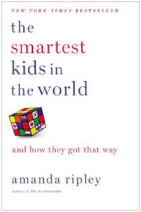

As I’ve outlined in my previous posts, I was pondering how to [guide our kids to the best path of success](http://192.168.1.34:4945/?p=1903 "success factors: 1"), starting in high school by analyzing what the success factors are. We’ve tried both [a partial load of preAP/AP classes ](http://192.168.1.34:4945/?p=1920)and a [full load of preAP/AP classes.](http://192.168.1.34:4945/?p=1927) Our personal experience has been that both ways have their own drawbacks.

Then I came across, [The Smartest Kids in the World: and how they got that way, by Amanda Ripley](http://www.amazon.com/gp/product/1451654421/ref=as_li_qf_sp_asin_il_tl?ie=UTF8&camp=1789&creative=9325&creativeASIN=1451654421&linkCode=as2&tag=esiv-20 "Buy it on Amazon").

Of course, everyone would like to think that their kid is the smartest kid in the world,:) even if they don’t want to admit it. But that’s not really what this book is about. It’s an unfortunate title, because it might make most parents think that the book has nothing to offer for their “average smart” kids let alone their “average” kids, but it does.

It’s not about being the “smartest” but about what type of education makes all kids “smarter.” In fact, one of the illustrations in the book was that a company was moving one of it’s factories overseas, not because it needed PhDs, but because in it’s current location in the United States, it couldn’t find enough workers who could do the jobs on their *assembly lines.* Technology is upping the game everywhere, and in every job, problem solvers – not just widget movers – are needed.

You can get an exact rundown of the book elsewhere, so I’m just going to give you a really brief introduction to the book and then my take-away impressions.

The book looks at the results of a different type of educational test, one that doesn’t test if the students have learned facts, but one that tries to measure if students have *learned to think on their own.* It’s the PISA test, Program for International Student Assessment.

Countries get ranked according to the results of that test. Ripley then picked out three countries – South Korea, Finland, and Poland – to compare their educational systems to the that of the United States. Among other things, she talked to exchange students both from and to those countries. She also traveled to talk to students and educators first hand.

South Korea’s educational system is generally regarded to be among the top in the world and it’s been up there awhile. It’s a system of high stakes testing and unbelievable pressure. Students attend school during the day, then attend private tutoring classes late into the night, which often cause them to fall asleep in their school classes the next day. It is generally accepted that most of the learning takes place in the private tutoring classes. Tension and pressure are high, students are miserable, teen suicide and depression rates are high. Even educators in Korea aren’t happy with their current system and are looking to change it.

Does the system sound familiar? Ironically, that’s the system that the United States still seems to be going to great lengths to emulate!

This system was compare to Finland – which is ranked top among the countries in the survey – and Poland, which is rising fast. In both Finland and Poland, students *have very little homework.* In both countries, students *have a lot of spare time.*

This is nothing like the United States.

Students do *not* take lots of standardized tests.

And yet, students are expected to – and do – pass rigorous graduation exams. One recent question on an exit exam was “Why is it difficult to achieve peace in the Middle East?”

Um, yeah. I could write a sentence, maybe stretch it out into a paragraph, myself. And yet I do consider it an interesting and important question.

So this is an indication that lots of homework is not needed to learn massive amounts and pass difficult exams.

In addition to lack of lots of standardized tests, the main difference I remember is that in both countries the standards for teachers are high. But they’re not just high *after* a teacher begins their career. There are high standards to *enter school to become a teacher.* Apparently it works to put that high standard in place first, and then the high quality applicants, the prestige, and the pay, follow.

According to this book, poverty was not as much of a factor in low performance at school as low expectations were.

Another difference between the schools in these countries and the United States – and in fact all countries – was that there was universal evidence and agreement that sports are much more emphasized in the United States than in any other country. In all the other countries students took part in sports *only outside* of school.

What I took from all this was that study, study, study with a huge homework load isn’t required to learn a a lot of information. So all that stress isn’t necessary, and it has a lot of downsides.

I’ll be checking out [Amanda Ripley’s blog](http://www.amandaripley.com/blog "Amanda Ripley blog") to keep up to date and see if I can get some ideas on how to make the best of the school system we have. To start with, see what she has to say about [the new SAT.](http://www.amandaripley.com/blog/how-do-you-say-sat-in-finnish "Amanda Ripley thoughts on new SAT")