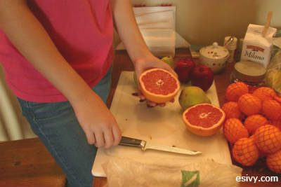
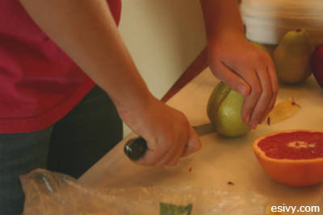
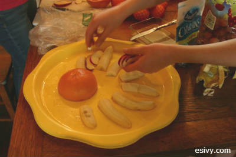
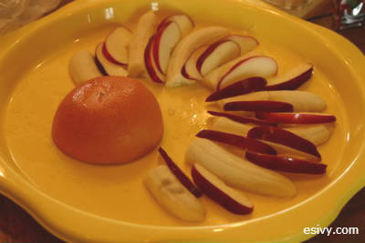
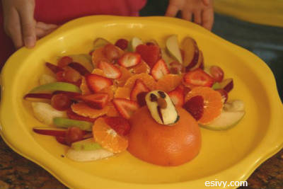

Little kids won’t really go for the fancy fruit salad with Jello and cottage cheese that your Great Aunt Ida always brings to Thanksgiving dinner. This Thanksgiving Fruit Turkey recipe is an easy way to make plain fruit look fancy. It’s also a great way to take fruit to a Thanksgiving class party.

Don’t worry if it’s not perfect! As I’ll show you at the end of the post, it will turn out great even if you’re not too persnickety.

But, if you’re picky, the trick to making fruit arrangements is to use uniformly shaped pieces. This may mean that you won’t use all the pieces that you cut from each fruit, so always have extra. The left-over pieces are perfect for rewarding your kitchen help and tiding them over until the big meal.

Recipe for a Thanksgiving Fruit Turkey
======================================================================================================================================================================================================================================================================================================================================================================================================================================================================================================

Ingredients  
1 large grapefruit  
5 bananas\* (pick ones that are fairly straight instead of ones that have more of a C shape)  
2 – 3 large red apples\*  
6 – 9 strawberries  
9 blueberries  
2 small oranges  
1 macaroni shell noodle, uncooked  
1 peanut-shaped peanut butter sandwich cookie\*\* (I used Nutter Butter cookies)  
2 Tablespoons peanut butter

Directions (photos of steps below)

1. Cut the grapefruit in half and place it at the bottom of a round or square tray.
2. Peel the bananas. You are going to cut the bananas in half-lengthwise, but you want them to lie flat on the tray after cutting. So, if you lay the banana down on the cutting board, you are going to make your cut parallel to the surface of the board. After the bananas are cut apart lengthwise, cut off the most curved end of the banana, probably and inch or two.\*
3. Now arrange the bananas around the grapefruit to form the back tail feathers. Start with the longest bananas in the center back and gradually work toward the shortest bananas on either side. The bananas do not need to touch the grapefruit; there may be a gap.
4. Cut the apples into eighths and core.
5. Place nine of the apple pieces in between the bananas with the peeling side out.
6. Cut the remaining pieces of apple in half again (sixteenths). Set one piece aside.
7. Starting at the outside edges of the tail, arrange the remaining pieces on their sides in a fan shape, just barely overlapping the other apple pieces. Lay the apples so that the peeling sides lay toward the outside of the tail. (The two sides will lie in different directions.)
8. Peel the oranges. Slice the oranges ¼ inch thick, across the sections.
9. Using nine orange slices, arrange the slices in a fan shape starting on either side of the tail. Each piece should overlap the previous piece of orange and the last row of apples. Lay the last piece in top on the center of the row.
10. Cut the tops off of the strawberries and slice them 3/16 inch thick.
11. Place 10 strawberry slices on top of each banana between the first row of apple pieces, tucking them slightly under the top of the second row of apple pieces. Arrange seven slices on top of the second row of apple slices, tucking them slightly below tops of the orange slices.
12. Alternate eight blueberries with the strawberries you placed last.
13. Use peanut butter to stick the peanut butter cookie in the center of the grapefruit half. Cut the peeling from the remaining piece of apple to form the wattle, and stick on the blueberry eye, macaroni beak, and wattle using peanut butter.

\*Tip: If it is going to be a while before the fruit turkey is eaten, dip your cut bananas and apples in a mixture of lemon juice and water. Drain the fruit well and blot it on paper towels before arranging it.

\*\* As you can see below, any oblong cookie will work. Last year we used a Pepperidge Farm Milano cookie.

Since I first dreamed up this fruit turkey about a half a dozen years ago, it’s become something of a tradition, and the kids usually assemble it. As you can see below, if you have 6 girls helping, your turkey might not be as perfect! But it still looks great and gets gobbled right up!

Our Fruit Turkey Last Year, with steps

Cut the grapefruit in half for the body.

Slice the fruit for the tail.

Arrange the fruit for the tail.

The bottom layer doesn’t have to touch the grapefruit body.

The girls’ fruit turkey from last year. We gobbled it up!

