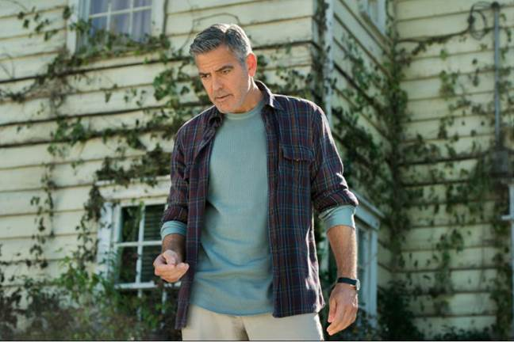
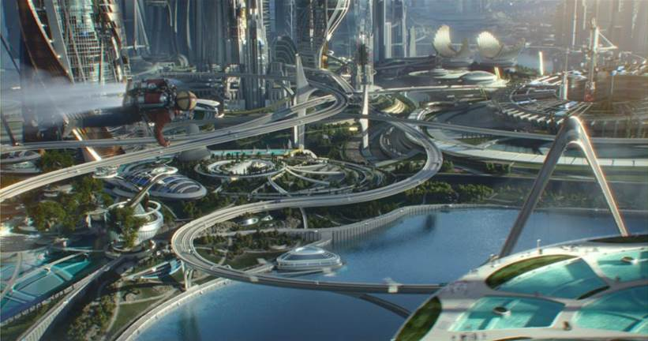
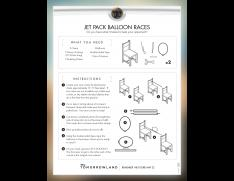

Our family was able to catch Tomorrowland during it’s premier holiday weekend, and we’re glad we did! Because…

They showed the trailer for Star Wars the Force Awakens!

<iframe allowfullscreen="true" class="youtube-player" height="360" src="https://www.youtube.com/embed/ngElkyQ6Rhs?version=3&rel=1&fs=1&autohide=2&showsearch=0&showinfo=1&iv_load_policy=1&wmode=transparent" style="border:0;" width="640"></iframe>

No, I kid. That definitely was *not* the best part of seeing Tomorrowland. But I did grow up during the golden age of the original Star Wars movies. Or should I admit, the golden age of Luke Skywalker and Han Solo.

Han Solo and Chewbacca flash past in the last scene of the trailer. While wookies don’t seem to gray as they age, I couldn’t help thinking. “Wow, Han Solo’s old.”

And then Tomorrowland started up and the first person you see is —

“Wow, George Clooney’s getting old.”

Hmm… I must be getting old. Nah. Besides, if I am, these two make it look pretty good. When I mentioned the men getting old, my daughter protested “But George Clooney looks good old!” (Sorry, Harrison. My son is a true Jedi, but my girls are clueless when it comes to Star Wars. We’ll have to try to fix that with a marathon this summer— if randomly glimpsing the Darth Vader-making volcano scene hasn’t spoiled them for good. I do hope that under Disney Star Wars follows the lead of Tomorrowland in getting back to more family-friendly films.)

Oh, yes, Tomorrowland! That’s what we were talking about, right? What did our family think of [Tomorrowland](http://www.Disney.com/Tomorrowland)?

We thought it was a really great time!

The movie does a great job of accomplishing the odd mix of evoking nostalgia and excitement of the future at the same time, just like Disney World’s Tomorrowland in Magic Kingdom and Epcot. In fact, the movie might just be one big giant advertisement because I found myself wanting [to plan a trip there…](http://192.168.1.34:4945/trip-planning-tips-for-disney-parks/)

Oh yes, back to the movie.

The first thing I love Tomorrowland for is all the cool scenery and futuristic gadgets . It’s just fun. And I love a fun movie. (If you’re curious if we’ll really get any of the cool technology of Tomorrowland any time soon, check out the post [Jetpacks! Robots! ‘Tomorrowland’s’ Awesome Vision of the Future](http://www.livescience.com/50937-tomorrowland-movie-future-tech.html).)

The acting is fantastic!

We all agreed that our favorite parts included the wheat field. Both from the fantastical view, and how funny it is when Casey keeps running into things when she thinks she’s in the field.

But what I really like is the central message of the movie. Yes, I said message. And they kind of hit you over the head with it, but in a good way. I’ll go into that later.

Because some parents may be wondering, should I take young children to see Tomorrowland?
----------------------------------------------------------------------------------------

Keep in mind we are now (officially!) a family of teens and we saw this just two days after the [Avengers: Age of Ultron](http://marvel.com/movies/movie/193/avengers_age_of_ultron). That said, Tomorrowland is pretty tame. The writers made a real attempt to keep everything “safe and responsible.” For example, one of main characters, Casey, does go off on her own, but after a day she calls her dad and leaves a message to apologize and let him know she’s okay. It’s tame enough that my youngest thought the ending solution might have been too “easy.” The violence is pretty much of the [Home Alone](http://www.amazon.com/gp/product/B003CSX6HQ/ref=as_li_qf_sp_asin_il_tl?ie=UTF8&camp=1789&creative=9325&creativeASIN=B003CSX6HQ&linkCode=as2&tag=esiv-20&linkId=J2Z3VHIC7F4KSBTA) slapstick type. Aside from a bloody nose, the major injuries occur to robots. But there is one rather major type of injury —

SPOILER ALERT FOR TOMORROWLAND
-------------------------------------------------------------------

There is a death of a main character in the movie, a robot who looks like a young girl. You are well aware she’s animatronic at that point, and you get the idea that she’s lived a long time. However, it might be upsetting to young kids who are genuinely fond of stuffed animals and the like.

UPDATE: I just heard from my daughter who saw Tomorrowland again today with a group of middle schoolers. (It was a “rain plan” reward field trip for science fair participation.) Tomorrowland is plenty intense for tween/teen girls who are sensitive! They were scared, but not permanently scarred. It was just tense enough to be thrilling.

END SPOILER ALERT For Tomorrowland
-----------------------------------------------------------------------

Begin Minor Plot Give-Away For Tomorrowland
--------------------------------------------------------------------------------

Here’s the message of the movie, that I think bears repeating.

*In a time when watching the world news will make everything seem hopeless—*

*For that matter, in a time when just [your child’s required reading list for English](http://192.168.1.34:4945/why-is-required-school-reading-so-depressing/) will make you feel hopeless—*

*In a time when we not only seem to dread and dwell on tragedy, but embrace it in the form of a love for dystopian novels and movies —*

*It’s about the importance of Dreamers.*

*It’s about the importance of Dreamers Doing something.*

*It’s about Dreamers Doing something to Save the World.*

And if you’ve got a little dreamer you’d like to inspire, check out these directions for Disney Jet Pack Balloon Races! Because a big part of [setting your kids up for success](http://192.168.1.34:4945/success-factors-whats-the-best-way-to-guide-your-child-through-high-school-to-be-a-success-in-college-and-in-life/) is inspiring them.

Note: At the two movie theaters our family goes to, Disney had the only non-rated R movies showing. (Tomorrowland PG and Avengers: Age of Ultron PG13.) Thank you Disney! If you like having family friendly options at the movie theaters, get out there and support the PG-rated movies!

*I was not compensated in any way for this posts; we paid for our own movie tickets. Thoughts about Tomorrowland are my own. Media from Walt Disney Studios and Youtube.*