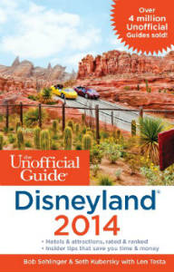

The crowd as we entered the Magic Kingdom – and we still never spent more than 30 minutes standing in line!

Thinking of planning a trip to Disney World in Orlando and looking for some tips? We went to Disney World and Universal Studios Orlando theme parks in June 2013 and spent very little time standing in line. We were able to manage this even though the parks were crowded – crowd levels were predicted to be a 7-8 out of 10. We pulled it off because we – or I should say *I* – planned ahead.

I’m planner.

That may be an understatement. 🙂

Before this trip I was hanging out by the pool with two friends who were also leaving on vacation in a matter of days. They were joking about the trips where they unknowingly passed the last option for food and ended up splitting the last fruit roll-up with the whole family for supper. I just kept silent, because I didn’t want to make them feel bad. I don’t think we’ve ever run out of food on a trip. Here is what I packed for our trip the next day:

That’s just the food that didn’t go in the cooler! And we weren’t going anywhere near the wilderness. We were going to Disney World!

So yes, I plan. And when going to Disney World that’s a good thing, because the days were you can just drive up to the Disney parks and wander around are no more. The parks are crowded. The parks are big. You don’t just happen upon characters and get to snap a quick photo. You can end up standing in a line 2 hours for a 2 minute ride.

We got a chance to experience that. In 1999 we were in Florida to see my plant biology experiment go up on Shuttle Mission STS-93. With a one-year-old, we couldn’t resist dropping by Disney.

And we stood in those lines in August. With a one year old. In Florida.

Did I mention it was August?

And we had a one-year-old?

So several years later when we went to Disneyland in California, I knew I had to plan.

The best guidebook I found was [The Unofficial Guide to Disneyland. ](http://www.amazon.com/gp/product/1628090049/ref=as_li_qf_sp_asin_il_tl?ie=UTF8&camp=1789&creative=9325&creativeASIN=1628090049&linkCode=as2&tag=esiv-20&linkId=MY6UHWEANMZFNI6N "Buy it on Amazon! Check current year for latest version.")Hint: make sure you get *Disneyland* if you’re going to California and *Disney World* if you’re going to Florida.) I modified their plans and the first week in June we only stood in one line for more than 15 minutes.

The problem was that I went through the park with tunnel vision. I had my nose in the map while my family oohed and aahed, “Look at this!”

I would glance up. “Yep, cool! Hang a left at the thatched roof. We’ve got to get to Dumbo by 10:05.”

This time I still read [The Unofficial Guide version to Walt Disney World, ](http://www.amazon.com/gp/product/1628090006/ref=as_li_qf_sp_asin_il_tl?ie=UTF8&camp=1789&creative=9325&creativeASIN=1628090006&linkCode=as2&tag=esiv-20&linkId=SGYX5SY55Z2IUNLD "Buy it on Amazon! Check current year for latest version.")but then I found [easyWDW.com](http://www.easywdw.com/) for planning a trip to Disney World. This helped me simplify our plan. But we still did everything at a breakneck pace. It might be the rest of the family. I’m not sure they can *do* an amusement park at a leisurely pace.

At one point as we raced through this at Epcot, the scent of roses was thick in the air. It was gorgeous!

“You can smell the roses,” I called out.

Someone else hollered back, “Just don’t stop to smell them!”

So it may be that no matter how much you plan, you still do the parks at a gallop.

One other problem we found is all the guide books are written for someone who’s already seen the Disney Parks and just want to make sure they get to all the new and popular rides. Some of our favorite attractions get absolutely no love. They’re not thrilling. But when you haven’t seen them ten times already, they’re awesome. So I thought it might help if I chronicled some actual experiences. Something that would have useful tips for planning a first trip to Disney Parks. It wasn’t our absolutely first trip. We’ve gone just enough (a total of three times now in in the last 15 years) to have some experience, but infrequent enough that it seems new every time we go.

I’ll be doing a series of posts about our actual trip, how I planned it, tips for what to take to Disney, and what we experienced in the Disney Parks when we got there. For your crowd planning purposed, the trip was during the second week of June 2013 with a crowd level on most calendars of a 7 or 8.