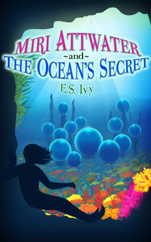

Hi, I’m E.S. Ivy, writer of fun, middle grade fiction. I do a lot of research for my books, so if you’re not careful you might accidentally learn something. 🙂

This blog will cover a variety of topics related to my books and turning kids into avid readers by making reading fun. I have a background in science and I’m also pretty crafty (I’ve published crafts in Family Fun Magazine) so all of that will influence the blog. For my first series, Miri Attwater, I also did a lot of research into the structure of governments and how they have evolved over time, so you’ll find a little bit of history as well. Posts should occur about once a week, starting …. um….. soon, I hope!

Miri Attwater and the Ocean’s Secret is currently available in Amazon! After I get all my blogs and webpages up and running, get the final draft of Book 2 off to proof readers, and learn how to sing on my [E.S. Ivy twitter account](https://twitter.com/ESIvy), I’ll start getting The Ocean’s Secret up on other platforms including Barnes and Noble, Smashwords, and Kobo. If you have a vote for which platform you want it on first, let me know in the comments.

For now I’ll just leave you with a larger version of The Ocean’s Secret to gaze at. I designed the cover and Techno Tim, my resident tech guy, made it a reality. I even got a refresher course in Photoshop and drew in some of the coral! Doesn’t the yellow one in the lower right hand corner look particularly nice?

