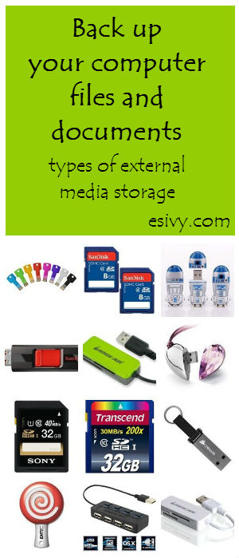

What is a flash drive?

Are you asking that question? If you’re still feeling lost without a floppy disk to safely back up your computer files, you’ll find this quick tutorial on the current types of external, removable storage media handy.

External removable storage media for computer files – 3 Types and Terms
-----------------------------------------------------------------------

SD card, memory card

  
1\. SD card – a memory card like you would use in a digital camera. It looks like a little tiny floppy disk and it’s got the same purpose. It feels like it’s about the size of your thumbnail, but it’d be more accurate to say its approximately 1 inch square. It inserts completely into the computer, flush with the case. You have to use your fingernail to depress it and pop it out. You can see what memory card slots look like on the memory card reader pictured below. Note that the “plug” in the end plugs into a USB port, which we’ll talk about next.

Memory card slots, memory card reader with USB plug

USB hub

2\. USB port – a port or a socket into which you can plug devices up to your computer, including phones, ebook readers, external disk drives, and external hard disks.

You can see both the USB ports and the USB “plug” on the USB hub pictured. Think of it like an extension cord. There’s one “plug” and multiple rectangular “sockets.”

But a USB port is even fancier than an electric socket. You can transfer data through it AND you can use it like an electric socket – to charge a device like a phone or ereader. That confused the heck out of me for the longest time! Sometimes flash drives are called USB sticks because they “stick into” the USB port. Which brings us to…

Flash drive, USB stick with keychain loop

  
3\. Flash drive – a tiny drive you plug into a USB port. You don’t see the “cord” and the “plug” on this tiny device because it’s all included in one compact package with the even tinier drive. This is a miniature hard drive with no moving parts.

Think of it as an itty-bitty external harddrive that you can plug into your computer. That’s itty bitty in physical size, not in storage (memory) capacity, because they can store a lot of data.

Lollipop flashdrive

  
This is a good type of storage to use if you’re going to be working on lots of different computers, like home, school and work. Since it sticks out of the computer, you’re less likely to forget it and leave it in the computer. They also sell them with nifty ways to attach them to a key ring and cute covers.

*Some of the links in this post are affiliate links. When you purchase through these links I receive a tiny commission, at absolutely no cost to you. Thanks for supporting my time for writing these tutorials in this way!*