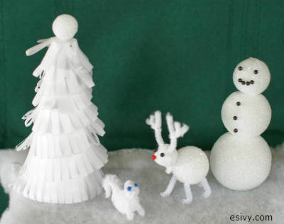

If your kids were as enamored by the Disney movie Frozen as my girls have been, you may be looking for fun winter craft ideas for kids to make. Here in central Texas, we often have to make our own snow. You can make a whole snow scene out of Styrofoam that won’t melt!

This craft appeared in the February 2008 issue of FamilyFun magazine. It used to be featured on the [spoonful.com website.](http://spoonful.com/winter/snowman-crafts "snowman crafts") You can read my original directions for some of the figures below.

Tip: The magic trick for these figures is to compress the Styrofoam into the shape you want by gently pressing and rolling. Even the snowman looks better when the balls aren’t perfectly round!

Winter craft ideas for kids to make: directions for Styrofoam and Pipe cleaner animals Winter Wonderland
========================================================================================================

Tree for Winter Wonderland Craft
-----------------------------------------------------------------------------------------------------------------------------------------------------------------------------------------------------------------------------------------------------

You will need:  
1: 6 X 2-7/8 inch Styrofoam cone  
1 sheet of white tissue paper  
1: 1 inch Styrofoam ball  
straight pins

1\. Cut a three inch wide strip of tissue paper and fold it in half length-wise. Cut fringe in the bottom inch of the folded edge. Using straight pins, attach the unfringed edge of the tissue paper to the cone in a spiral, starting at the bottom. Overlap each row so that the bottom edge covers each unfringed portion below it.  
2\. Top off the tree by attaching the Styrofoam ball by pushing a straight pin halfway into the center of the cone and then pushing the ball down on the head of the pin.

Reindeer for Winter Wonderland Craft
---------------------------------------------------------------------------------------------------------------------------------------------------------------------------------------------------------------------------------------------------------------------------------------------------------------------------------------------------------------------

You will need:  
1 : 1 ½ inch Styrofoam ball  
1 : 1 inch Styrofoam ball  
1 bump from a white chenille stem with bumps  
2 white chenille stems  
Optional: 2 black ball pins and 1 red ball pin

1\. Use the chenille bump to attach the 1 inch ball as a head to the 1 ½ inch ball. Poke each narrow tip into one of the balls and then collapse the stem between them to form the rough of the neck. Use the tips of your fingers to squeeze the front of the head into a nose shape.  
2\. For each antler, use three pieces of chenille stem: 2 inches, 1 inch, and ¾ inch long. Use needle nose pliers to bend a crook in the end of the 1 inch piece and attach it to the 2 inch piece to form the first branch. Crimp it down tightly. Attach the ¾ inch piece to the one-inch piece to form the second branch. Trim as needed. Push the antlers into the top of the head.  
3\. For the legs, use four pieces of chenille stem, each 2 inches long. Push them into the body and bend up the ends the amount needed to make the deer stand. Trim ends as needed.

Optional: Use the ball pins to give the deer eyes and a red nose.

Squirrel for Winter Wonderland Craft
-----------------------------------------------------------------------------------------------------------------------------------------------------------------------------------

You will need:  
1 : 1 inch Styrofoam ball  
1 bump from a white chenille stem with bumps  
1 white chenille stem  
Optional: 2 blue or black ball pins

1\. Poke one end of the bump into the ball body and curve it against the ball and then curve the tip down to form the tail.  
2\. Make the head. Bend the tip of the chenille stem back on itself ½ inch. Now, holding onto this double portion, grab the tail of the chenille stem near your first hand and wrap the tail end around the doubled part of the stem in a coil, two times. Clip off all but ¾ inch of the tail. Use this portion to attach the head onto the body.  
3\. Balance the body by using two one-inch-long pieces of chenille stem to make the front legs. Bend up the tips of the legs to make feet. Trim as needed.  
Optional: Use two ball pins to make eyes. Be careful to angle the pins so that the ends go down into the body and not out the back of the head.

 Snowman for Winter Wonderland Craft
------------------------------------------------------------------------------------------------------------------------------------------------------------

You will need:  
1: 2 ½ inch Styrofoam ball  
1: 2 inch Styrofoam ball  
1: 1 ½ inch Styrofoam ball  
1 white (or black) chenille stem  
Optional: 9 black ball pins

1\. Using a small hardback book or other flat object, such as a coaster, press down firmly on the top of the largest Styrofoam ball to form a flat base for the bottom and a flat base for the second ball. Do the same with the medium sized ball. For the smallest ball, hold the ball in the tips of your fingers and press down firmly against a flat surface to flatten only the bottom of the ball, not the top.  
2\. Poke the end of a one inch long piece of chenille stem into the top of the largest ball. Press the middle ball down on top of it. Use another piece of chenille stem to attach the head.  
3\. Make arms using two two-inch-long pieces of white (or black, if you are using black eyes and buttons) chenille stem.  
Optional: Use black ball pins to make a face and buttons.

Arrange your figures on a piece of white batting. If the figurines need stabilizing, place the batting on a piece of Styrofoam and anchor the figurines using chenille stems pushed into the Styrofoam and figures.

If you want to extend this craft into a learning experience, you could talk about animal winter camouflage. Here are some webpages with some information to help you get started:

[How Animal Camouflage Works](http://science.howstuffworks.com/zoology/all-about-animals/animal-camouflage2.htm "animal camouflage")

[5 Arctic Animals that Turn White for Winter](http://webecoist.momtastic.com/2008/12/24/arctic-animals-change-color-camouflage/ "arctic animal camouflage")

[LIST OF ANIMALS THAT HAVE WINTER CAMOUFLAGE](http://animals.pawnation.com/list-animals-winter-camouflage-7944.html "camouflage list")

I hope you enjoy this winter craft idea for kids! Finally, something else to do besides listen to *Do You Want to Build a Snowman?* over and over and over…. 🙂